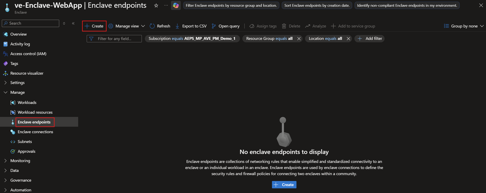
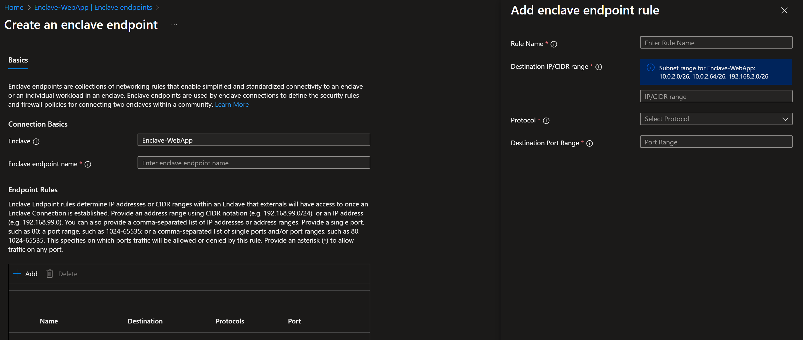

# Create an enclave endpoint in the Azure portal

In this how-to guide, you create an [enclave endpoint](./what-enclave-endpoint.md) in the Azure portal. Enclave endpoints define destination rules that other enclaves or transit hubs can use when creating enclave connections.

## Prerequisites

- An Azure subscription. If needed, create a [free Azure account](https://azure.microsoft.com/free/).
- A [community](./create-community-portal.md) and an [enclave](./create-enclave-portal.md).

## Sign in to Azure

Sign in to the [Azure portal](https://portal.azure.com).

## Create endpoint

1. Enter `Azure Enclave` in the search.

1. Under `Services`, select `Azure Enclave`.

1. In the `Azure Enclave` page, select `Enclaves` in the left menu.

1. On the `Enclaves` page, select your Enclave's name to open the enclave resource.

1. Select `Enclave Endpoints` on the left navigation and then select `Create`.

1. Enter the basic details for your enclave endpoint:
   - `Enclave endpoint name`: Enter a name, such as `endpoint-MyService`.

1. Under `Endpoint rules`, select `Add`.

1. Enter the `Rule Name`, `Destination IP addresses/CIDR range`, `Protocol`, and `Destination Port Range`.

   For example, to allow traffic to an HTTPS server hosted on an Azure virtual machine (VM) in a [workload](./what-workload.md), enter the VM private IP address or subnet IP range, such as `10.0.2.5` or `10.0.2.0/26`, select `TCP`, and enter `443`.

> [!NOTE]
>
> Enclave endpoint rules must use destinations within enclave subnets that are protected by [network security groups](/azure/virtual-network/network-security-groups-overview).

1. Select `Next` and enter any [tags](/azure/azure-resource-manager/management/tag-resources) for your enclave endpoint.

1. Select `Review + create`, validate that the details for your enclave endpoint are correct, and then select `Create`.
