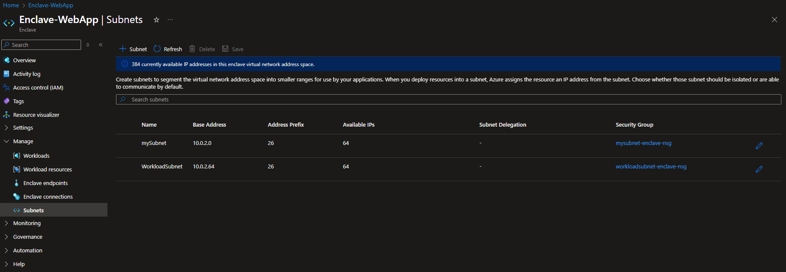

# Create new subnet within an enclave Virtual Network

This guides you through replacing the existing Azure Enclave enclave virtual network subnet `AzureVirtualEnclaveSubnet` with a replacement `AzureVirtualEnclaveSubnet` subnet and a new subnet of your choice. This is an important step to perform early after the enclave is created so there are no resources attached to the existing subnet. An existing subnet can't be deleted until there are no resources attached to it.

> [!NOTE]
> * You aren't able to resize a virtual network with existing connections. [Official Docs](/azure/virtual-network/virtual-network-manage-subnet?tabs=azure-portal#change-subnet-settings). If you need to resize an existing subnet you need to move any connected devices out first, resize, then move them back.
> * Remember when sizing your subnets that five IP addresses per subnet are reserved by Azure. See [official documentation](/azure/virtual-network/virtual-networks-faq#are-there-any-restrictions-on-using-ip-addresses-within-these-subnets).

## Size Table Reference
The subnet size determines how many usable IP addresses are in the subnet.

| Subnet Size | Useable IPs |
| -------- | -------- |
| /29 | 3  |
| /28 | 11 |
| /27 | 27 |
| /26 | 59 |
| /25 | 123 |
| /24 | 251 |

## Detailed subnet creation steps
Change the subnets in the enclave by selecting `Manage` on the left side and then `Subnet` to manage existing subnets or create new subnets.

