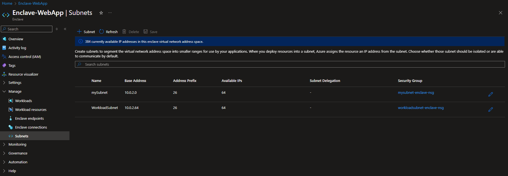

# Create a new subnet within an enclave virtual network

This article guides you through replacing the existing Azure Enclave virtual network subnet `AzureVirtualEnclaveSubnet` with a replacement `AzureVirtualEnclaveSubnet` subnet and a new subnet of your choice. This step is important to perform early after the enclave is created so there are no resources attached to the existing subnet. You can't delete an existing subnet until there are no resources attached to it.

> [!NOTE]
> * You aren't able to resize a virtual network with existing connections. [Official Docs](/azure/virtual-network/virtual-network-manage-subnet?tabs=azure-portal#change-subnet-settings). If you need to resize an existing subnet you need to move any connected devices out first, resize, then move them back.
> * Remember when sizing your subnets that five IP addresses per subnet are reserved by Azure. See [official documentation](/azure/virtual-network/virtual-networks-faq#are-there-any-restrictions-on-using-ip-addresses-within-these-subnets).

## Size table reference

The subnet size determines how many usable IP addresses are in the subnet.

| Subnet size | Usable IPs |
| -------- | -------- |
| /29 | 3  |
| /28 | 11 |
| /27 | 27 |
| /26 | 59 |
| /25 | 123 |
| /24 | 251 |

## Create a subnet

1. In the Azure portal, open your enclave.

2. Select **Manage** in the left menu, and then select **Subnet**.

   

3. Select **+ Subnet** to open the subnet form.

4. Enter the following values:

   - **Name**: Enter a name that identifies the subnet's purpose. The name must be unique within the enclave virtual network.
   - **IPv4**: Enter an address range in CIDR notation, such as `10.0.0.0/26`. The range must be within the enclave virtual network address space and must not overlap another subnet. Choose a size that provides enough addresses for the service and workload you plan to deploy. Azure reserves five IP addresses in every subnet.
   - **Subnet delegation**: Leave this field empty unless the Azure service that you plan to deploy requires a delegated subnet. If delegation is required, select the service specified in that service's documentation. Don't select a service based only on a possible future workload.

   If you don't select an Azure service that requires delegation, create the subnet without delegation. For example, the App Service subnet in [Tutorial 1-2: Create enclaves in an Azure Enclave community](./1-2-create-enclaves-inside-community.md) is delegated to `Microsoft.Web/serverFarms`, while the common subnet used for other resources isn't delegated.

5. Select **Save**.

## Subnet delegation

When you create a new subnet in the enclave virtual network, you can delegate the subnet to an Azure service. Subnet delegation designates the subnet for use by a specific service (for example, a service that must inject its own resources into the subnet) and grants that service the permissions it needs to manage its service-specific resources in the subnet. Set the delegation when you create or manage the subnet through the enclave's **Manage** > **Subnet** experience, so the delegation is recorded in the enclave's authoritative configuration.

> [!NOTE]
> 
> Azure reserves five IP addresses per subnet, and a delegated subnet is dedicated to its delegated service. Size delegated subnets accordingly. See [Size table reference](#size-table-reference).

## Enclave authority over the virtual network

Azure Enclave manages the enclave virtual network. It creates the virtual network, its subnets, and the routing and configuration that connect the virtual network to enclave connection management. Because the enclave owns this state, create and change subnets only through the enclave's `Manage` experience.

> [!WARNING]
> 
> Don't perform operations directly against the enclave virtual network. Direct changes cause the virtual network to drift out of Azure Enclave management, which can break enclave connection management (including, but not limited to, enclave endpoints, enclave connections, and enclave subnet features). After the virtual network drifts, the enclave can no longer reliably reconcile it and might require you to re-deploy the enclave through an ARM template with specific properties to synchronize the enclave properties to match the enclave virtual network.

Operations to avoid performing directly on the enclave virtual network include, but aren't limited to, the following examples:
- Adding, deleting, resizing, or delegating subnets outside of the enclave experience.
- Changing the virtual network address space.
- Editing route tables, network security group associations, or peerings.
- Other virtual network-level edits.

## Example allowed customer operation: DNS servers

Modifying the DNS servers on the enclave virtual network is supported and doesn't cause the enclave to drift out of management. You can set custom DNS servers on the enclave virtual network to provide name resolution for your workloads. Apart from DNS server settings, use the Azure Enclave management experience for other virtual network and subnet changes.
