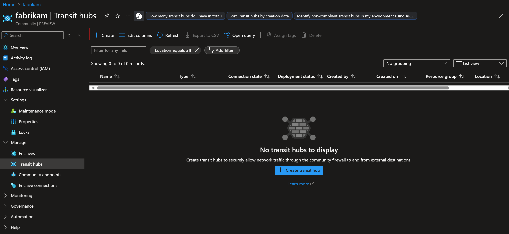
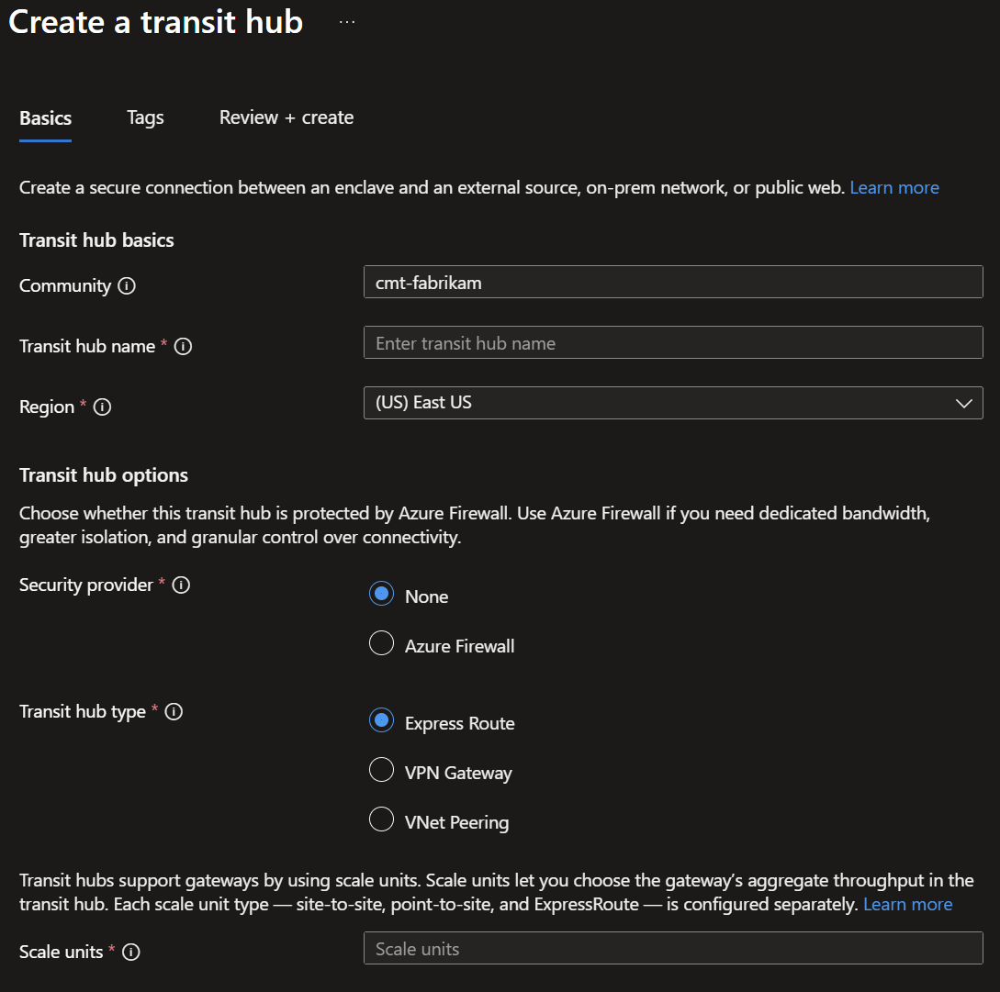

# Create a transit hub from the Azure portal

A [transit hub](./what-transit-hub.md) establishes a virtual hub within a community Virtual WAN that serves as a secure tunnel between the community and an external private network. A transit hub can be associated with a Private Network rule within a community endpoint to enable enclaves to connect to trusted private networks outside of the community boundary.

## Prerequisites

- To access Azure Enclave, you need an Azure subscription. If you don't already have a subscription, create a [free account](https://azure.microsoft.com/free/) before you begin.

- All access to Azure Enclave takes place through a community or an enclave. For this how-to article, create a [community](./create-community-portal.md) and [enclave](./create-enclave-portal.md).

## Sign-in to Azure
Sign-in to the [Azure portal](https://portal.azure.com).

## Create a transit hub

1. Navigate to an existing `Community` within your Azure subscription, select the `transit hubs` tab, and select `Create`

1. Provide a name and type for the transit hub and select the type of transit hub.

Refer to this guidance for more information on the different types of transit hub connections:

- [Express Route](/azure/virtual-wan/virtual-wan-expressroute-portal)
- [VPN Gateway](/azure/virtual-wan/virtual-wan-site-to-site-portal)
- [Virtual Network Peering](/azure/virtual-network/tutorial-connect-virtual-networks-portal)

1. Select `Next`, add any tags, and select `Review + Create`.

1. Select `Review + Create` and select `Create`

> [!NOTE]
> 
> Transit hub connectivity might be a "break-glass" scenario due to configuration variability of transit connections.
