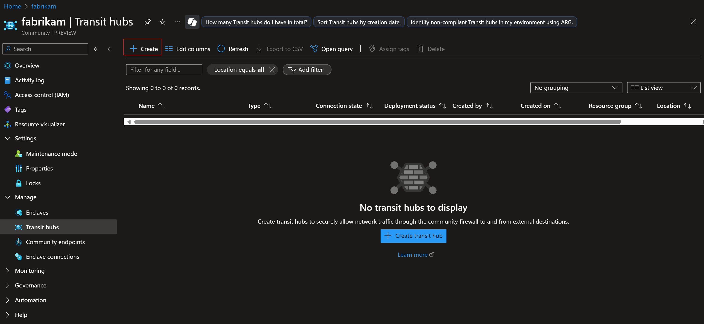
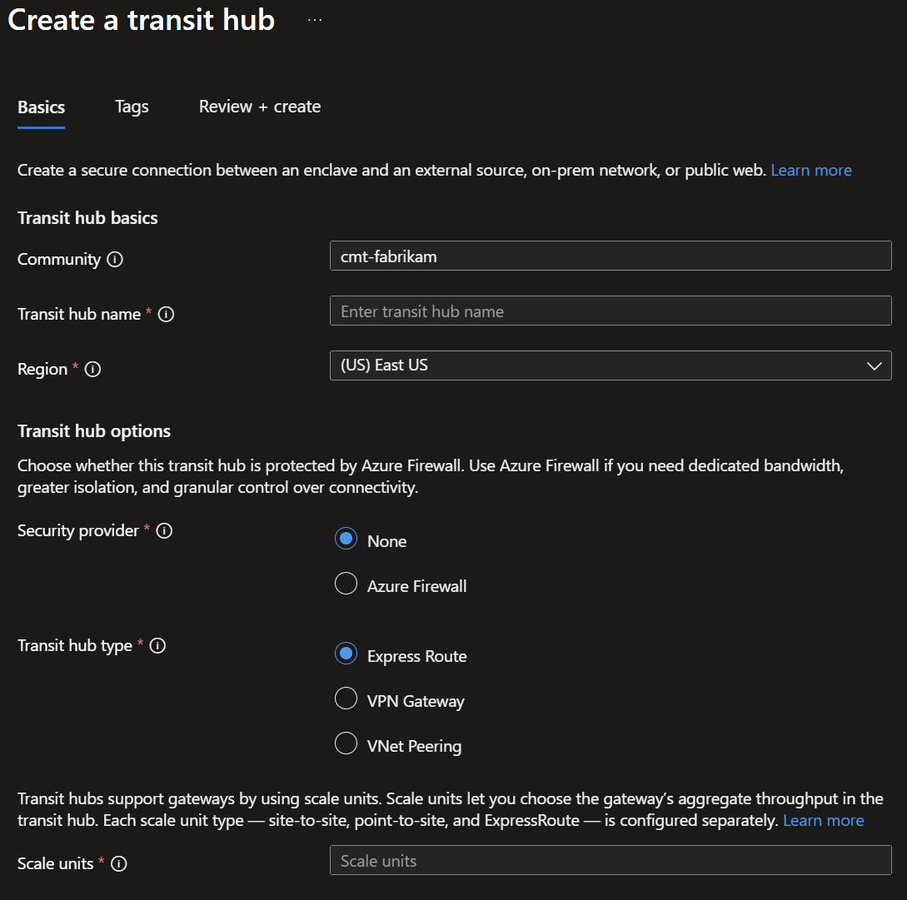

# Create a transit hub from the Azure portal

A [transit hub](./what-transit-hub.md) creates a virtual hub within a community Virtual WAN that acts as a secure connectivity path between the community and an external private network. You can associate a transit hub with a `PrivateNetwork` destination rule in a community endpoint so enclaves can connect to trusted private networks outside of the community boundary.

## Prerequisites

- To access Azure Enclave, you need an Azure subscription. If you don't already have a subscription, create a [free account](https://azure.microsoft.com/free/) before you begin.

- All access to Azure Enclave takes place through a community or an enclave. For this how-to article, create a [community](./create-community-portal.md) and [enclave](./create-enclave-portal.md).

## Sign in to Azure

Sign in to the [Azure portal](https://portal.azure.com).

## Create a transit hub

1. Go to an existing community in your Azure subscription. Select the **Transit hubs** tab, and then select **Create**.

1. Enter a transit hub name and select the connection type.

Refer to this guidance for more information on the different types of transit hub connections:

- [ExpressRoute](/azure/virtual-wan/virtual-wan-expressroute-portal)
- [VPN Gateway](/azure/virtual-wan/virtual-wan-site-to-site-portal)
- [Virtual Network Peering](/azure/virtual-network/tutorial-connect-virtual-networks-portal)

1. Select **Next**, add any tags, and then select **Review + Create**.

1. Review the settings, and then select **Create**.
