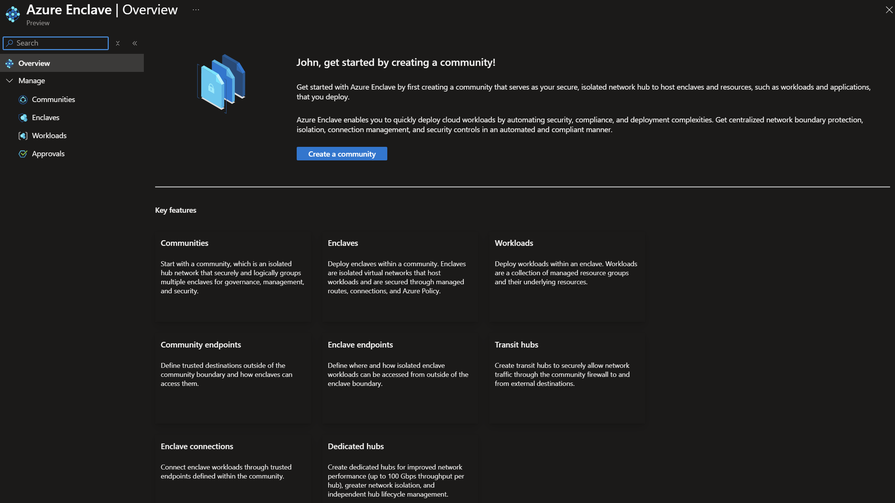
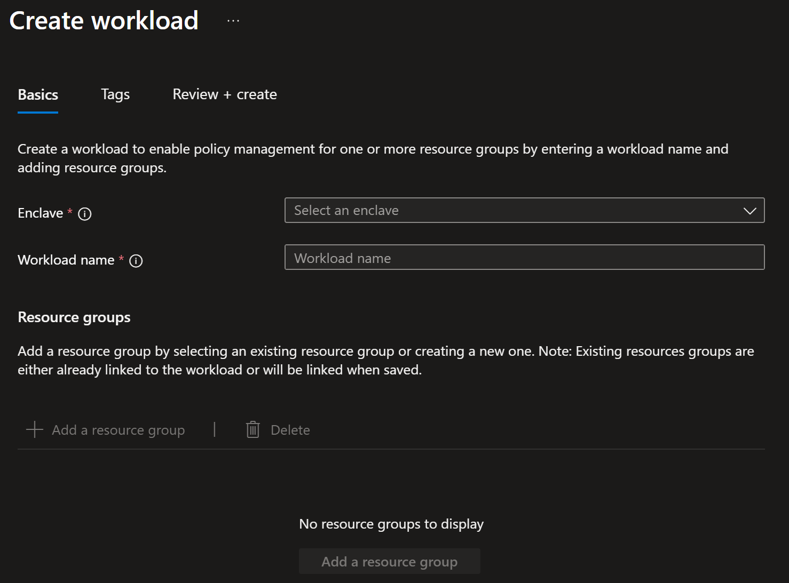

# Create a workload in the Azure portal

[Workloads](./what-workload.md) are logical groups of zero or more workload resource groups and their underlying Azure resources in an enclave.

In this how-to guide, you create a workload in an existing Azure Enclave enclave and optionally add workload resource groups.

## Prerequisites
- To access Azure Enclave, you need an Azure subscription. If you don't already have a subscription, create a [free account](https://azure.microsoft.com/free/) before you begin.
- All access to Azure Enclave takes place through a community or an enclave. For this how-to article, create a [community](./create-community-portal.md) and [enclave](./create-enclave-portal.md) using the Azure portal.

## Sign in to Azure

Sign in to the [Azure portal](https://portal.azure.com).

## Create workload

1. Enter `Azure Enclave` in the search.

1. Under `Services`, select `Azure Enclave`.

1. In the `Azure Enclave` page, select `Workloads` in the left menu.

    

1. On the `Workloads` page, select `Create`.

1. Enter the basic details for your workload:
   - `Enclave`: Select an existing enclave. This value is automatically applied if you started workload creation from an existing enclave.
   - `Workload name`: Enter a workload name, for example, `cyber-monitoring-apps`.

    

> [!NOTE]
>
> Choose a workload naming convention that makes sense for your organization. For more information, see [Define your naming convention](/azure/cloud-adoption-framework/ready/azure-best-practices/resource-naming).

## Add workload resource groups

1. To add a new resource group during workload creation, select `Add`, enter a resource group name, and repeat as needed. You can also create resource groups later or move existing resource groups into the workload after the workload is created.

1. Select `Next`, and then enter any [tags](/azure/azure-resource-manager/management/tag-resources) for your workload.

1. Select `Review + create`, confirm that the workload details are correct, and then select `Create`.

> [!NOTE]
>
> Workload resource groups are flexible and you can decide how to logically organize your resources in [workload resource groups](./best-practices.md#workload-resource-group).

## References
- [What is a workload?](./what-workload.md)
- [Create an enclave](./create-enclave-portal.md)
- [Best practices](./best-practices.md)
- [Defining your naming convention](/azure/cloud-adoption-framework/ready/azure-best-practices/resource-naming)
