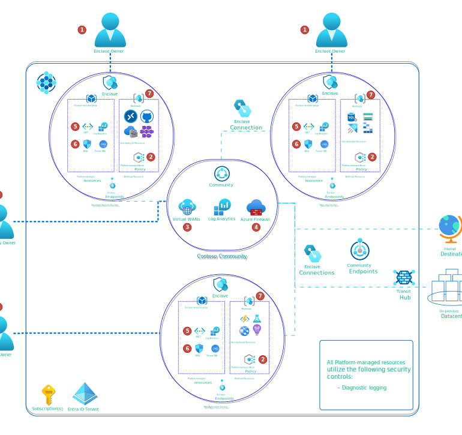

# Azure Enclave Defense in depth

Azure Enclave provides defense-in-depth through multiple layers of boundary protections and guardrails to protect and safeguard your data. 

1. [**Role-based access control (RBAC)**](https://aka.ms/azure-rbac) - Standard access management system for all Azure resources. Security principals are sourced in Microsoft Entra ID (for example community owner or enclave owner).  ​
1. [**Azure Policy**](./what-azure-enclave.md#multi-layered-governance-security-and-monitoring) - Policy engine to enforce organizational standards and to assess compliance at-scale. Azure Policy evaluates Azure Resource Manager (ARM) requests and resources against business rules known as policy definitions. Policies are assigned at the workload resource group and enclave managed resource group scopes. They are also used to control which Azure Services can be deployed and which enclave Virtual Network a workload can be deployed.
1. [**Azure Virtual Wide Area Network**](/azure/virtual-wan/virtual-wan-about) - Software defined wide-area-network for managing security, routing, and connectivity. Virtual WAN implementation has a secured hub protected by Azure Firewall.
1. [**Azure Firewall**](https://aka.ms/azurefirewall) - Platform firewall service is a controlled interface for network traffic entering/leaving the community and for internal traffic flows between enclaves within the community.
1. [**Azure Virtual Network**](/azure/virtual-network/virtual-networks-overview) - Software defined network for hosting private Azure resources. In enclaves, workloads use private IP addresses; flows are forced through the community Azure Firewall. Only enclave owners can create or modify their enclave's Virtual Network. Contains subnets for further networking granularity.​
1. [**Network Security Groups**](/azure/virtual-network/network-security-groups-overview) - OSI layer 3&4 network security service to filter traffic to and from Azure resources in an Azure virtual network. This is supplemental to control provided by OS firewall and the community Azure Firewall. All flows are logged through NSG Flows Logs.
1. [**Workloads**](./what-workload.md) - Combination of cloud services and installed software hosted inside of a virtual network. Because the services are either deployed in a Virtual Network or linked to a Virtual Network, flows are controlled by the Azure Firewall through central Azure Virtual WAN. ​
  > [!NOTE]
  > 
  > Virtual Network integration is only one pattern of isolating platform resources. You can further isolate your workloads through other Identity and Access Management solutions such as Microsoft Entra ID and Attribute-based Access Control.
1. **Secrets, Logging, and Monitoring** - Enclave-specific secret store (Key Vault) and Log Analytics Workspace. Although these services are platform services, they are only accessible from within the enclave virtual network (firewall + private endpoint).​ All platform-managed and customer workload resources automatically log [diagnostics settings](/azure/azure-monitor/essentials/diagnostic-settings) data and [Azure Activity](https://aka.ms/activity-log) logging. When a community owner creates a new enclave, they can choose a destination for this logging data (enclave Log Analytics Workspace, community Log Analytics Workspace, or both).

## Layered Security
Multi-layer protections provided by Azure Enclave include:

- **Physical security**: Microsoft enforces strict security measures to ensure the Azure data centers are protected and secured. This is true both for Air-Gapped and Commercial cloud environments.

- **Virtual Network Isolation**: Next-level zero-trust networking that leverages and combines the power of Azure Virtual WAN, Firewall, Policy, Role Based Access Controls (RBAC), Network Watcher, Monitor, Microsoft Sentinel, Defender, and others to ensure that you know where your data is and who is accessing it at all times.

- **Virtual Connection Management**: All connections, internal or external, are governed by strict, user-defined rules to prevent unwarranted access.

- **Azure Policy Enforcement**: Ensure your environments remain secure through build-in policies at the community, Enclave, and workload levels to audit and/or enforce consistency and compliance across your environment.

- **Mandatory Access Control** - Access to Azure Enclave resources is controlled through built-in RBAC roles that can be assigned at any scope from subscription, resource group, down to individual resources

- **Mandatory Observability**: The Azure Enclave service consolidates the full power of Azure's built-in logging, alerting, and auditing features through integration with Microsoft Sentinel, Defender, and other network monitoring and security tools to ensure that your data remains secure.
