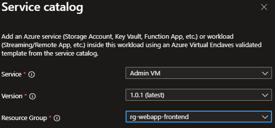

# Deploy Admin Virtual Machine (VM) from the service catalog into a workload
The Admin VM template creates a VM on the management subnet so you can access the enclave resources securely. This type of VM is also called a jumpbox because it allows you to jump into the isolated network.

In this article, you:

- Deploy a service catalog template for an Admin VM into an existing workload from the Portal.

> [!NOTE]
> 
> This sample deployment is just for demonstration purposes and doesn't represent all the best practices for network, systems, or applications administration.

## Deploy Options
The Admin VM template can be deployed in multiple configurations:
1. Virtual Machine (~10 min)
1. Virtual Machine domain-joined (~12 min)

## Before you begin
- This quickstart assumes a basic understanding of networking and Azure Enclave concepts. For more information, see [Concepts and best practices of Azure Enclave](./best-practices.md).

- You need an Azure account with an active subscription. If you don't have one, [create an account for free](https://azure.microsoft.com/free/).

- You need a [community](./what-community.md), [enclave](./what-enclave.md), [workload](./what-workload.md), and at least one [workload resource group](./what-workload.md#workload-resource-group) and permissions to create resources inside the workload resource group.

- Enable `Advanced` [maintenance mode](./maintenance-mode.md) for your enclave so you can add the Private Link resources to your enclave managed resource group.

## Prerequisites
There are guardrail requirements on the enclaves to ensure enclave resources are using Customer-Managed Keys (CMK) encryption. This requires a key and identity to access the key to be accessible in the enclave. Create the CMK (optional Key Vault) and Managed Identity in the [Common Dependencies service catalog template](./deploy-common-dependencies-service-catalog.md)

1. Subnet for Private Endpoints: You had the option to create subnets during enclave creation or you can [create new subnets](./create-new-enclave-subnet.md) after enclave creation. The private endpoint subnet should have no [subnet delegation](/azure/virtual-network/subnet-delegation-overview) for the private endpoints to work properly.
1. Quickly create these [Private DNS Zones](./deploy-private-dns-zones-service-catalog.md) based on what you create next:
    - `Key Vault` required when creating a Key Vault from this template or the more customizable [Key Vault template](./deploy-key-vault-service-catalog.md).
    - `Storage File`, `Storage Queue`, `Storage Blob`, and `Storage Table` are required when making a Storage Account from this template or the more customizable [Storage Account template](./deploy-storage-account-service-catalog.md).
1. A Key Vault, Customer Managed Key (CMK), and Managed Identity are required for this template. Create a Key Vault, CMK, and Managed Identity in the [Common Dependencies service catalog quickstart](./deploy-common-dependencies-service-catalog.md) or create your own.
    - These resources should be created inside a [workload resource group](./create-workload-portal.md#add-workload-resource-groups).
    - After creating the User Managed Identity, ensure it has access to the CMK key
        - Assign the `Key Vault Crypto Service Encryption User` RBAC role to the managed identity scoped to the key vault with [these instructions](./create-user-managed-identity.md#assign-role-to-managed-identity). This role allows you to then assign the managed identity to another resource, like a Virtual Machine, and that Virtual Machine can encrypt the operating system disk with the CMK in the key vault with least privilege.
1. (optional) An existing domain to join if the Admin VM will be domain joined.

## Deploy the template
1. Navigate to the workload for the intended deployment.
1. Select `+Add an Azure Service` button.
1. Select the `Admin VM` service template from the [service catalog list](./list-service-catalog-templates.md) dropdown. Confirm the version you need (default: `latest`) and then select `Next`.

1. Enter all the required parameters on each of the tabs.
1. For `OS Disk Encryption Name` and `OS Disk Encryption Resource Group Name`, enter the names used in the prerequisites section.
1. Adjust the prepopulated parameters as needed. 
1. Select `Review + Create`, if all validations passed, select `Create`

## Validate the deployment
Go to the specified resource group to confirm the intended resources were created. Including: VM, OS Disk, NIC.

## Connect to the Virtual Machine
Via the [Admin VM](./understand-admin-vm.md):
The Admin VM is used for administrator access the resources within the enclave boundary from outside the boundary. The Admin VM might also be called a "jumpbox."
1. Sign in to a desktop session on the [Admin VM](./understand-admin-vm.md).
1. From the start menu, type `RDP`, and open the RDP window
1. Enter the Virtual Machine IP address as the destination IP address for the RDP connection.
1. Enter Virtual Machine credentials and select `Accept/Yes` to warnings about a new connection.
1. From the Virtual Machine desktop, validate any VM settings set during the deployment or complete any custom configuration.
1. Assign a security group assignment to give users access to your Virtual Machine. Otherwise, start using the Virtual Machine.

## Delete the deployment
If you don't plan on keeping these resources, clean up unnecessary resources to avoid Azure charges. If no other deployments exist in the resource group, the whole resource group can be deleted.

## Recommendations
- Session host or VM [Sizing](/windows-server/remote/remote-desktop-services/virtual-machine-recs)
- [Add tags](/azure/azure-resource-manager/management/tag-resources) to service catalog deployments to track important information for that resource such as:
  - Owner: `<main POC>`
  - Deployer: `<yourName>`
  - Purpose: `<enclave administration>`
  - Service Catalog Name: `<Admin VM>`
  - Service Catalog Version: `<version you deployed>`
- Consider adding an [Azure Policy to enforce and inherit tags](/azure/azure-resource-manager/management/tag-policies)
- [Collect Custom Logs](/azure/azure-monitor/agents/data-sources-custom-logs) from applications
