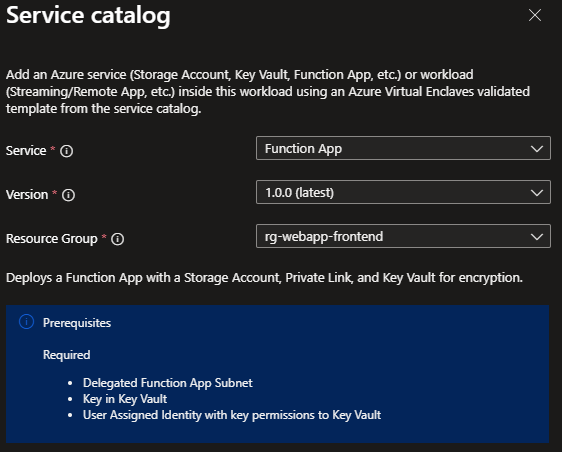

# Deploy an App Service Function App from the service catalog into a workload

Azure Enclave is a cloud networking service that provides organizations with highly sensitive data the ability to quickly deploy and manage workloads across Commercial and air-gapped Azure clouds at scale. In this article, you:

- Deploy a service catalog template for an App Service Function App into an existing workload from the Portal.

> [!NOTE]
> 
> This sample deployment is just for demo purposes and doesn't represent all the best practices for network, systems, or applications administration.

## Before you begin
- This article assumes a basic understanding of networking and Azure Enclave concepts. For more information, see [Best practices of Azure Enclave](./best-practices.md).

- You need an Azure account with an active subscription. If you don't have one, [create an account for free](https://azure.microsoft.com/free/).

- You need a [community](./what-community.md), [enclave](./what-enclave.md), [workload](./what-workload.md), and at least one [workload resource group](./what-workload.md#workload-resource-group) and permissions to create resources inside the workload resource group.

- Enable `Advanced` [maintenance mode](./maintenance-mode.md) for your enclave so you can add the Private Link resources to your enclave managed resource group.

## Prerequisites
There are guardrail requirements on the enclaves to ensure enclave resources are using Customer-Managed Keys (CMK) encryption. This requires a key and identity to access the key to be accessible in the enclave. Create the CMK (optional Key Vault) and Managed Identity in the [Common Dependencies service catalog template](./deploy-common-dependencies-service-catalog.md)

1. Subnet for Private Endpoints: You had the option to create subnets during enclave creation or you can [create new subnets](./create-new-enclave-subnet.md) after enclave creation. The private endpoint subnet should have no [subnet delegation](/azure/virtual-network/subnet-delegation-overview) for the private endpoints to work properly.
  - Use the subnet management feature of the enclave so you have two subnets with size `/26` (for example, 10.0.2.0/26 [10.0.2.0 - 10.0.2.63] and 10.0.2.128/26 [10.0.2.128 - 10.0.2.191])
  - The first subnet is used for the "Subnet Name" template parameter. Create a subnet name with a name like `FunctionAppSubnet` and use the name in deployment step 5 below.
    - Add subnet delegation `Microsoft.Web/serverFarms`
  - The second subnet is used for the "Private Link Subnet Name" template parameter. Create a subnet name like `PrivateLinkSubnet` and use the name in deployment step 5 below.

  > [!NOTE]
  > 
  > You can't resize a subnet once resources are deployed inside the subnet.
  > Two "/26" subnets leave space in the enclave subnet for more subnets (for example another "/26"). If these two subnets are the only subnets needed in the enclave, they can be resized according to your needs.

1. Quickly create these [Private DNS Zones](./deploy-private-dns-zones-service-catalog.md) based on what you create next:
    - `Key Vault` required when creating a Key Vault from this template or the more customizable [Key Vault template](./deploy-key-vault-service-catalog.md).
    - `Storage File`, `Storage Queue`, `Storage Blob`, and `Storage Table` are required when making a Storage Account from this template or the more customizable [Storage Account template](./deploy-storage-account-service-catalog.md).
    - `privatelink.azurewebsites.net` under `Additional Private DNS Zone names` which is required to access Function Apps privately.
1. A Key Vault, Customer Managed Key (CMK), and Managed Identity are required for this template. Create a Key Vault, CMK, and Managed Identity in the [Common Dependencies service catalog quickstart](./deploy-common-dependencies-service-catalog.md) or create your own.
    - These resources should be created inside a [workload resource group](./create-workload-portal.md#add-workload-resource-groups).
    - After creating the User Managed Identity, ensure it has access to the CMK key
        - Assign the `Key Vault Crypto Service Encryption User` RBAC role to the managed identity scoped to the key vault with [these instructions](./create-user-managed-identity.md#assign-role-to-managed-identity). This allows you to then assign the managed identity to another resource, like a Virtual Machine, and that Virtual Machine can encrypt the operating system disk with the CMK in the key vault without having permissions to do other operations on the key vault following least privilege.

## Deploy the template
1. Navigate to the workload for the intended deployment.
1. Select `Add Service` button.
1. Select the `Function App` service template from the [service catalog list](./list-service-catalog-templates.md) dropdown, confirm the version you need (default: `latest`), and select `Next`.

1. On the Basics tab, enter all the required parameters. The Storage Account name is the name of the new storage account.
1. Once the two subnets are created, enter the new subnet names on the Networking tab.
1. On the Encryption tab, enter the name of the new key added to the Key Vault for the Customer Managed Key (CMK) setup.
1. Enter the User Managed Identity Name created during the CMK setup.
1. Adjust any of the prepopulated or default parameters as needed.
1. Select `Review + Create` then `Create`.

It can take 10 minutes to finish all resource creation. Wait for the deployment to be successfully completed before you take any actions within your deployed resources.

## Validate the deployment
Go to the specified resource group to confirm the intended resources were created. Including: Function App and new Storage Account

### Open the Function App resource
1. Open the Function App resource
1. On the overview page, check functions

## Delete the deployment
If you don't plan on keeping these resources, clean up unnecessary resources to avoid Azure charges. If no other deployments exist in the resource group, the whole resource group can be deleted.

## Recommendations
- [Add tags](/azure/azure-resource-manager/management/tag-resources) to service catalog deployments to track important information for that resource such as:
  - Owner: `<main POC>`
  - Deployer: `<yourName>`
  - Purpose: `<automation function>`
  - Service Catalog Name: `<App Service Function App>`
  - Service Catalog Version: `<version you deployed>`
- Consider adding an [Azure Policy to enforce and inherit tags](/azure/azure-resource-manager/management/tag-policies)
