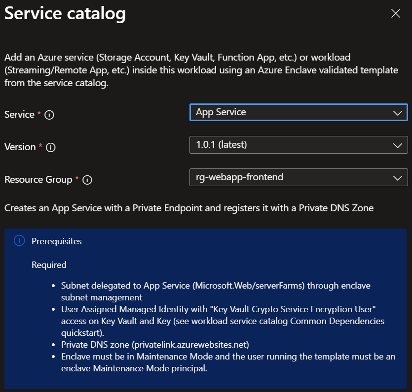

# Deploy an App Service Web App from the service catalog into a workload

Azure Enclave is a cloud networking service that provides organizations with highly sensitive data the ability to quickly deploy and manage workloads across Commercial and air-gapped Azure clouds at scale. In this article, you:

- Deploy a service catalog App Service Web App template into an existing workload from the Azure portal.
- Review an architecture example for a [basic web application](/azure/architecture/web-apps/app-service/architectures/basic-web-app)

> [!NOTE]
> 
> This sample deployment is just for demonstration purposes and doesn't represent all the best practices for network, systems, or applications administration.

## Before you begin
- This article assumes a basic understanding of networking and Azure Enclave concepts. For more information, see [Best practices of Azure Enclave](./best-practices.md).

- You need an Azure account with an active subscription. If you don't have one, [create an account for free](https://azure.microsoft.com/free/).

- You need a [community](./what-community.md), [enclave](./what-enclave.md), [workload](./what-workload.md), and at least one [workload resource group](./what-workload.md#workload-resource-group) and permissions to create resources inside the workload resource group.

- Enable `Advanced` [maintenance mode](./maintenance-mode.md) for your enclave so you can add the Private Link resources to your enclave managed resource group.

## Prerequisites
There are guardrail requirements on the enclaves to ensure enclave resources are using Customer-Managed Keys (CMK) encryption. This requires a key and identity to access the key to be accessible in the enclave. Create the CMK (optional Key Vault) and Managed Identity in the [Common Dependencies service catalog template](./deploy-common-dependencies-service-catalog.md)

1. Subnet for Private Endpoints: You had the option to create subnets during enclave creation or you can [create new subnets](./create-new-enclave-subnet.md) after enclave creation. The private endpoint subnet should have no [subnet delegation](/azure/virtual-network/subnet-delegation-overview) for the private endpoints to work properly.
  - Create new subnet `AzureVirtualEnclaveSubnet /26 [example: 10.0.2.0 - 10.0.2.63]`
    - Add NSG rule set
    - Don't delegate this subnet
    - Use this subnet for private endpoint resources
  - Create new subnet `AppServiceSubnet /26 [example: 10.0.2.64 - 10.0.2.127]`
    - Add NSG rule set
    - Add subnet delegation `Microsoft.Web/serverFarms`
    - Use this subnet for App Service resources
  - Create new subnet `FunctionAppSubnet /26 [example: 10.0.2.128 - 10.0.2.191]`
    - Add NSG rule set
    - Add subnet delegation `Microsoft.Web/serverFarms`
    - Use this subnet for Function App resources

  > [!NOTE]
  > 
  > You can't resize a subnet once resources are deployed inside the subnet.

1. Quickly create these [Private DNS Zones](./deploy-private-dns-zones-service-catalog.md) based on what you create next:
    - Create `privatelink.azurewebsites.net` under `Additional Private DNS Zone names` which is required to access the web app privately.

## Deploy the template
1. Navigate to the [workload](./what-workload.md) for the intended deployment.
1. Select `+Add Azure Service` button.
1. Select the `App Service` service template from the [service catalog list](./list-service-catalog-templates.md) dropdown, confirm the version you need (default: `latest`), and select `Next`.

1. Enter all the required parameters on each page.
1. Adjust any of the prepopulated parameters as needed.
1. Select `Review + Create` then `Create`.

It can take up to 30 minutes to finish all resource creation. Wait for the deployment to be successfully completed before you take any actions within your deployed resources.

## Validate the deployment
Go to the specified resource group to confirm the intended resources were created. Including: App Service, App Service Plan, Private Endpoint, Network Interface

## Delete the deployment
If you don't plan on keeping these resources, clean up unnecessary resources to avoid Azure charges. If no other deployments exist in the resource group, the whole resource group can be deleted.

## Recommendations
- [Add tags](/azure/azure-resource-manager/management/tag-resources) to service catalog deployments to track important information for that resource such as:
  - Owner: `<main POC>`
  - Deployer: `<yourName>`
  - Purpose: `<prod user web app>`
  - Service Catalog Name: `<App Service Web App>`
  - Service Catalog Version: `<version you deployed>`
- Consider adding an [Azure Policy to enforce and inherit tags](/azure/azure-resource-manager/management/tag-policies)
