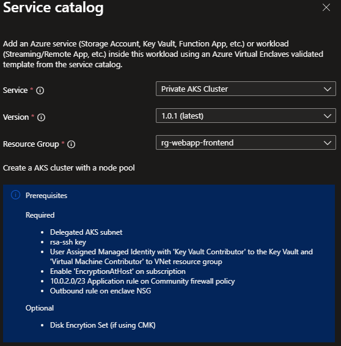

# Deploy Azure Kubernetes Service (AKS) from the service catalog into a workload

Azure Enclave is a cloud networking service that provides organizations with highly sensitive data the ability to quickly deploy and manage workloads across Commercial and air-gapped Azure clouds at scale. In this quickstart, you:

- Deploy a service catalog template for Azure Kubernetes Service (AKS) into an existing workload from the Portal.

> [!NOTE]
> 
> This sample deployment is just for demo purposes and doesn't represent all the best practices for network, systems, or applications administration.

## Before you begin
- This quickstart assumes a basic understanding of networking and Azure Enclave concepts. For more information, see [Best practices of Azure Enclave](./best-practices.md).

- You need an Azure account with an active subscription. If you don't have one, [create an account for free](https://azure.microsoft.com/free/).

- You need a [community](./what-community.md), [enclave](./what-enclave.md), [workload](./what-workload.md), and at least one [workload resource group](./what-workload.md#workload-resource-group) and permissions to create resources inside the workload resource group.

- Enable `Advanced` [maintenance mode](./maintenance-mode.md) for your enclave so you can add the Private Link resources to your enclave managed resource group.

## Prerequisites
There are guardrail policies on the enclaves to ensure enclave resources are using Customer-Managed Keys (CMK) encryption. This policy requires a key and identity to access the key to be accessible in the enclave. Create the CMK (optional Key Vault) and Managed Identity in the [Common Dependencies service catalog template](./deploy-common-dependencies-service-catalog.md)

1. Subnet for Private Endpoints: You can create subnets during enclave creation or you can [create new subnets](./create-new-enclave-subnet.md) after enclave creation. The private endpoint subnet should have no [subnet delegation](/azure/virtual-network/subnet-delegation-overview) for the private endpoints to work properly.
  - Create new subnet `AzureVirtualEnclaveSubnet /26 [example: 10.0.2.0 - 10.0.2.63]`
    - Add Network Security Group (NSG) rule set
    - Don't delegate this subnet
    - Use this subnet for private endpoint resources
  - Create new subnet `aksSubnet /26 [example: 10.0.2.64 - 10.0.2.127]`
    - Use this subnet for Azure Kubernetes Service agent pools
  - Create new subnet `agentSubnet /26 [example: 10.0.2.128 - 10.0.2.191]`
    - Use this subnet for Azure Kubernetes Service managed cluster API server
  - For a 30 pod cluster with a max node count of 3, a /26 subnet is required. Use the following equation to calculate the minimum subnet size including an extra node for upgrade operations: `(node count + 1) + ((node count + 1) * maximum pods per node that you configure)`.

  > [!NOTE]
  > 
  > You can't resize a subnet once resources are deployed inside the subnet.

1. Quickly create these [Private DNS Zones](./deploy-private-dns-zones-service-catalog.md) based on what you create next:
    - `Key Vault` required when creating a Key Vault from this template or the more customizable [Key Vault template](./deploy-key-vault-service-catalog.md).
    - `Storage File`, `Storage Queue`, `Storage Blob`, and `Storage Table` are required when making a Storage Account from this template or the more customizable [Storage Account template](./deploy-storage-account-service-catalog.md).
    - `privatelink.{regionName}.azmk8s.io` under `Additional Private DNS Zone names`, which is required to access AKS privately.
1. Create an RSA key for SSH named **aks-ssh-public-key** and store it as a secret in your key vault. Create the public key type use ssh-keygen from PowerShell: `ssh-keygen -t RSA -f test`
    - Two files are created and you use the public key. (located in test.pub)
    - Save the key as a secret named 'aks-ssh-public-key' in your keyvault

    > [!NOTE]
    >
    > You must create or use a Key Vault for your AKS cluster. If using Key Vault for secret management, it needs to be configured for Role Base Access Control (RBAC) by enabling the `RBAC Access Policy`. The RBAC roles for the AKS identity need to be set to `Key Vault Admin` and the disk encryption set you created needs the `Key Vault Crypto Service Encryption User` role.

1. A Key Vault, Customer Managed Key (CMK), Managed Identity, and Disk Encryption Set are required for this template. Create a Key Vault, CMK, Managed Identity, and Disk Encryption Set in the [Common Dependencies service catalog quickstart](./deploy-common-dependencies-service-catalog.md) or create your own.
    - These resources should be created inside a [workload resource group](./create-workload-portal.md#add-workload-resource-groups).
    - After creating the User Managed Identity, ensure it has access to the CMK key
        - Assign the `Key Vault Crypto Service Encryption User` RBAC role to the managed identity scoped to the key vault with [these instructions](./create-user-managed-identity.md#assign-role-to-managed-identity). This assignment allows you to then assign the managed identity to another resource, like a Virtual Machine. That Virtual Machine can encrypt the operating system disk with the CMK in the key vault without having permissions to do other operations on the key vault (a least privilege best practice).
        - Assign `Virtual Machine Contributor` access on the enclave managed resource group containing the Virtual Network 
        - Assign `Key Vault Contributor` access to the resource group containing the ssh-key.
        - (Optional) Azure Container Registry: Typical configuration requires granting the `Acr Pull` role to the AKS managed identity for the container registry resource. In addition if the container registry is configured to use a public storage account, that URL must be added as a community endpoint to create the firewall policy.
    - External services using the enclave Virtual Network: If using the enclave Virtual Network as the dedicated subnet for the cluster service, you also need to grant the managed identity `Contributor` on the Virtual Network resource group.
1. In order to deploy AKS, you must deploy to a subscription that allows `EncryptionAtHost`. To do this setting, first set your azContext to ensure you're using the correct subscription, and then execute:
`Register-AzProviderFeature -FeatureName "EncryptionAtHost" -ProviderNamespace "Microsoft.Compute"`.

> [!NOTE]
> 
> This command might take several minutes, to check on the status of this registration run:
`Get-AzProviderFeature -FeatureName "EncryptionAtHost" -ProviderNamespace "Microsoft.Compute"`

1. In order to deploy AKS within an Azure Enclave, you must deploy to a subscription that allows `EnableAPIServerVnetIntegrationPreview`. First set your azContext to ensure you're using the correct subscription, and then execute: `Register-AzProviderFeature -FeatureName EnableAPIServerVnetIntegrationPreview -ProviderNamespace Microsoft.ContainerService`.

> [!NOTE]
> 
> This command might take several minutes, to check on the status of this registration run: `Get-AzProviderFeature -FeatureName EnableAPIServerVnetIntegrationPreview -ProviderNamespace Microsoft.ContainerService`

1. Add the following Firewall rule to your community firewall policy as an Application rule:
    - Source: 10.0.2.0/23
    - Protocol: Https:443
    - Destination type: FQDN
    - Target FQDNs: `mcr.microsoft.com,*.hcp.useast2.azmk8s.io,*.data.mcr.microsoft.com,management.azure.com,login.microsoftonline.com,packages.microsoft.com,acs-mirror.azureedge.net`
1. Add the following outbound rule to your enclave NSG:
    - source: any
    - sourcePortRanges: *
    - Destination: Service Tag
    - Destination service tag: internet
    - Service: custom
    - Destination port ranges: 443
    - protocol: any
    - action: allow
    - priority: 1000

More information about these rules can be found in this [documentation](/azure/aks/outbound-rules-control-egress)

## Deploy the template

> [!NOTE]
>
> Make sure the AKS cluster version is supported in the location where the AKS resource is being deployed. Run `az aks get-versions --location <location-name>` to get a list of supported versions for a given location.

1. Navigate to the workload for the intended deployment.
1. Select `+Add an Azure Service` button.
1. Select the `Private AKS Cluster` service template from the [service catalog list](./list-service-catalog-templates.md) dropdown. Confirm the version you need (default: `latest`) and select `Next`.



1. Go through each tab and enter all the required parameters.
1. Use `172.16.0.0/16` for the serviceCidr and `172.16.0.10` for the dnsServiceIP
1. Adjust any of the prepopulated parameters as needed.
1. Select `Review + Create` then `Create`.

It can take up to 30 minutes to finish all resource creation. Wait for the deployment to be successfully completed before you take any actions within your deployed resources.

> [!IMPORTANT]
>
> If you're deploying an AKS cluster within an Azure Enclave, you need to make sure that the user assigned managed identity has sufficient permissions to perform operations within an enclave. Add the managed identity to the enclave's [Maintenance Mode](./maintenance-mode.md) principals configuration. This permission ensures that the user assigned managed identity doesn't get blocked by any enclave deny assignments.

### (Optional) Associating AKS resource groups to workload

The Azure Enclave workload resource, as of API version `2024-06-01-preview`, now supports multiple resource groups. This feature means that an Azure Enclave workload can now apply Azure Enclave policies to multiple resource groups.

Once the AKS deployment succeeds, the AKS deployment's User RG and MRG can be brought to a workload by running an API PUT request for the workload resource. An example of a request body for an API PUT request for a workload resource:

```json
{
    "$schema": "https://schema.management.azure.com/schemas/2019-04-01/deploymentTemplate.json#",
    "contentVersion": "1.0.0.0",
    "parameters": {},
    "resources": [
        {
            "type": "Microsoft.Mission/virtualEnclaves/workloads",
            "apiVersion": "2024-06-01-preview",
            "name": "<virtual-enclave-name>/<workload-name>",
            "location": "<some-location>",
            "tags": {
                "department": "MIP",
                "company": "MIP"
            },
            "properties": {
                "resourceGroupCollection": [
                    "<resource-id-of-the-user-rg-where-aks-cluster-is-deployed>",
                    "<resource-id-of-the-aks-cluster-mrg>"
                ]
            }
        }
    ]
}
```

## Validate the deployment
Go to the specified resource group to confirm the intended resources were created.

### Connect
Via the Admin VM:
The Admin VM is used for administrator access the resources within the enclave boundary from outside the boundary. The Admin VM is also called a "jumpbox."
1. Sign-in to the Admin VM you deployed for your enclave or [create a new Admin VM](./deploy-admin-vm-service-catalog.md)
1. From the start menu, type `RDP`, and open the RDP window
1. Enter the Virtual Machine IP address as the destination IP address for the RDP connection.
1. Enter Virtual Machine credentials and select `Accept/Yes` to warnings about a new connection.
1. From the Virtual Machine desktop, validate any VM settings set during the deployment. Otherwise, start using your new resources.

## Delete the deployment
If you don't plan on keeping these resources, clean up unnecessary resources to avoid Azure charges. If no other deployments exist in the resource group, the whole resource group can be deleted.

## Recommendations
- [Add tags](/azure/azure-resource-manager/management/tag-resources) to service catalog deployments to track important information for that resource such as:
  - Owner: `<main POC>`
  - Deployer: `<yourName>`
  - Purpose: `<devsecops containers>`
  - Service Catalog Name: `<AKS>`
  - Service Catalog Version: `<version you deployed>`
- Consider adding an [Azure Policy to enforce and inherit tags](/azure/azure-resource-manager/management/tag-policies)
