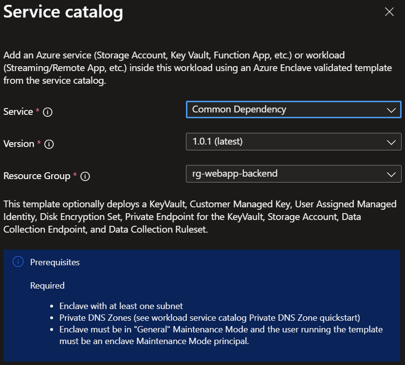

# Deploy Common Dependencies from the service catalog into a workload

Azure Enclave is a cloud networking service that provides organizations with highly sensitive data the ability to quickly deploy and manage workloads across Commercial and air-gapped Azure clouds at scale. In this quickstart, you:

Deploy a service catalog template for Common Dependencies when deploying Azure services into an existing workload from the Portal. The template includes the options to create a:
  - [Key Vault](/azure/key-vault/general/overview)
  - [Customer Managed Key (CMK)](/azure/storage/common/customer-managed-keys-overview) for encryption
  - [Disk Encryption Set (DES)](/azure/virtual-machines/disk-encryption#full-control-of-your-keys) for disk encryption
  - [Storage Account](/azure/storage/common/storage-account-overview) quickstart. See the separate Storage Account service catalog template for more deployment customization
  - [Managed Identity](/entra/identity/managed-identities-azure-resources/how-manage-user-assigned-managed-identities) to securely access your resources within Azure Enclave

> [!NOTE]
>
> This sample deployment is just for demo purposes and doesn't represent all the best practices for network, systems, or applications administration.

## Before you begin
- This quickstart assumes a basic understanding of networking and Azure Enclave concepts. For more information, see [Best practices of Azure Enclave](./best-practices.md).

- You need an Azure account with an active subscription. If you don't have one, [create an account for free](https://azure.microsoft.com/free/).

- You need a [community](./what-community.md), [enclave](./what-enclave.md), [workload](./what-workload.md), and at least one [workload resource group](./what-workload.md#workload-resource-group) and permissions to create resources inside the workload resource group.

- Enable `General` (minimum) or `Advanced` [maintenance mode](./maintenance-mode.md) for your enclave so you can add the Private Link resources to your enclave managed resource group.

## Prerequisites
There are guardrail requirements on the enclaves to ensure enclave resources are using Customer-Managed Keys (CMK) encryption. This requires a key and identity to access the key to be accessible in the enclave. Create the CMK (optional Key Vault) and Managed Identity in the [Common Dependencies service catalog template](./deploy-common-dependencies-service-catalog.md)

1. Subnet for Private Endpoints: You had the option to create subnets during enclave creation or you can [create new subnets](./create-new-enclave-subnet.md) after enclave creation.
1. Quickly create these [Private DNS Zones](./deploy-private-dns-zones-service-catalog.md) based on what you create next:
    - `Key Vault` required when creating a Key Vault from this template or the more customizable [Key Vault template](./deploy-key-vault-service-catalog.md).
    - `Storage File`, `Storage Queue`, `Storage Blob`, and `Storage Table` are required when making a Storage Account from this template or the more customizable [Storage Account template](./deploy-storage-account-service-catalog.md).

## Deploy the template
1. Navigate to the workload for the intended deployment.
1. Select `Add Service` button.
1. Select the `Common Dependencies` service template from the [service catalog list](./list-service-catalog-templates.md) dropdown, confirm the version you need (default: `latest`), and select `Next`.

1. Go through each tab and enter all the required parameters.
1. Adjust any of the prepopulated parameters as needed.
1. Select `Review + Create` then `Create`.

It can take 30 minutes to finish all resource creation. Wait for the deployment to be successfully completed before you take any actions within your deployed resources.

## Validate the deployment
Go to the specified resource group to confirm the intended resources were created.

## Delete the deployment
If you don't plan on keeping these resources, clean up unnecessary resources to avoid Azure charges. If no other deployments exist in the resource group, the whole resource group can be deleted.

## Recommendations
- [Add tags](/azure/azure-resource-manager/management/tag-resources) to service catalog deployments to track important information for that resource such as:
  - Owner: `<main POC>`
  - Deployer: `<yourName>`
  - Purpose: `<enclave shared resources>`
  - Service Catalog Name: `<Common Dependencies>`
  - Service Catalog Version: `<version you deployed>`
- Consider adding an [Azure Policy to enforce and inherit tags](/azure/azure-resource-manager/management/tag-policies)

## Troubleshooting

### Expiration date doesn't match
If you deploy the Common Dependencies template and see an error about the expiration date not matching for the CMK (Customer Managed Key) resource, you probably have a CMK (a Key Vault key) with the same name already. This can occur if you deploy the template with the same inputs twice since the expiration date can't be updated through a redeployment. This means that your CMK already exists and you can use it as-is. If you need to update the CMK, you can log in to your Admin VM, then access the key vault via the portal to make changes. You can also redeploy the Common Dependencies template again and change the name of the CMK to create a new CMK.