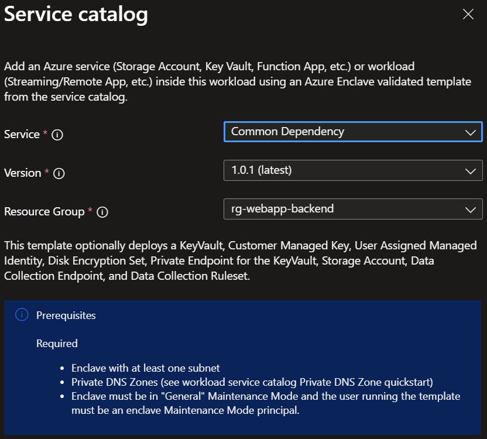

# Deploy Common Dependencies from the service catalog into a workload

In this article, you:

- Deploy a service catalog template for common dependencies into an existing workload from the portal.

The common dependencies template includes options to create the following resources:
  - [Key Vault](/azure/key-vault/general/overview)
  - [Customer Managed Key (CMK)](/azure/storage/common/customer-managed-keys-overview) for encryption
  - [Disk Encryption Set (DES)](/azure/virtual-machines/disk-encryption#full-control-of-your-keys) for disk encryption
  - [Storage Account](/azure/storage/common/storage-account-overview). See the separate [Storage Account service catalog template](./deploy-storage-account-service-catalog.md) for more deployment customization.
  - [Managed Identity](/entra/identity/managed-identities-azure-resources/how-manage-user-assigned-managed-identities) to securely access your resources within Azure Enclave

> [!NOTE]
>
> This sample deployment is just for demonstration purposes and doesn't represent all the best practices for network, systems, or applications administration.

## Before you begin
- This article assumes a basic understanding of networking and Azure Enclave concepts. For more information, see [Best practices of Azure Enclave](./best-practices.md).

- You need an Azure account with an active subscription. If you don't have one, [create an account for free](https://azure.microsoft.com/free/).

- You need a [community](./what-community.md), [enclave](./what-enclave.md), [workload](./what-workload.md), and at least one [workload resource group](./what-workload.md#workload-resource-group) and permissions to create resources inside the workload resource group.

- Enable `General` (minimum) or `Advanced` [maintenance mode](./maintenance-mode.md) for your enclave so you can add the Private Link resources to your enclave managed resource group.

## Prerequisites
The enclaves have guardrail requirements to use customer-managed key (CMK) encryption for some resources. Create a key and an identity with access to the key for secured key access. Use this Common Dependencies service catalog template to create the CMK, with an optional Key Vault, and a managed identity.

1. Subnet for private endpoints: You can create subnets during enclave creation, or you can [create new subnets](./create-new-enclave-subnet.md) after enclave creation.
1. Quickly create these [Private DNS Zones](./deploy-private-dns-zones-service-catalog.md) based on what you create next:
    - `Key Vault` required when creating a Key Vault from this template or the more customizable [Key Vault template](./deploy-key-vault-service-catalog.md).
    - `Storage File`, `Storage Queue`, `Storage Blob`, and `Storage Table` are required when making a Storage Account from this template or the more customizable [Storage Account template](./deploy-storage-account-service-catalog.md).

## Deploy the template
1. Navigate to the workload for the intended deployment.
1. Select the `+Add an Azure Service` button.
1. Select the `Common Dependencies` service template from the [service catalog list](./list-service-catalog-templates.md) dropdown, confirm the version you need (default: `latest`), and select `Next`.

   

1. Enter the required parameters on each tab.
1. Adjust any of the prepopulated parameters as needed.
1. Select `Review + Create` then `Create`.

Wait for the deployment to complete before you take any actions within your deployed resources.

## Validate the deployment
Go to the specified resource group to confirm the intended resources were created.

## Delete the deployment
If you don't plan on keeping these resources, clean up unnecessary resources to avoid Azure charges. If no other deployments exist in the resource group, the whole resource group can be deleted.

## Recommendations
- [Add tags](/azure/azure-resource-manager/management/tag-resources) to service catalog deployments to track important information for that resource such as:
  - Owner: `<main POC>`
  - Deployer: `<yourName>`
  - Purpose: `<enclave shared resources>`
  - Service Catalog Name: `<Common Dependencies>`
  - Service Catalog Version: `<version you deployed>`
- Consider adding an [Azure Policy to enforce and inherit tags](/azure/azure-resource-manager/management/tag-policies).

## Troubleshooting

### Expiration date doesn't match
If you deploy the Common Dependencies template and see an error stating the expiration date doesn't match for the CMK (Customer Managed Key) resource, you likely already have a CMK (a Key Vault key) with the same name. This error can occur if you deploy the template with the same inputs twice, since the expiration date can't be updated through a redeployment. This error means your CMK already exists and you can use it as-is. If you need to update the CMK, sign in to your Admin VM, and then access the key vault through the portal to make changes. You can also redeploy the Common Dependencies template and change the name of the CMK to create a new CMK.
