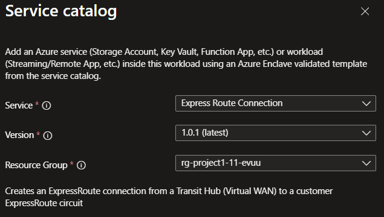

# Deploy ExpressRoute connection from the service catalog into a workload

Use the [ExpressRoute](/azure/expressroute/expressroute-introduction) connection template to connect a transit hub ExpressRoute gateway to a customer-owned ExpressRoute circuit. This template creates the connection object that links the service catalog deployment to your existing circuit.

In this article, you:

- Deploy the ExpressRoute connection service catalog template into an existing workload from the Azure portal.

> [!NOTE]
>
> This article covers the service catalog deployment flow only. You still need a provisioned ExpressRoute circuit with `AzurePrivatePeering` configured before the connection can become active.

## Before you begin

- This article assumes a basic understanding of Azure Enclave and network connectivity concepts. For more information, see [Best practices of Azure Enclave](./best-practices.md).
- You need an Azure account with an active subscription. If you don't have one, [create an account for free](https://azure.microsoft.com/free/).
- You need a [community](./what-community.md), [enclave](./what-enclave.md), [workload](./what-workload.md), and permissions to create resources inside the workload resource group.

## Prerequisites

1. An active ExpressRoute circuit provisioned through a carrier.
1. `AzurePrivatePeering` configured on the circuit.
1. If the circuit is in another subscription, an authorization key from the circuit owner.
1. The circuit SKU supports the transit hub region:
   - `Standard` is the minimum recommended SKU.
   - `Local` only works when the transit hub is in the same metro.
   - `Premium` is required for cross-geo connectivity.

Use these Azure PowerShell commands to confirm the circuit is ready:

```powershell
$circuit = Get-AzExpressRouteCircuit -ResourceGroupName "<circuit-rg>" -Name "<circuit-name>"
$circuit | Select-Object Name, SkuTier, CircuitProvisioningState, ServiceProviderProvisioningState, PeeringLocation | Format-Table
$circuit.Peerings | Select-Object Name, State, PeeringType | Format-Table
```

If `AzurePrivatePeering` is missing, your network team must add it before deployment.

## Deploy the template

1. Go to the workload for the intended deployment.
1. Select `+ Add an Azure Service`.
1. Select `ExpressRoute Connection` from the [service catalog list](./list-service-catalog-templates.md), confirm the version you need (default: `latest`), and then select `Next`.

   

1. Enter the required values on each tab.
1. Review any prepopulated values and adjust them as needed.
1. Select `Review + Create`. If validation passes, select `Create`.

## Validate the deployment

Go to the target resource group and confirm that the ExpressRoute connection is created.

You can also verify the connection by using Azure PowerShell.

```powershell
Get-AzResource -ResourceGroupName "<hosted-resources-rg>" -ResourceType "Microsoft.Network/expressRouteGateways/expressRouteConnections" -Name "<connection-name>" | Select-Object Name, ResourceId, Location | Format-Table
```

## Delete the deployment

If you don't plan to keep the connection, remove it from the workload to avoid unnecessary Azure charges.

## Recommendations

- Keep the circuit and gateway configuration aligned with the same peering and authorization details.
- Add tags to service catalog deployments to track ownership, purpose, and version.
- Review the Azure ExpressRoute documentation for circuit and peering guidance:
  - [ExpressRoute overview](/azure/expressroute/expressroute-introduction)
  - [ExpressRoute circuit peerings](/azure/expressroute/expressroute-circuit-peerings)
