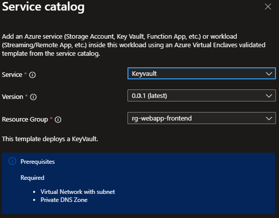

# Deploy a Key Vault from the service catalog into a workload

In this article, you:

- Deploy a service catalog template for a Key Vault into an existing workload from the Portal.

> [!NOTE]
> 
> This sample deployment is just for demonstration purposes and doesn't represent all the best practices for network, systems, or applications administration.

## Before you begin
- This article assumes a basic understanding of networking and Azure Enclave concepts. For more information, see [Best practices of Azure Enclave](./best-practices.md).

- You need an Azure account with an active subscription. If you don't have one, [create an account for free](https://azure.microsoft.com/free/).

- You need a [community](./what-community.md), [enclave](./what-enclave.md), [workload](./what-workload.md), and at least one [workload resource group](./what-workload.md#workload-resource-group) and permissions to create resources inside the workload resource group.

- Enable `Advanced` [maintenance mode](./maintenance-mode.md) for your enclave so you can add the Private Link resources to your enclave managed resource group.

## Prerequisites
There are guardrail requirements on the enclaves to ensure enclave resources are using Customer-Managed Keys (CMK) encryption. This requires a key and identity to access the key to be accessible in the enclave. Create the CMK (optional Key Vault) and Managed Identity in the [Common Dependencies service catalog template](./deploy-common-dependencies-service-catalog.md)

1. Subnet for Private Endpoints: You had the option to create subnets during enclave creation or you can [create new subnets](./create-new-enclave-subnet.md) after enclave creation. The private endpoint subnet should have no [subnet delegation](/azure/virtual-network/subnet-delegation-overview) for the private endpoints to work properly.
1. Quickly create these [Private DNS Zones](./deploy-private-dns-zones-service-catalog.md) based on what you create next:
    - `Key Vault` required when creating a Key Vault from this template or the more customizable [Key Vault template](./deploy-key-vault-service-catalog.md).

## Deploy the template
1. Navigate to the workload for the intended deployment.
1. Select `+Add an Azure Service` button.
1. Select the `Key Vault` service template from the [service catalog list](./list-service-catalog-templates.md) dropdown, confirm the version you need (default: `latest`), and select `Next`.

  

1. Enter the required parameters on each tab.
1. Adjust any of the prepopulated parameters as needed.
1. Select `Review + Create` then `Create`.

It can take up to 15+ minutes to finish all resource creation. Wait for the deployment to be successfully completed before you take any actions within your deployed resources.

## Validate the deployment
Go to the specified resource group to confirm the intended resources were created. Including: key vault and private endpoint.

## Delete the deployment
If you don't plan on keeping these resources, clean up unnecessary resources to avoid Azure charges. If no other deployments exist in the resource group, the whole resource group can be deleted.

## Recommendations
- [Add tags](/azure/azure-resource-manager/management/tag-resources) to service catalog deployments to track important information for that resource such as:
  - Owner: `<main POC>`
  - Deployer: `<yourName>`
  - Purpose: `<shared secrets>`
  - Service Catalog Name: `<Key Vault>`
  - Service Catalog Version: `<version you deployed>`
- Consider adding an [Azure Policy to enforce and inherit tags](/azure/azure-resource-manager/management/tag-policies).
