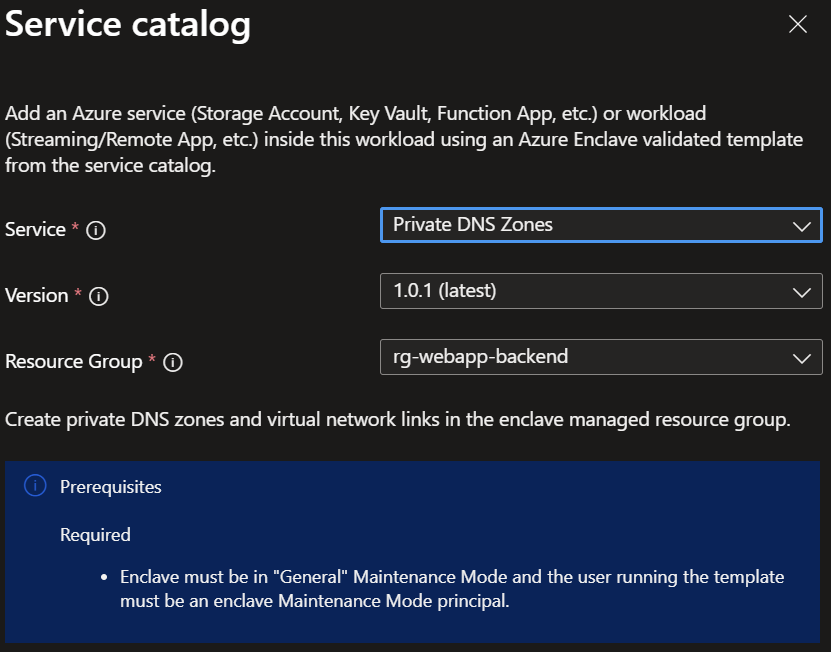

# Deploy private DNS zones from the service catalog into a workload

Azure Enclave is a cloud networking service that provides organizations with highly sensitive data the ability to quickly deploy and manage workloads across Commercial and air-gapped Azure clouds at scale. In this quickstart, you:

- Deploy a service catalog template for Private DNS Zones into an existing enclave from the Portal. The template includes the options to create private DNS zones for Azure storage, key vault, SQL, container registry, or a specified private DNS zone name like one you created or another one from this [list of Azure Private DNS Zones](/azure/private-link/private-endpoint-dns). This allows you to connect privately and securely to the Azure service. [Learn more](/azure/private-link/private-link-overview)

> [!NOTE]
>
> This sample deployment is just for demo purposes and doesn't represent all the best practices for network, systems, or applications administration.

## Before you begin
- This quickstart assumes a basic understanding of networking and Azure Enclave concepts. For more information, see [Best practices of Azure Enclave](./best-practices.md).

- You need an Azure account with an active subscription. If you don't have one, [create an account for free](https://azure.microsoft.com/free/).

- You need a [community](./what-community.md), [enclave](./what-enclave.md), and [workload](./what-workload.md) and permissions to create resources inside the enclave managed resource group.

- Enable `General` (minimum) or `Advanced` [maintenance mode](./maintenance-mode.md) for your enclave so you can add the Private Link resources to your enclave managed resource group.

## Deploy the template
1. Navigate to the workload for the intended deployment.
1. Select `Add Service` button.
1. Select the `Private DNS Zones` service template from the [service catalog list](./list-service-catalog-templates.md) dropdown, confirm the version you need (default: `latest`), and select `Next`.

> [!NOTE]
> 
> This template deploys resources into the [enclave managed resource group](./best-practices.md#enclave-managed-resource-group) by default because the other enclave private DNS zones are located there.

1. Go through each tab and enter all the required parameters.
1. Adjust any of the prepopulated parameters as needed.
1. Select `Review + Create` then `Create`.

It can take a few minutes to finish all resource creation. Wait for the deployment to be successfully completed before you take any actions within your deployed resources.

## Validate the deployment
Go to the specified resource group to confirm the intended resources were created.

> [!NOTE]
> 
> This template deploys resources into the [enclave managed resource group](./best-practices.md#enclave-managed-resource-group) by default because the other enclave private DNS zones are located there.

## Delete the deployment
If you don't plan on keeping these resources, clean up unnecessary resources to avoid Azure charges. If no other deployments exist in the resource group, the whole resource group can be deleted.

## Private DNS zones
This template has multiple options you can select based on the resources you want to create next:
- Storage file: required for file share storage
- Storage queue: required for queue storage
- Storage table: required for table storage
- Storage blob: required for blob storage
- Key vault: required for Key Vaults
- Azure SQL: required for Azure SQL
- Container registry: required for Container Registries
- Additional: optional array of DNS zone names to deploy. Example: ["privatelink.table.cosmos.azure.com","privatezone1.com"] where the first name is for Cosmos DB and the second name is a custom name created by you.

## Recommendations
- [Add tags](/azure/azure-resource-manager/management/tag-resources) to service catalog deployments to track important information for that resource such as:
  - Owner: `<main POC>`
  - Deployer: `<yourName>`
  - Purpose: `<prod private DNS zones>`
  - Service Catalog Name: `<Private DNS Zones>`
  - Service Catalog Version: `<version you deployed>`
- Consider adding an [Azure Policy to enforce and inherit tags](/azure/azure-resource-manager/management/tag-policies)
