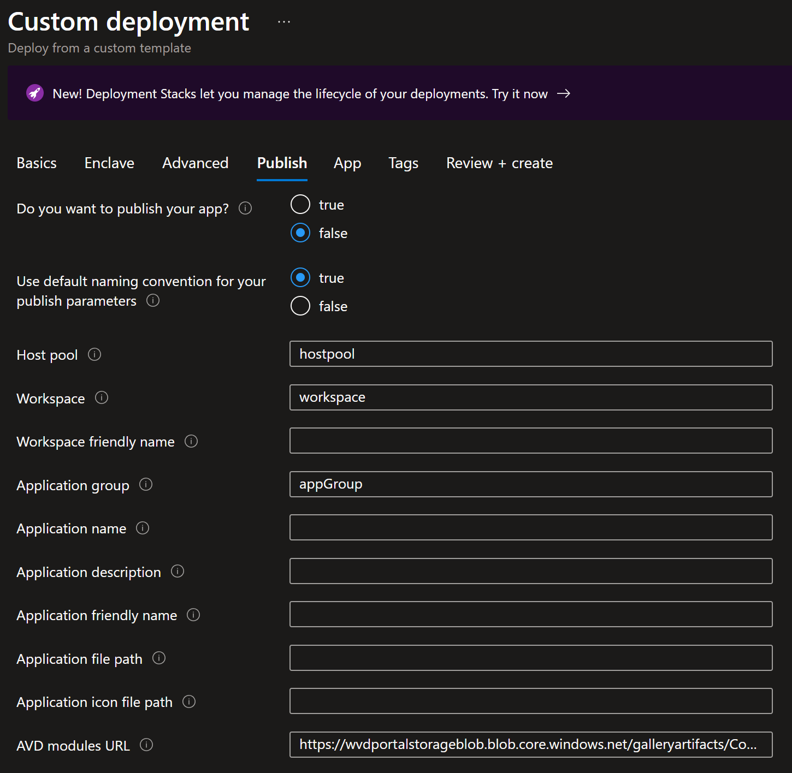

# Deploy Virtual Machine from the service catalog into a workload
The Virtual Machine (VM) template creates a Virtual Machine which helps with multiple workload scenarios. The Virtual Machine template also allows you to publish an application as an Azure Virtual Desktop RemoteApp so you can host a managed app and stream it to individual users.

In this article, you:

- Deploy a service catalog template for a Virtual Machine into an existing workload from the Azure portal.

> [!NOTE]
> 
> This sample deployment is just for demonstration purposes and doesn't represent all the best practices for network, systems, or applications administration.

## Deploy Options
The Virtual Machine template can be deployed in multiple configurations:
1. Virtual Machine (~10 min)
1. Virtual Machine domain-joined (~12 min)
1. Virtual Machine domain-joined and published as a RemoteApp (~20 min)

## Before you begin
- This quickstart assumes a basic understanding of networking and Azure Enclave concepts. For more information, see [Concepts and best practices of Azure Enclave](./best-practices.md).

- You need an Azure account with an active subscription. If you don't have one, [create an account for free](https://azure.microsoft.com/free/).

- You need a [community](./what-community.md), [enclave](./what-enclave.md), [workload](./what-workload.md), and at least one [workload resource group](./what-workload.md#workload-resource-group) and permissions to create resources inside the workload resource group.

- Enable `Advanced` [maintenance mode](./maintenance-mode.md) for your enclave so you can add the Private Link resources to your enclave managed resource group.

## Prerequisites
There are guardrail requirements on the enclaves to ensure enclave resources are using Customer-Managed Keys (CMK) encryption. You need a key in a key vault and a managed identity to access the key. Create the CMK (optional Key Vault) and Managed Identity in the [Common Dependencies service catalog template](./deploy-common-dependencies-service-catalog.md)

1. Subnet for Private Endpoints: You can create subnets during enclave creation or you can [create new subnets](./create-new-enclave-subnet.md) after enclave creation. The private endpoint subnet should have no [subnet delegation](/azure/virtual-network/subnet-delegation-overview) for the private endpoints to work properly.
1. Quickly create these [Private DNS Zones](./deploy-private-dns-zones-service-catalog.md) based on what you create next:
    - `Key Vault` required when creating a Key Vault from this template or the more customizable [Key Vault template](./deploy-key-vault-service-catalog.md).
    - `Storage File`, `Storage Queue`, `Storage Blob`, and `Storage Table` are required when making a Storage Account from this template or the more customizable [Storage Account template](./deploy-storage-account-service-catalog.md).
1. A Key Vault, Customer Managed Key (CMK), and Managed Identity are required for this template. Create a Key Vault, CMK, and Managed Identity in the [Common Dependencies service catalog quickstart](./deploy-common-dependencies-service-catalog.md) or create your own.
    - These resources should be created inside a [workload resource group](./create-workload-portal.md#add-workload-resource-groups).
    - After creating the User Managed Identity, ensure it has access to the CMK key
        - Assign the `Key Vault Crypto Service Encryption User` role to the managed identity scoped to the key vault with [these instructions](./create-user-managed-identity.md#assign-role-to-managed-identity). This role allows you to then assign the managed identity to another resource, like a Virtual Machine. Then that Virtual Machine can encrypt the operating system disk with the CMK in the key vault without having permissions to do other operations on the key vault. Assigning a managed identity in this way is a least privilege best practice.
1. (optional) An existing domain to join if the `Admin VM` is domain joined.

## Deploy the template
1. Navigate to the workload for the intended deployment.
1. Select `+Add an Azure Service` button.
1. Select the `Virtual Machine` service template from the [service catalog list](./list-service-catalog-templates.md) dropdown
1. Confirm the version you need (default: `latest`) and select `Next`.

1. Enter all the required parameters on each of the tabs.
1. For `OS Disk Encryption Name` and `OS Disk Encryption Resource Group Name`, enter the names used in the prerequisites section.
1. Adjust the prepopulated parameters as needed. 
1. (Optional) [Publish your RemoteApp](#publish-remoteapp-optional) to other users.
1. (Optional) [Join a domain](#join-a-domain-optional) on your virtual machine.
1. (Optional) [Install application](#install-remoteapp-optional) to your RemoteApp.
1. Select `Review + Create`, if all validations passed, select `Create`.

## Join a domain (optional)
1. Should you choose to Domain Join your Virtual Machine, you need to select which method you want (Active Directory or Microsoft Entra ID) on the Basic tab and enter the domain joining information.
1. For the `Active Directory` Domain join options, see the following examples

   > [!NOTE]
   > 
   > If the domain controller is inside an enclave, you need an enclave endpoint for the enclave with the domain controller to allow domain joining in the domain controller subnet, `TCP, UDP` protocols, and these ports `53,88,135,138,139,389,443,445,464,636,686,3268`.
   > You need a DNS Forwarder in your enclave forwarding DNS traffic to your Domain Controller.

   * The Domain name should be in the format of `contoso.com`
   * Organization Unit (OU) path should be in the format of `OU=Organizations,DC=contoso,DC=com` and can be left blank if the default `Computers` OU path is fine.
   * `Domain admin username` and `Domain admin password` should match the domain joining credentials for the domain controller

1. For the `Microsoft Entra ID` Domain join option,
   * First you need to [deploy an Microsoft Entra Domain Services managed domain](/entra/identity/domain-services/tutorial-create-instance)
   * Next you need to use the domain you created to [create an OU](/entra/identity/domain-services/create-ou) or use the default OU of `Computers`
   * Use the previously created OU and Domain to fill in these respective parameters for your virtual machine

## Publish RemoteApp (Optional)
If you publish your application, all of the following fields on this tab must be filled out.

- **Use default naming convention for your publish parameters**: Keeping the default to `True` will ignore the parameter values for `host pool`, `workspace`, and `Application Group` and instead will create resources in this format `<vmName>-<resourceName>` (for example "vm01-hostpool"). You can still add the friendly names to improve the names that you will see.
- **Application file path**: Provide the file path on the VM app for the application (for example, `C:\Program Files (x86)\Microsoft\Edge\Application\msedge.exe` with no "quotes")
- **Application icon file path**: Provide the file path on the VM for the icon (for example, `C:\Program Files (x86)\Microsoft\Edge\Application\msedge.exe` with no "quotes")
- **Azure Virtual Desktop modules URL**: Provide the URL for Azure Virtual Desktop modules for your cloud. The Azure Commercial URL is provided by default. As an example, if you are deploying to the Azure Government Cloud the URL is `https://wvdportalstorageblob.blob.core.usgovcloudapi.net/galleryartifacts/Configuration_01-20-2022.zip`.

It can take 20+ minutes to finish all resource creation. Wait for the deployment to be successfully completed before you take any actions within your deployed resources.

## Validate the deployment
1. Go to the specified resource group, the workload resource group by default, and confirm the intended resources were created. Including: Virtual Machine and OS Disk.
1. If the RemoteApp was published: host pool, app group, and workspace.

## Connect to the Application Virtual Machine
Via the [Admin VM](./understand-admin-vm.md):
The Admin VM is used for administrator access the resources within the enclave boundary from outside the boundary. The Admin VM might also be called a "jumpbox."
1. Sign in to a desktop session on the [Admin VM](./understand-admin-vm.md) page for the enclave.
1. From the start menu, type `RDP`, and open the Remote Desktop Connection app.
1. Enter the Virtual Machine IP address as the destination IP address for the Remote Desktop Connection.
1. Enter Virtual Machine credentials and select `Accept/Yes` to warnings about a new connection.
1. From the Virtual Machine desktop, validate any Virtual Machine settings set during the deployment or complete any custom configuration.
1. Next, [install application](#install-remoteapp-optional)
1. Assign a security group assignment to give users access to your RemoteApp(s).

## Install RemoteApp (Optional)
Install an application on your Virtual Machine using one of these methods or a method you're familiar with.

- [Install via Virtual Machine](./application-deployment-using-remote-app-vm.md) (install or configure an application for RemoteApp publishing)
- Prerequisites:
    1. A [container](/azure/storage/blobs/blob-containers-portal) (artifacts) within the [storage account](./deploy-storage-account-service-catalog.md).
        - **Private or Public Container**
            - *Private Container* - securely store installers, main script, and any supporting scripts. 
                - Choose this option if your scripts or installers can’t be shared with others who have access to that storage account container.
            - *Public Container* - stores publicly accessible artifacts in the remoteappvm folder in the service catalog's container
        - App Folder:
            - app installer (ex: VSCodeSetup.exe)
            - main script to install the application (and any other supporting scripts)
    1. A copy of [AzCopy.exe](./application-deployment-using-remote-app-vm.md#prerequisites)
    1. A [community endpoint](./create-community-endpoint-portal.md) to the storage account and AzToolBox.
    1. [Enclave connections](./create-enclave-connection-portal.md) to the previously made community endpoint.
        -  Make an enclave connection to your IP Groups ending in `(enclave-name}`-ipg-eas and another at `{enclave-name}`-ipg-mgmt-vms.
        
        > [!NOTE]
        > 
        > If the storage account is in a different enclave, create an [enclave endpoint](./create-enclave-endpoint-portal.md) in the enclave with the storage account and [enclave connection](./create-enclave-connection-portal.md) to that storage account.

- Install Application:
    1. On the workload overview page, select `Add an Azure Service`.
    1. For `Service`, select `Virtual Machine`.
    1. For `Version`, if not selected by default, select the most recent version (for example, 1.0.1(latest)).
    1. Select `Next`
    1. Basics Tab:
        - For `Virtual Machine name`, input the name of the Virtual Machine.
        - For  `Admin username` and `Admin password`, input the username and password you use to log into your Virtual Machine. 
    1. App Tab: 
        - For `App Folder URI` add the URI to the app folder from the container.
        - For `Main Script` add the name of the main script (ex: main.ps1) in the app folder that installs the application.
        - Private Container: 
            - For `Storage Container Resource ID` add the [resource ID](./application-deployment-using-remote-app-vm.md) of the container.
            - For `App folder in private container` select `true`. If it's a private container, selecting `true` enables reader role access to the storage account via the Virtual Machine.

        > [!NOTE] 
        > 
        > If in Microsoft Azure for U.S. Government, do the following steps: 
        > For the `AzCopy File URI`, add the URI to the azcopy.exe from the container.

    1. Select `Review + Create`, if all validations passed, select `Create`. Otherwise, start using the Virtual Machine. 

## Delete the deployment
If you don't plan on keeping these resources, clean up unnecessary resources to avoid Azure charges. If no other deployments exist in the resource group, the whole resource group can be deleted.

## Recommendations
- Session host or Virtual Machine [Sizing](/windows-server/remote/remote-desktop-services/virtual-machine-recs)
- [Add tags](/azure/azure-resource-manager/management/tag-resources) to service catalog deployments to track important information for that resource such as:
  - Owner: `<main POC>`
  - Deployer: `<yourName>`
  - Purpose: `<user desktop>`
  - Service Catalog Name: `<Virtual Machine>`
  - Service Catalog Version: `<version you deployed>`
- Consider adding an [Azure Policy to enforce and inherit tags](/azure/azure-resource-manager/management/tag-policies)
- [Collect Custom Logs](/azure/azure-monitor/agents/data-sources-custom-logs) from applications
