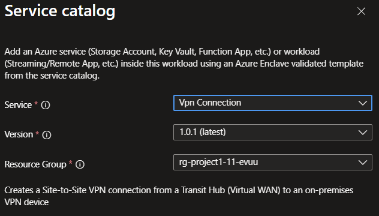

# Deploy VPN connection from the service catalog into a workload

Use the VPN connection template to create a site-to-site VPN connection from a transit hub [VPN gateway](/azure/vpn-gateway/vpn-gateway-about-vpngateways) to an on-premises VPN device. The template also supports an optional customer-side VPN connection when you already have an Azure standard VPN gateway and local network gateway.

In this article, you:

- Deploy the VPN connection service catalog template into an existing workload from the Azure portal.

> [!NOTE]
>
> This template creates the connection resources, but your VPN device still needs matching IPsec settings and the same pre-shared key before traffic can flow.

## Before you begin

- This article assumes a basic understanding of Azure Enclave and network connectivity concepts. For more information, see [Best practices of Azure Enclave](./best-practices.md).
- You need an Azure account with an active subscription. If you don't have one, [create an account for free](https://azure.microsoft.com/free/).
- You need a [community](./what-community.md), [enclave](./what-enclave.md), [workload](./what-workload.md), and permissions to create resources inside the workload resource group.

## Prerequisites

1. An on-premises VPN device or firewall with a static public IP address.
1. On-premises address spaces in CIDR format.
1. A pre-shared key for IPsec.

If you want the optional customer-side connection, you also need:

- A customer Azure VPN gateway resource ID.
- A customer local network gateway resource ID that already points to the Transit Hub VPN gateway IP.

## Deploy the template

1. Go to the workload for the intended deployment.
1. Select **+ Add an Azure Service**.
1. Select **VPN Connection** from the [service catalog list](./list-service-catalog-templates.md), confirm the version you need (default: `latest`), and then select **Next**.

   

1. Enter the required values on each tab.
1. If you want BGP or a custom IPsec policy, set `ipsecMode` to `Custom` and then adjust the optional settings before you create the deployment.
1. Select **Review + Create**. If validation passes, select **Create**.

## Validate the deployment

Go to the target resource group and confirm that the VPN connection and VPN site were created.

If you created the optional customer-side connection, confirm that the customer VPN gateway connection also exists.

## Delete the deployment

If you don't plan to keep the connection, remove it from the workload to avoid unnecessary Azure charges.

## Recommendations

- Use the same pre-shared key and IPsec settings on both sides of the tunnel.
- Keep on-premises address spaces accurate so route exchange works as expected.
- Review the Azure VPN documentation for device setup and policy guidance:
  - [Azure Virtual WAN VPN](/azure/virtual-wan/virtual-wan-site-to-site-portal)
  - [VPN Gateway documentation](/azure/vpn-gateway/)
