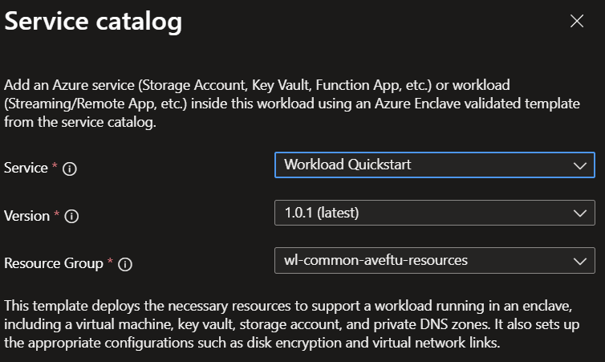

# Deploy the workload quickstart from the service catalog into a workload

Azure Enclave helps organizations deploy and manage sensitive workloads across Azure environments. In this article, you deploy a workload quickstart template into an existing workload by using the Azure portal.

The workload quickstart allows you to quickly create:

- Private DNS Zones for:
	- Key Vault
	- Storage Blob
	- Storage File
	- Storage Queue
	- Storage Table
- A Key Vault with a customer-managed key (CMK)
- A user-assigned managed identity
- A disk encryption set (DES)
- A Storage Account configured to use the CMK and private networking
- A Virtual Machine configured with the user-assigned managed identity and OS disk encryption set

This virtual machine allows you to securely access the isolated resources in your enclave.

## Before you begin

- You need an Azure account with an active subscription. If you don't have one, [create an account for free](https://azure.microsoft.com/free/).
- You need a [community](./what-community.md), [enclave](./what-enclave.md), [workload](./what-workload.md), and permissions to create resources in at least one [workload resource group](./what-workload.md#workload-resource-group).
- Review [best practices](./best-practices.md) and ensure network and governance prerequisites are in place for your workload.

## Prerequisites

Some deployments require dependency resources before you deploy from the service catalog.

1. If your deployment requires customer-managed key (CMK) encryption, create required key and identity dependencies by using the [Common Dependencies service catalog template](./deploy-common-dependencies-service-catalog.md).
2. Ensure your enclave has the required subnet for your resources.

## Deploy the template

1. Go to your [workload](./what-workload.md) for the intended deployment.
2. Select `+Add an Azure Service`.
3. In the [service catalog list](./list-service-catalog-templates.md), select `Workload Quickstart`.

4. Confirm the template version you want to deploy, and then select `Next`.
5. Enter all required parameters.
6. Review optional parameters for networking, security, and tagging.
7. Select `Review + Create`, and then select `Create`.

Deployment can take several minutes, depending on what resources you created.

## Validate the deployment

After deployment completes, verify that:

- The expected resources are created in the intended workload resource group.
- Deployment outputs and generated names match expected values.
- Network access behavior matches your design (for example, private-only endpoints aren't publicly exposed).
- Required identity and encryption settings are correctly applied.

## Delete the deployment

If you deployed this solution only for testing:

1. Go to the target resource group in the Azure portal.
2. Remove the resources created by this deployment.
3. If you don't need any resources in the resource group, delete the resource group.

## Recommendations

- Add [tags](/azure/azure-resource-manager/management/tag-resources) to track owner, purpose, and deployment version.
- Record the deployed service catalog template name and version in your change record.
- Capture a known-good parameter set for repeatable operations.

## Next steps

- [List service catalog templates](./list-service-catalog-templates.md)
- [Deploy service catalog template from Azure CLI](./deploy-template-service-catalog-azure-cli.md)
- [Create workload in the Azure portal](./create-workload-portal.md)
