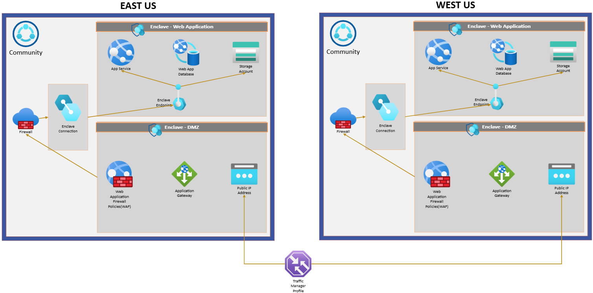

# Disaster Recovery Planning within Azure Enclave

Disaster recovery is an essential aspect of managing Azure Enclave. It ensures that cloud services remain available even if one of the cloud regions fails. This document provides a comprehensive guide on creating a client-side disaster recovery plan using Azure's built-in products and multi-region support to enhance resilience and availability.

## Client-Side Disaster Recovery Plan
You should create a disaster recovery plan for your critical workloads.

### Creating multiple replicas of the services (workloads)

You should create multiple Azure Enclave instances with identical configurations and workloads in at least two Azure regions: one designated as the primary region and the other as the secondary region. Depending on the services and workloads hosted inside the Azure Enclave, an appropriate load balancer can then distribute and/or redirect network traffic. Depending on your deployment scenario, review the recommended load balancing options available on the Azure Architecture Center page. For more information, please visit: [Load-balancing options - Azure Architecture Center](/azure/architecture/guide/technology-choices/load-balancing-overview). The following example explains the use of Azure Front Door as a load
balancer for Azure App Services. [Tutorial: Create a multi-region app - Azure App Service](/azure/app-service/tutorial-multi-region-app).

- Primary Region: The region where the main resource resides and operates under normal conditions. (for example, East US)

- Secondary Region: The backup region, which mirrors the data and configurations of the primary region. (for example, West US)

### Synchronization of Data

Similar to any other resource deployment in Azure, geo-replicated services in Azure Enclave can also be deployed via ARM/Bicep templates or via Azure portal. Ensure that the data between the primary and secondary regions remains synchronized.

Geo-replicated services can be achieved through automated replication processes provided by Azure including:
- [Azure Site Recovery](/azure/site-recovery/site-recovery-overview) to keep apps and workloads online
- [Azure Storage](/azure/storage/common/storage-redundancy) redundancy, which stores multiple copies of your data.

### Failover Mechanism

If a failure in the primary region occurs, the failover mechanism through Azure Front Door should activate to divert operations to the secondary region. Here are the steps to implement a failover:

- Monitor: Continuously monitor the health and performance of services in the primary region.

- Trigger Failover: Configure alerts to trigger automatic failovers to the secondary region when a failure is detected.

- Testing: Regularly test the failover process to ensure seamless transition between regions.

## Disaster Recovery in the Event of Regional Failures

A load balancer is crucial for ensuring the high availability and reliability of web applications, particularly in scenarios where downtime isn't an option and user access must remain uninterrupted. A load balancer distributes incoming traffic across multiple servers or regions, and prevents any single resource from becoming overwhelmed while avoiding performance bottlenecks and failures. Additionally, advanced load balancing solutions integrate health probes and failover mechanisms to detect issues in real time and redirect traffic to healthy regions or servers. This active-active approach minimizes disruptions, enhances user experience, and guarantees operational continuity even during unexpected outages or peak demand periods. Alternatively, you could choose not to use a load balancer but would then need to implement active-passive configurations that include some automation but also manual effort to ensure disaster recovery and maintain resilience in your infrastructure.

For a deeper understanding of Azure\'s load balancing capabilities, be sure to review the load balancing options page mentioned above. It offers valuable insights into selecting the right solutions for how to efficiently monitor outages and trigger failover mechanisms.

In the following example, we explore how to use Application Gateway and Traffic Manager as a load balancing solutions. These tools not only enhance the security of web applications but also bolster disaster recovery strategies, ensuring resilience and seamless user experiences during unexpected outages.

### Using Application Gateway and Traffic Manager

[Application Gateway](/azure/application-gateway/overview) is a load balancer that makes routing decisions based on the attributes of an HTTP request. It integrates with Web Application Firewall (WAF) to provide protection at the application level, ensuring that incoming traffic is inspected and filtered based on predefined security rules.

[Azure Traffic Manager](/azure/traffic-manager/traffic-manager-overview) is a DNS-based traffic load balancer that helps distribute traffic to your public-facing applications across global Azure regions. It enhances the availability and performance of your applications by directing user requests to the most appropriate service endpoint based on various traffic-routing methods, such as performance, geographic, or priority routing. For more information on applying Traffic Manager to an Application Gateway, visit: [Use Azure App Gateway with Azure Traffic Manager](/azure/traffic-manager/traffic-manager-use-with-application-gateway)

To utilize an app service within Azure Enclave while maintaining secure and efficient communication, you can use the Application Gateway to act as a bridge between the web application and a demilitarized zone (DMZ) enclave. All incoming traffic is routed through the Web Application Firewall (WAF) by deploying an Application Gateway that inspects and filters requests based on predefined security policies. This helps ensure that only legitimate traffic reaches the application and effectively mitigates potential threats and enhances the security posture of the infrastructure.

Furthermore, the integration of Azure Traffic Manager with the Application Gateway adds a robust layer to disaster recovery planning. The Traffic Manager operates as a DNS-based load balancer, directing traffic to the Public IP address associated with the Application
Gateway. If a regional failure occurs, the Traffic Manager can seamlessly fail over to a secondary region, ensuring that users
experience minimal disruption. This failover mechanism uses health probes to continuously monitor the availability of endpoints,
automatically rerouting traffic to the most responsive or geographically optimal endpoint.

This combination of Application Gateway, WAF, and Traffic Manager not only fortifies security but also guarantees high availability and operational continuity for app services deployed in Azure Enclave. To complement these failover and load balancing strategies, you should also consider using data persistence services like SQL databases and Azure Storage Accounts. These services come with inherent capabilities to replicate data across regions, ensuring durability and high availability of critical information. By utilizing these features, businesses can maintain consistent access to their data, even if a regional failure occurs. However, it's imperative for you to evaluate your specific requirements and configure these services appropriately to achieve the desired level of data resiliency and accessibility.

## Conclusion

Implementing a comprehensive disaster recovery plan for Azure Enclave involves creating multiple resources with synchronized configurations across primary and secondary regions. Utilizing a load balancer for traffic management and failover routing further enhances the resilience and availability of services deployed within Azure Enclave. Regular testing and monitoring are essential to ensure the effectiveness of the disaster recovery plan and provide uninterrupted service to users.

By following these guidelines, you can achieve robust disaster recovery and ensure high availability for your services hosted in Azure Enclave, even in the face of regional failures.

## Resources

- For more information on how Azure Site Recovery works: [Azure Site Recovery documentation](/azure/site-recovery/)
- For more information on the integration of WAF and Azure Front Door: [Web Application Firewall (WAF) on Azure Front Door](/azure/frontdoor/web-application-firewall)
- [Use Azure App Gateway with Azure Traffic Manager](/azure/traffic-manager/traffic-manager-use-with-application-gateway)
- Guidance on how to configure WAF policies for an application gateway can be found here: [Create Web Application Firewall (WAF) policies for Application Gateway](/azure/web-application-firewall/ag/create-waf-policy-ag)
- [Tutorial: Create a multi-region app - Azure App Service](/azure/app-service/tutorial-multi-region-app)