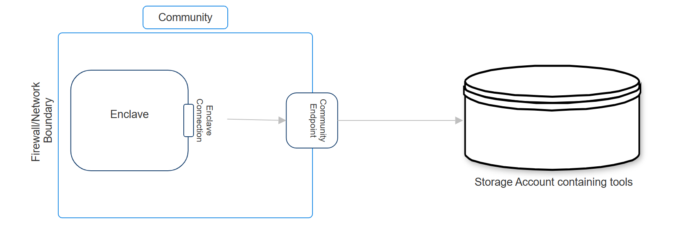
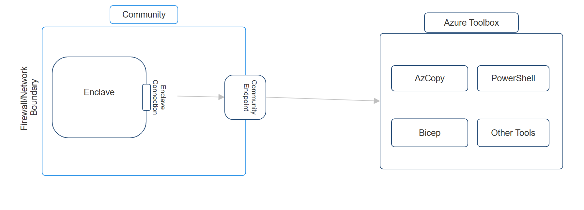

# Transferring data into an enclave

By default, all network traffic within an [enclave](./what-enclave.md) is permitted by Azure Enclave product design. This means that all resources and hosts within an enclave can reach, discover, and communicate with each other. However, this poses a potential issue for community and enclave owners when first creating their Azure Enclave-related resources on how to initially migrate or bring their data into their enclaves.

## Overview
If the data that needs to be moved into an enclave resides in an Azure Storage Account, you'll need to create a connection to the data source, optionally download an application to help download/copy/move, and then perform the download/copy/move operation. Follow these detailed steps:
1. Log into [Admin VM](./understand-admin-vm.md), or any other resource located in the enclave private network. 
1. Create an Endpoint (at either the community or Enclave level) and Connection (targeting the enclave/community and Endpoint created) to where the data is.
      - How to make a [community endpoint](./create-community-endpoint-portal.md) or [enclave endpoint](./create-enclave-endpoint-portal.md) for your IP Data Source / External Data Network (an example of this could look like this: `name: ep-mydatasource`, `source: 172.168.10.0/16`, `protocol: https`, `port: 443`).
      - [How to make a Connection](./create-enclave-connection-portal.md) connecting either a community or an enclave to the Endpoint created above.
1. Use [AzCopy](https://aka.ms/azcopy), [Azure portal](https://aka.ms/azureportal), or [Azure Storage Explorer](https://aka.ms/storageexplorer) while on Enclave Admin VM to transfer data from location specified above into the enclave.
      - By default these tools aren't installed on Admin VMs or other machines. To install these tools onto resources residing in the enclave private network, you must create an endpoint and connection to the download location of these tools.
      - Azure Enclave recommends downloading these tools using [Azure Toolbox](https://aka.ms/aztoolbox).

## Downloading tools from Azure Toolbox
To download tools from Azure Toolbox into an enclave, Azure Enclave recommends that either an enclave or community endpoint be created to Azure Toolbox. Furthermore, enclave owners should then also create a connection from the enclave or community to the Azure Toolbox endpoint. This is an example of how to creation the connection and endpoint:
- How to make a [community endpoint](./create-community-endpoint-portal.md) or [enclave endpoint](./create-enclave-endpoint-portal.md) for your IP Data Source / External Data Network (an example of this could look like this: `name: ep-aztoolbox`, `source: <aztoolbox-fqdn>`, `protocol: https`, `port: 443`). This is a table with the current environments and their respective FQDNs needed to connect to Azure Toolbox.

|Environment| FQDN  |
|--|--|
| Test | prod.api.toolbox.azure-test.net |
| US Sec |  |
| US Nat |  |

- [How to make a Connection](./create-enclave-connection-portal.md) connecting either a community or an enclave to the Endpoint created above

Should further troubleshooting be required to investigate making Connections, see [Create a Connection from the Azure portal](./create-enclave-connection-portal.md) or contact [Azure Support](https://azure.microsoft.com/support/).

## References
- [What is Azure Enclave?](./what-azure-enclave.md)
- [Best Practices](./best-practices.md)
- [What is an enclave?](./what-enclave.md)
- [Understanding Admin VM](./understand-admin-vm.md)
- [Create an enclave endpoint](./create-enclave-endpoint-portal.md)
- [Create a community endpoint](./create-community-endpoint-portal.md)
- [Create a Connection from the Azure portal](./create-enclave-connection-portal.md)
- [Azure Support](https://azure.microsoft.com/support/)
