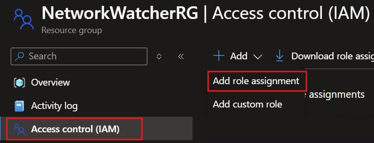
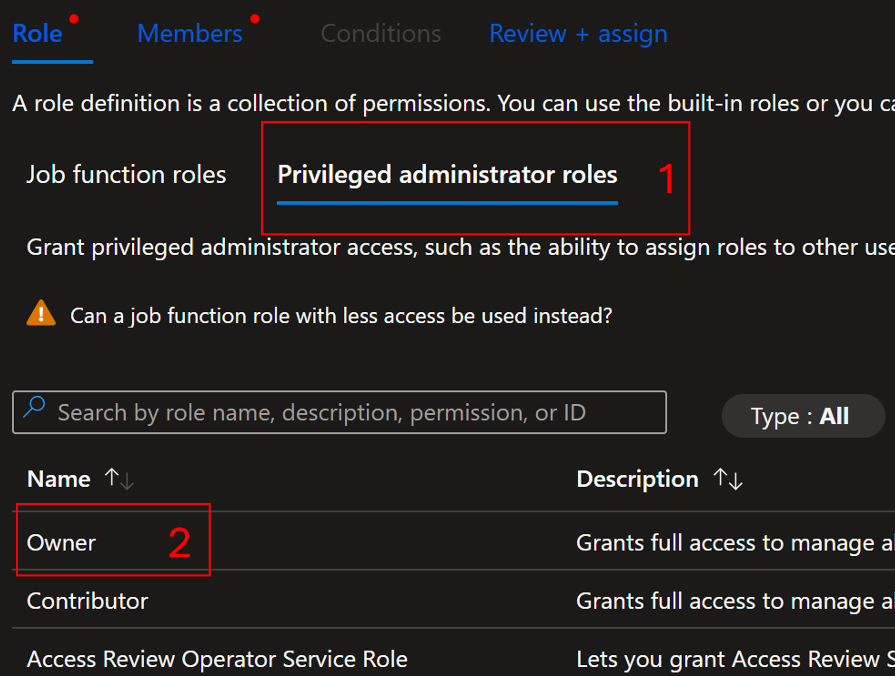
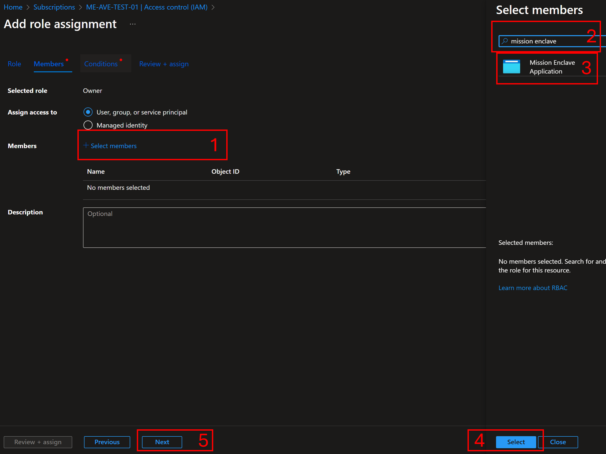
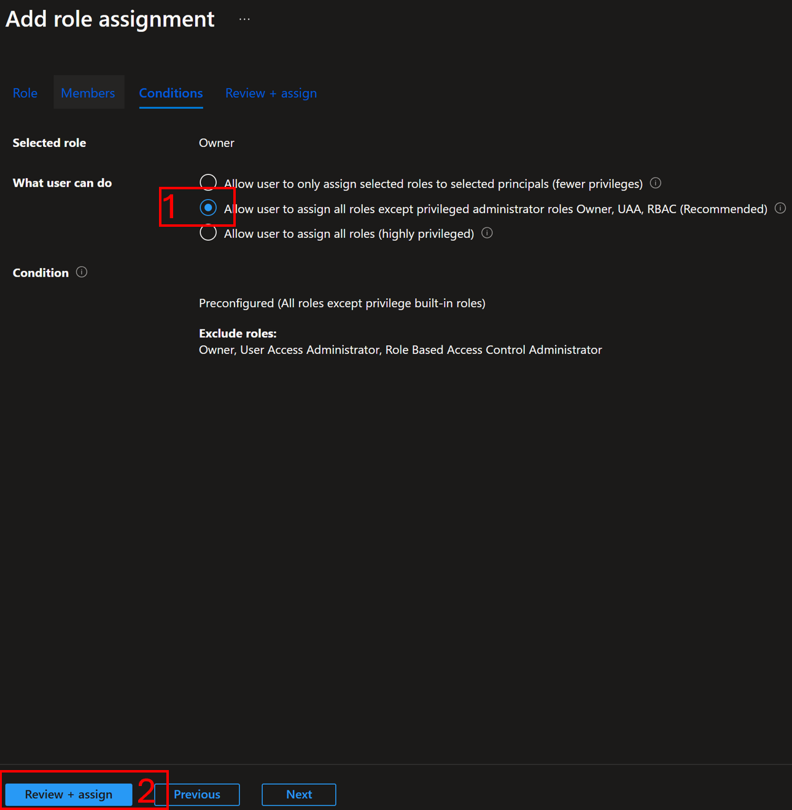

# Observability in Azure Enclave

Azure Enclave provides observability features to support monitoring of workloads and network resources across communities and enclaves. This article describes the available logging destinations, how destinations affect diagnostic settings and flow logs, and how to prepare the `NetworkWatcherRG` resource group.

You can configure monitoring destinations. The Azure Enclave resource provider creates a Community or Enclave Log Analytics workspace when you select the corresponding monitoring destination. Flow-log setup can create or reuse a storage account in the enclave managed resource group. The exact defaults and available properties depend on the Mission Management API version. For the `2025-05-01-preview` API, don't assume that every workspace, storage account, flow log, or diagnostic setting is created for every enclave.

## Centralized and isolated observability

Observability in Azure Enclave is built on a dual-tier logging model that supports both centralized and enclave-isolated diagnostic logging using Azure Monitor, Log Analytics, and Storage Accounts.

### Community-level observability

When you configure it, a **Community** can include a **centralized Log Analytics workspace**. This workspace is designed to:

- Aggregate diagnostics and metrics from all enclaves within the community.
- Provide a single pane of glass for monitoring and querying diagnostics and flow logs.
- Support cross-enclave analytics, alerting, and compliance tracking.

The workspace is created when you select the Community workspace destination. You can use the workspace as a diagnostic destination for supported enclave or workload resources. Runtime-created workspaces currently enable public network access for ingestion and query; network isolation isn't enabled by these provider operations. To configure private access, see [Azure Monitor Private Link scope](/azure/azure-monitor/logs/private-link-security).

> [!Note]
> Diagnostic settings from enclave resources (such as workloads, public IPs, or Application Gateways) can be configured to send logs to the centralized workspace to support unified monitoring.

### Enclave-level observability

When you configure an **Enclave**, it can include an **isolated Log Analytics workspace** that's scoped specifically to that enclave. This workspace supports enclave-level logging use cases and can provide:

- **Storage of virtual network flow logs** when you enable flow-log setup and select the enclave workspace as the destination.
- Optional diagnostic settings for enclave-scoped resources, such as internal workloads and networking components.
- Designed to meet isolation or regulatory requirements that prevent cross-enclave log aggregation.

Administrators can choose to keep enclave diagnostics within this workspace when they select the enclave workspace as the destination.

## Configurable logging destinations

Azure Enclave supports flexible logging configurations that allow resource owners to choose between:

| Logging Destination                   | Purpose                                                    | Default Use |
|---------------------------------------|------------------------------------------------------------|-------------|
| **Community Log Analytics workspace** | Enables centralized monitoring and cross-enclave analytics | Configurable |
| **Enclave Log Analytics workspace**   | Supports enclave-level monitoring and isolation | Configurable |
| **Custom Log Analytics workspace**    | Sends supported flow logs to a customer-selected workspace | Configurable |

You can configure diagnostic settings through the Azure portal, CLI, or Bicep/ARM templates during or after deployment.

> [!IMPORTANT]
> Flow-log destinations are configurable. The provider supports enclave, community, and custom Log Analytics workspaces. Don't assume that flow logs are always sent to the enclave workspace.

## Common observability scenarios

| Scenario                                        | Logging Strategy |
|-------------------------------------------------|------------------|
| **Cross-enclave health dashboard**              | Send diagnostics from all enclaves to the centralized Community Log Analytics workspace |
| **Regulated enclave with strict data controls** | Keep diagnostics within the enclave-specific Log Analytics workspace |
| **Long-term retention for audit purposes**      | Send logs to a Storage Account with policy-controlled retention settings |
| **Network investigation or threat hunting**     | Use the enclave workspace to analyze default virtual network flow logs |

### Configure Network Watcher resource groups

To avoid potential issues with [virtual network flow log](/azure/network-watcher/vnet-flow-logs-overview) creation, verify that the `NetworkWatcherRG` resource group exists before creating your first enclave in the subscription.

The provider attempts to create `NetworkWatcherRG` if it doesn't exist and to ensure that the Mission Enclave app has an acceptable role on the resource group. The provider accepts `Network Contributor`, `Contributor`, or `Owner`; when no acceptable role exists, it attempts to create a `Contributor` assignment. If these operations can't complete, flow-log creation and enclave deployment can fail.

If you need to prepare the resource group manually, select the `NetworkWatcherRG` resource group, select `Access control (IAM)`, then select `Add` and `Add role assignment`.

   

1. Select `Privileged administrator roles`, select `Owner`, then select `Next`.

   

1. Select `Select members`, enter `Mission Enclave` in the search, select the `Mission Enclave` app, select `Select`, and then select `Next`.

   

1. If your subscription requires a condition, select `Allow user to assign all roles except privileged administrator roles Owner, UAA, RBAC (Recommended)`, and then select `Review + assign`.

   

1. Once the update is complete, you can start deploying Azure Enclave resources.

When a community or enclave is created, Azure Enclave can attempt the following steps:
1. Check if the `NetworkWatcherRG` exists. If not, attempt to create that resource group.
1. Check if the Mission Enclave app has an acceptable role assignment on `NetworkWatcherRG`. If not, attempt to create a `Contributor` assignment.
1. If a required operation fails, flow-log creation and enclave deployments might fail.