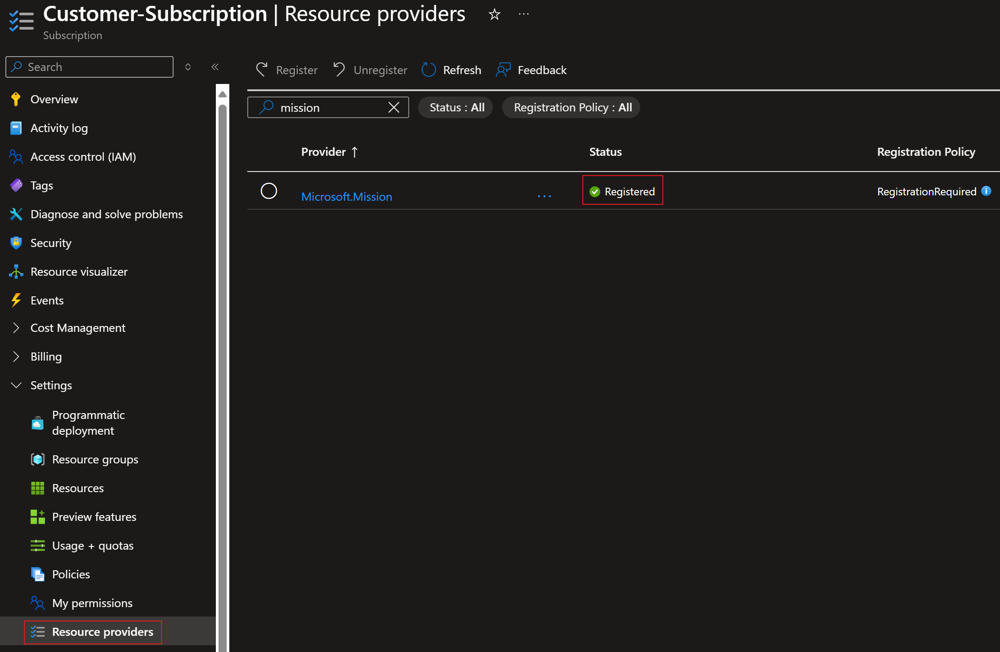

# Get started with Azure Enclave

Use this quickstart to onboard to Azure Enclave by registering the required resource providers and granting the permissions needed to manage Azure Enclave resources in your subscription.

## Prerequisites

  - You must already have an Azure tenant and subscription.
  - You must be an Owner of an existing Azure subscription.

## Register the `Microsoft.Mission` resource provider and grant permissions

### Option 1: PowerShell

PowerShell is the fastest way to register the required resource providers.

You can run the following code to quickly register all required resource providers to begin using Azure Enclave.

1. Sign in to your Azure tenant and open the subscription.
1. In the Azure portal, select the `Cloud Shell` icon at the top of the window.

   

1. Set the Azure context for your subscription. For example, run `Set-AzContext -Subscription <subscription-id>`.
1. Copy and paste this code into Cloud Shell, and then press Enter.

```
# Register the Azure Enclave Resource Provider and grant permissions to the Resource Provider application

$resourceProviders = @(
   "Microsoft.Advisor",
   "Microsoft.AlertsManagement",
   "Microsoft.Authorization",
   "Microsoft.Automation",
   "Microsoft.Billing",
   "Microsoft.Capacity",
   "Microsoft.ChangeAnalysis",
   "Microsoft.ClassicSubscription",
   "Microsoft.CognitiveServices",
   "Microsoft.Compute",
   "Microsoft.Consumption",
   "Microsoft.CostManagement",
   "Microsoft.DesktopVirtualization",
   "Microsoft.Features",
   "Microsoft.GuestConfiguration",
   "Microsoft.insights",
   "Microsoft.KeyVault",
   "Microsoft.Logic",
   "Microsoft.ManagedIdentity",
   "Microsoft.MarketplaceOrdering",
   "Microsoft.Network",
   "Microsoft.OperationalInsights",
   "Microsoft.OperationsManagement",
   "Microsoft.PolicyInsights",
   "Microsoft.Portal",
   "Microsoft.ResourceGraph",
   "Microsoft.ResourceHealth",
   "Microsoft.ResourceNotifications",
   "Microsoft.Resources",
   "Microsoft.Security",
   "Microsoft.SecurityInsights",
   "Microsoft.SerialConsole",
   "Microsoft.SqlVirtualMachine",
   "Microsoft.Storage",
   "Microsoft.support",
   "Microsoft.Web",
   "Microsoft.Mission"
)

$resourceProviders | foreach {Register-AzResourceProvider -ProviderNamespace $_ -Verbose}

```

1. (Optional) Enable the `EncryptionAtHost` feature

The [EncryptionAtHost](/azure/virtual-machines/linux/disks-enable-host-based-encryption-cli) feature enables encryption at the compute host level.

```azurecli
# Register the feature
az feature register --namespace Microsoft.Compute --name EncryptionAtHost

# Check registration status (may take 10-15 minutes)
az feature show --namespace Microsoft.Compute --name EncryptionAtHost

# Once registered, refresh the provider
az provider register --namespace Microsoft.Compute
```

1. After the update is complete, proceed to [Azure setup](./best-practices.md#azure-setup) or [next steps](#next-steps).

### Option 2: Azure portal

1. Sign in to your Azure tenant and open the subscription.
1. Under **Settings**, open **Resource providers**.
1. Register the resource providers listed in [Option 1: PowerShell](#option-1-powershell) in the subscription. The PowerShell script is the fastest option and the authoritative source for the required registrations. These images show the expected end state.

   :::image type="content" source="./media/onboard-providers-1.png" alt-text="Screenshot showing the first set of resource providers required by Azure Enclave." border="true" lightbox="./media/onboard-providers-1.png":::

   :::image type="content" source="./media/onboard-providers-2.png" alt-text="Screenshot showing the second set of resource providers required by Azure Enclave." border="true" lightbox="./media/onboard-providers-2.png":::

1. Search for and select `Microsoft.Mission`, and then select **Register**.

   

1. Proceed to [Azure setup](./best-practices.md#azure-setup) or [next steps](#next-steps).

For reference, you can also review the generic instructions for enabling a [preview feature](/azure/azure-resource-manager/management/preview-features).

### Configure Network Watcher resource group

To avoid potential issues with [virtual network flow log](/azure/network-watcher/vnet-flow-logs-overview) creation, set up the `NetworkWatcherRG` resource group manually in advance and assign the `Mission Enclave` app the `Owner` role on that resource group, or verify that setup and role assignment happened automatically before creating your first enclave in the subscription.

To mitigate this potential issue, for each subscription, manually create the NetworkWatcher resource group called `NetworkWatcherRG` in new subscriptions, and then grant the `Mission Enclave` Azure Enclave App `Owner` on the NetworkWatcherRG:
1. Select the `NetworkWatcherRG` resource group, select `Access control (IAM)`, then select `Add` and `Add role assignment`.

   :::image type="content" source="./media/onboard-network-watcher-add-role.png" alt-text="Screenshot showing resource group add role selection in the portal." border="True" lightbox="./media/onboard-network-watcher-add-role.png":::

1. Select `Privileged administrator roles`, select `owner`, then select `Next`.

   :::image type="content" source="./media/onboard-add-role-select-owner.png" alt-text="Screenshot showing the add owner role selection view in the portal." border="True" lightbox="./media/onboard-add-role-select-owner.png":::

1. Select `Select members`, type `Mission Enclave` in the search and select the `Mission Enclave` app, select `Select`, then `Next`.

   :::image type="content" source="./media/onboard-select-mission-enclave-app.png" alt-text="Screenshot showing how to select the Mission Enclave app in the portal." border="True" lightbox="./media/onboard-select-mission-enclave-app.png":::

1. If your subscription requires a condition, select `Allow user to assign all roles except privileged administrator roles Owner, UAA, RBAC (Recommended)`, then select `Review + assign`.

   :::image type="content" source="./media/onboard-add-condition.png" alt-text="Screenshot showing the add condition view if your subscription requires it." border="True" lightbox="./media/onboard-add-condition.png":::

1. Once the update is complete, you can start deploying Azure Enclave resources.

When a community or enclave is created, Azure Enclave attempts the following steps:
1. Check if the `NetworkWatcherRG` exists. If not, attempt to create that resource group.
1. Check if the `Mission Enclave` App has a permanent `Owner` assignment on `NetworkWatcherRG`. If not, attempt to assign the `Mission Enclave` App as a permanent `Owner` assignment on `NetworkWatcherRG`. Even if an inherited `Owner` permission exists, a permanent `Owner` assignment creation is attempted.
1. If any step fails, enclave deployments might fail when attempting to create virtual network flow logs.

## Transition steps for existing preview customers

Existing preview customers must re-register the Azure Enclave resource provider so their subscriptions can use the latest Azure Enclave API and service updates.

Complete these steps to use the latest Azure Enclave API:
1. In the Azure portal, navigate to your subscription.
1. Under **Settings**, open **Resource providers**.
1. Search for and select `Microsoft.Mission`, and then select **Re-register**.
1. Repeat these steps for any additional subscriptions.

## Next steps

After registering the Azure Enclave resource provider, you can start deploying Azure Enclave resources into your subscription.

  - Start building your Azure Enclave community:

    - [Create a community](./create-community-portal.md)
    - [Create an enclave](./create-enclave-portal.md)
    - [Create a workload](./create-workload-portal.md)

  - Establish network connectivity within your community:

    - [Create an enclave endpoint](./create-enclave-endpoint-portal.md)
    - [Create an enclave connection](./create-enclave-connection-portal.md)
    - [Create a transit hub](./create-transit-hub-portal.md)
    - [Create a community endpoint](./create-community-endpoint-portal.md)

  - Create resources within your workloads to meet your objectives:
     - Create resources from the [service catalog](./list-service-catalog-templates.md)
     - Create resources with a [template](/azure/azure-resource-manager/templates/deploy-to-resource-group) or [bicep template](/azure/azure-resource-manager/bicep/deploy-to-resource-group) from [these examples](https://github.com/Azure/azure-quickstart-templates/tree/master/quickstarts)
