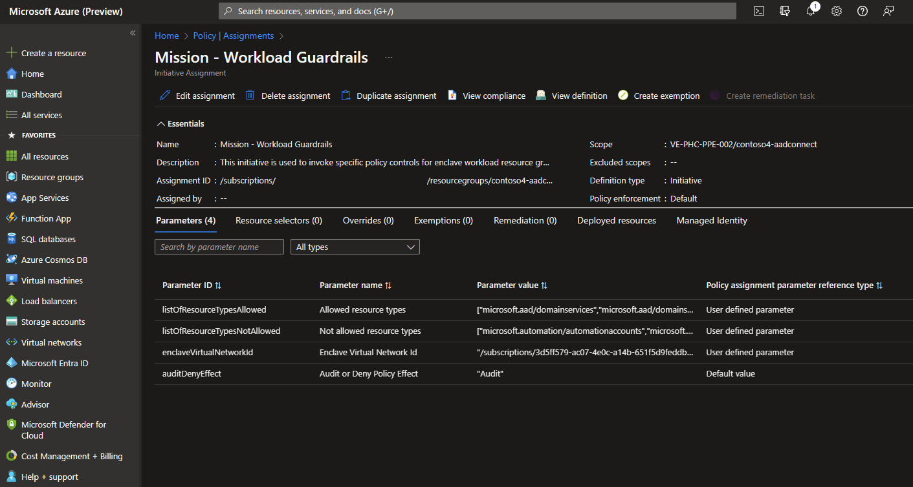

# Azure Enclave Policy exemptions

By default, all enclave [workloads](./what-workload.md) are governed following Azure Enclave platform-managed Azure Policy Initiatives detailed in [Azure Enclave governance/Governance](./what-azure-enclave.md#multi-layered-governance-security-and-monitoring). This means that all user workloads are governed by a set of Azure Policy Initiative assignments deployed by Azure Enclave.

For certain enclave owners, this level of governance might be too protective or not protective enough for various reasons. For example, some enclave owners might have regulatory requirements for their workloads to have Public IP addresses, but Azure Enclave governance/Governance policies would block the creation of Public IP addresses for security or compliance reasons.

Currently, this example would be expected behavior for governance on a workload. However, should enclave owners require greater flexibility or granularity over their enclave governance, they can manually exempt the platform-managed Azure Policies. This can be done using native Azure Policy capabilities called Policy exemptions, though it would require enclave owners to specifically modify platform-designed governance behavior on workloads within their enclave.

## Overview

First enclave owners must identify which [Azure Policy Initiative assignment](/azure/governance/policy/concepts/assignment-structure) in their workload needs custom exemption behavior. [Policy exemptions](/azure/governance/policy/concepts/exemption-structure) allow administrators to exempt a resource hierarchy or an individual resource from evaluation of initiatives or definitions.

Once these Initiative assignments have been identified, enclave owners can create and manage their own Policy Exemptions. For more details on how to perform these steps, learn more on how to [Create and manage exemptions
](/azure/governance/policy/concepts/exemption-structure#exemption-creation-and-management)

In this image, a Policy initiative assignment within the `contoso4-aadconnect` workload in the `contoso4` Enclave requires an exemption.

Should further troubleshooting be required to investigate Azure Policy exemptions, contact [Azure Support](https://azure.microsoft.com/support/).

## References
- [What is Azure Enclave?](./what-azure-enclave.md)
- [Best Practices](./best-practices.md)
- [What is an enclave?](./what-enclave.md)
- [What is a workload?](./what-workload.md)
- [Azure Policy initiatives](/azure/governance/policy/concepts/initiative-definition-structure)
- [Azure Policy assignment structure](/azure/governance/policy/concepts/assignment-structure)
- [Azure Policy exemptions](/azure/governance/policy/concepts/exemption-structure)
- [Azure Support](https://azure.microsoft.com/support/)
