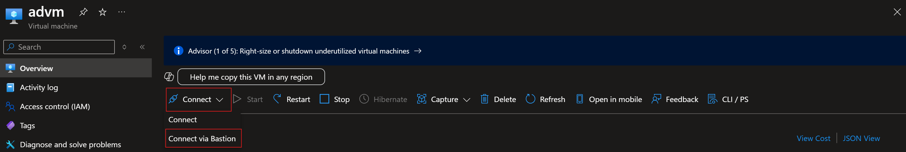
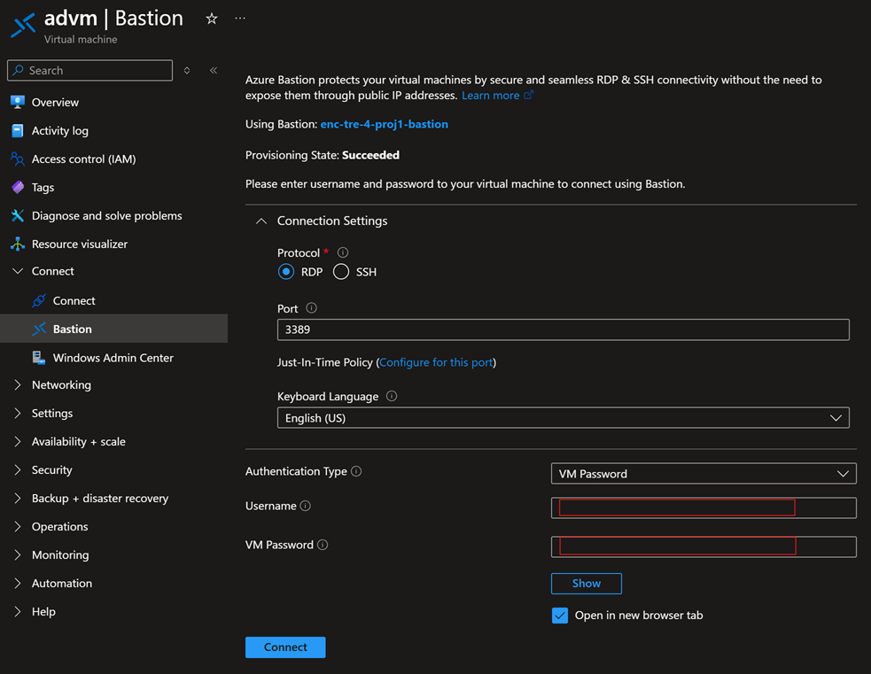
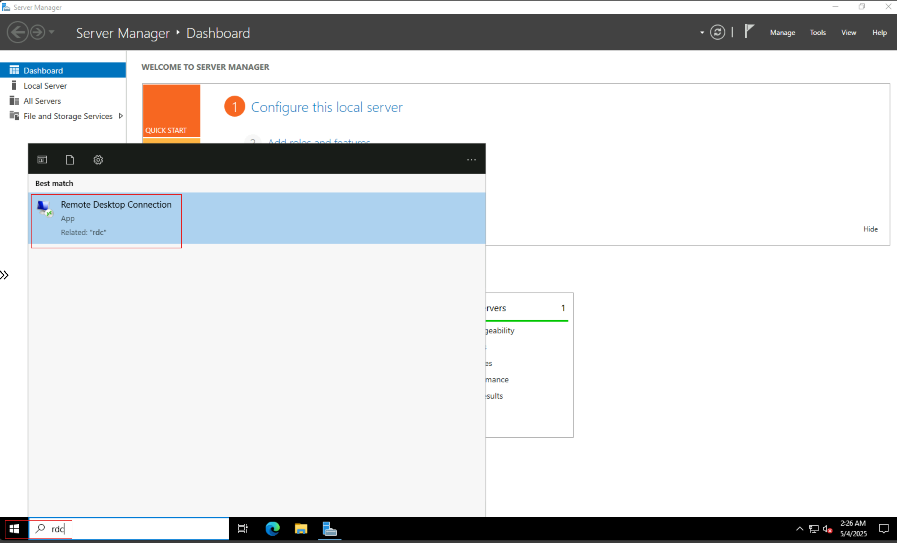
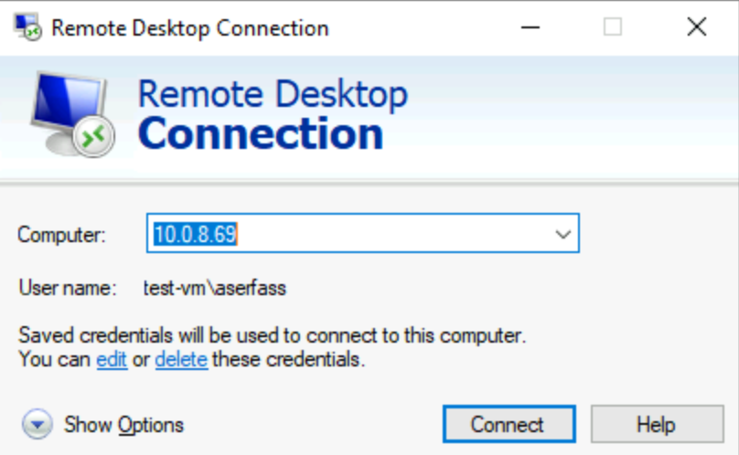
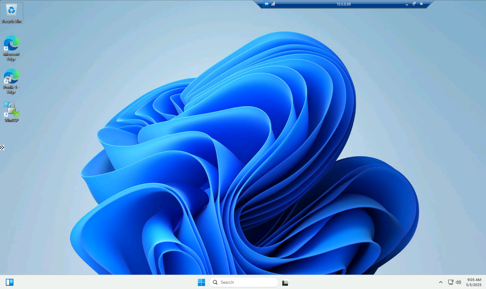

# Understanding Admin VMs in Azure Enclave

A Virtual Machine (VM) created to securely access enclave resources for administrative purposes and can be remotely accessed through [Azure Bastion](https://aka.ms/bastion). These VMs are meant to be temporarily lived resources for break-glass system administration of an enclave and the enclave resources

## Create an Admin VM
Use the [Admin VM](./deploy-admin-vm-service-catalog.md) to quickly create a VM that can access and configure your enclave resources.

## Access Admin VM
By default, Azure Enclave creates an Azure Bastion instance for community or enclave owners to access their enclaves.

### Enable enclave access to the Azure portal
Azure portal access is restricted by default for enclaves. This means you need to create endpoint rules and connections to access the Azure portal from within the Admin VM or enclave.

- [Create enclave endpoint in the Azure portal](./create-enclave-endpoint-portal.md)
- [Create community endpoint in the Azure portal](./create-community-endpoint-portal.md)
- [Create enclave in the Azure portal](./create-enclave-connection-portal.md)

### Accessing enclaves through Azure Bastion
Azure Enclave natively uses existing Azure user interface controls to allow for access into Admin VMs. [Learn more on how to Connect to a Windows VM using RDP - Azure Bastion](/azure/bastion/bastion-connect-vm-rdp-windows).

For certain community and enclave owners, this default access model might not be granular enough. For example, some enclave owners might have regulatory requirements for their workloads that do not authorize Azure Bastion. 

If the default behavior of Admin VMs or the configurations that Azure Enclave allows to be changed are insufficient for your use-cases, Azure Enclave recommends [creating a workload, Virtual Machines in the workload, an Endpoint, and Connections that function similarly to how Admin VMs function](./create-azure-virtual-desktop-workloads.md).

1. After you [create an Admin VM](#create-an-admin-vm), navigate to that Virtual Machine resource in the Azure portal.
1. Select `Connect` and then select `Connect via Bastion`.

1. Enter your credentials for the admin VM and select `Connect`.

1. Once you see the desktop for the Admin VM, select the windows start menu icon and enter `RDC` in the search field.

1. Select the `Remote Desktop Connection` application from the list.
1. Enter the IP address of the VM you want to access in the enclave.

1. Perform the task you needed to on the remote VM.

### Reset password
You can reset the password with the instructions below. Starting from the portal:
1. Select the VM name to open that VM resource
1. Scroll to the bottom of the blades and select "Reset Password"
1. Enter the new password twice and select "Update"

## Size
You can adjust the VM size for Azure Enclave Admin VMs based on the number of users you expect to have on a VM at the same time.

## Image
Community and enclave owners might also have concerns regarding the default VM image used for these VMs. Currently, Azure Enclave uses Azure Marketplace's Windows Server Datacenter image for Admin VMs. You can select a custom image of your own by providing the resource ID in the [Admin VM](./deploy-admin-vm-service-catalog.md) template advanced tab.

## References
- [What is Azure Enclave?](./what-azure-enclave.md)
- [Best Practices](./best-practices.md)
- [What is an enclave?](./what-enclave.md)
- [What is a workload?](./what-workload.md)
- [Azure Bastion](https://aka.ms/bastion)
- [Connect to a Windows VM using RDP - Azure Bastion](/azure/bastion/bastion-connect-vm-rdp-windows)
- [Azure Support](https://azure.microsoft.com/support/)
