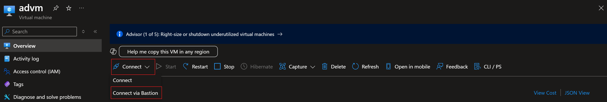
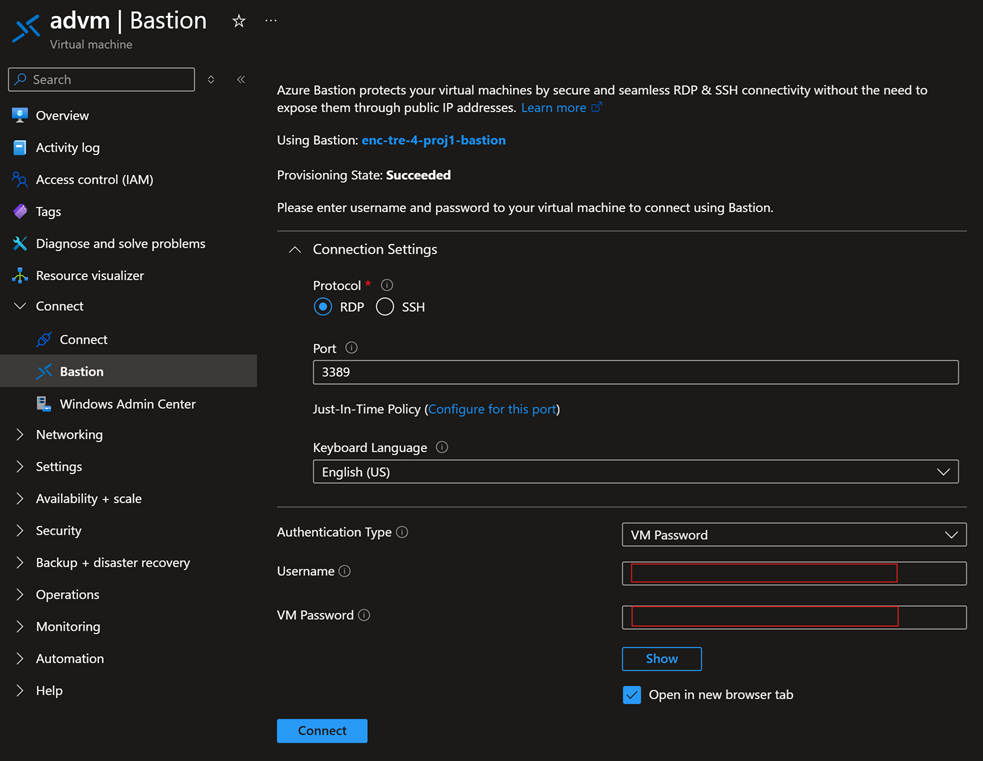
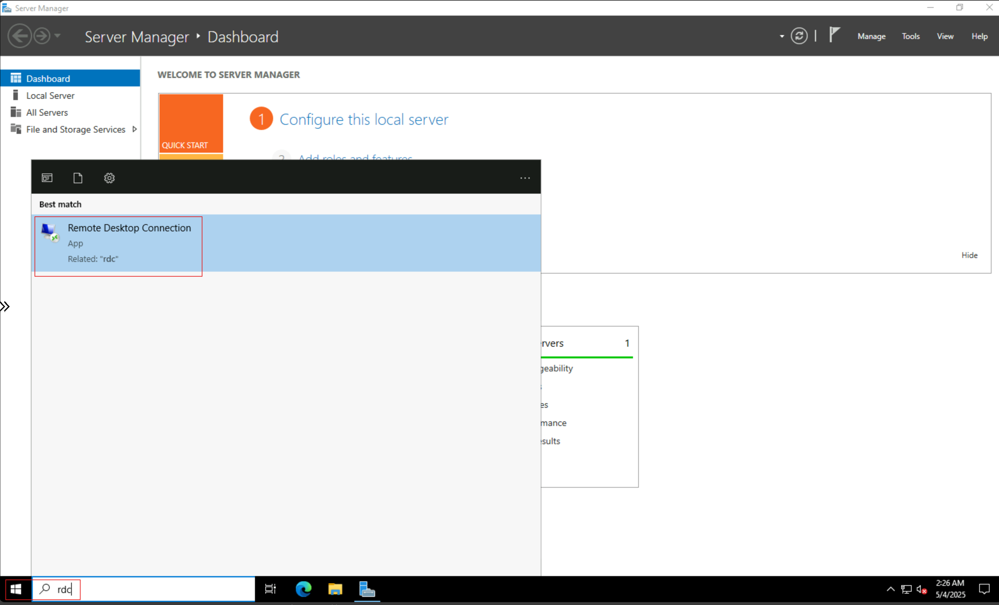
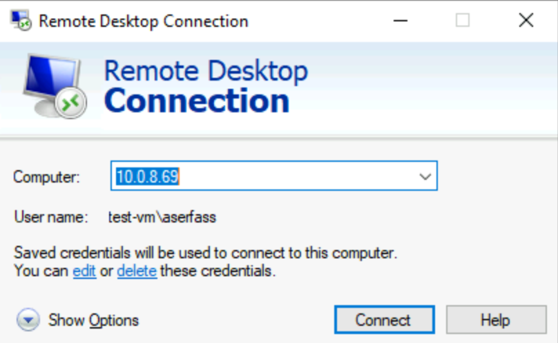
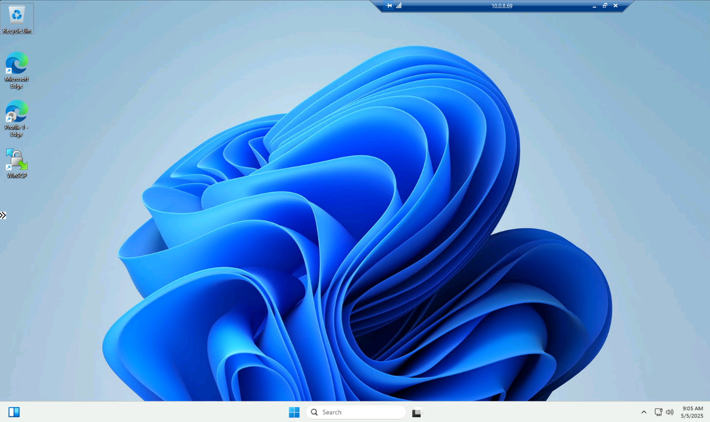

# Understanding admin VMs in Azure Enclave

An admin VM is a virtual machine you create to securely access enclave resources for administrative purposes. Deploy admin VMs to the enclave's management subnet and access them remotely through [Azure Bastion](https://aka.ms/bastion). They serve as your access point for focused, privileged enclave administration. Use them for time-limited administrative tasks, not persistent workloads.

## Create an Admin VM
Use the [Admin VM](./deploy-admin-vm-service-catalog.md) to quickly create a VM that can access and configure your enclave resources.

## When to use an admin VM

Use admin VMs when you need to:

- Perform privileged administrative tasks in your enclave
- Access enclave workloads or resources from outside the enclave boundary
- Troubleshoot or manage enclave connectivity

> [!NOTE]
> Admin VMs are administrative tools, not production workload resources. For workload-specific access patterns, consider [creating a workload with its own access endpoints and connections](./create-azure-virtual-desktop-workloads.md).

## Access admin VM

By default, Azure Enclave provisions an Azure Bastion instance within the enclave managed resource group to enable community and enclave owners to securely access admin VMs through Remote Desktop Protocol (RDP).

### Connect to the Admin VM by using Azure Bastion
1. In the Azure portal, go to the Admin VM resource.
1. Select `Connect` and then select `Connect via Bastion`.

   

1. Enter your credentials for the Admin VM and select **Connect**.

   

### Connect to resources inside the enclave

After you connect to the Admin VM, use Remote Desktop to access other VMs within the enclave:

1. When the Admin VM desktop appears, select the **Windows Start** menu and enter `RDC` in the search field.

   

1. Select the `Remote Desktop Connection` application from the list.
1. Enter the IP address or hostname of the enclave resource you want to access by using Remote Desktop.

   

1. Complete your administrative tasks on the remote VM.

   

## Manage admin VMs

### Reset the admin VM password

If you forget the Admin VM's operating system password, reset it from the Azure portal:

1. In the Azure portal, go to the Admin VM resource.
1. In the left menu under **Support + troubleshooting**, select `Reset password`.
1. Select a reset method and follow the prompts to set a new password.
1. Enter your new password twice and select `Update`.

> [!NOTE]
> To reset the password, you need the Azure Contributor role on the VM resource.

### Choose admin VM size

The Admin VM size depends on the number of concurrent administrators accessing the enclave. Larger VMs support more simultaneous Remote Desktop connections. You can resize the Admin VM after deployment from the VM's **Compute** page in the Azure portal.

For sizing recommendations, see [Virtual Machine sizing](/azure/virtual-machines/sizes) in Azure documentation.

### Customize the admin VM image

By default, Azure Enclave deploys Admin VMs by using the Windows Server Datacenter image from the Azure Marketplace. Use a custom image if you need preconfigured tools, security configurations, or organizational standards.

To use a custom image, provide the image resource ID in the **Advanced** tab when deploying the Admin VM from the [service catalog template](./deploy-admin-vm-service-catalog.md).

## References

### Conceptual
- [What is Azure Enclave?](./what-azure-enclave.md)
- [What is an enclave?](./what-enclave.md)
- [What is a workload?](./what-workload.md)
- [Best practices](./best-practices.md)

### Related tasks
- [Deploy an Admin VM from the service catalog](./deploy-admin-vm-service-catalog.md)
- [Create enclave endpoints](./create-enclave-endpoint-portal.md)
- [Connect using Azure Bastion](/azure/bastion/bastion-connect-vm-rdp-windows)

### External resources
- [Azure Bastion documentation](https://aka.ms/bastion)
- [Azure Support](https://azure.microsoft.com/support/)
