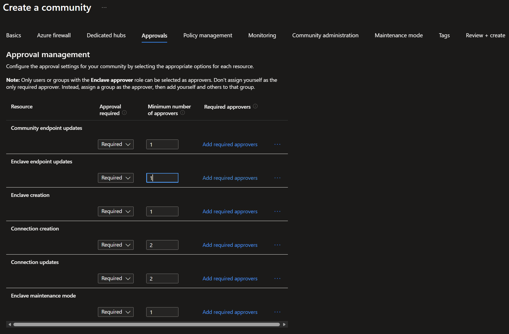
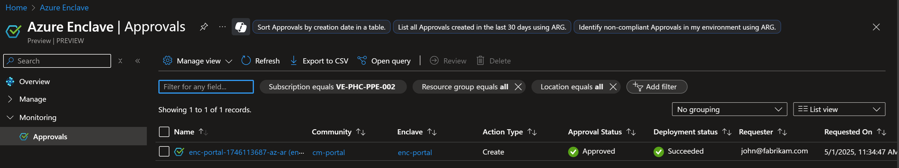
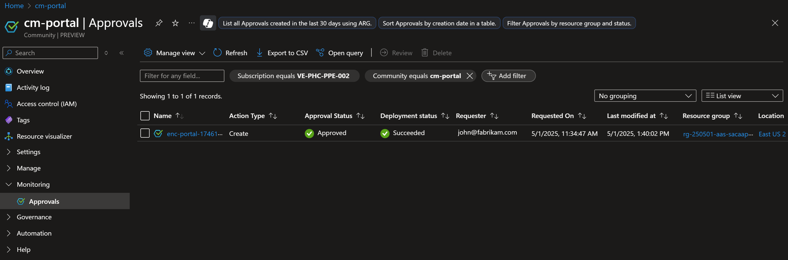
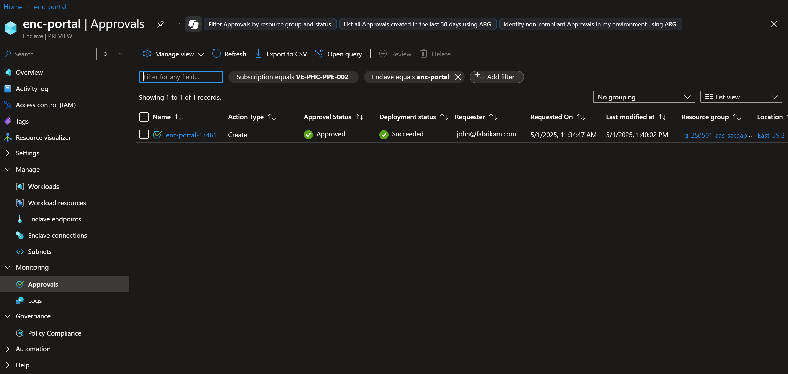
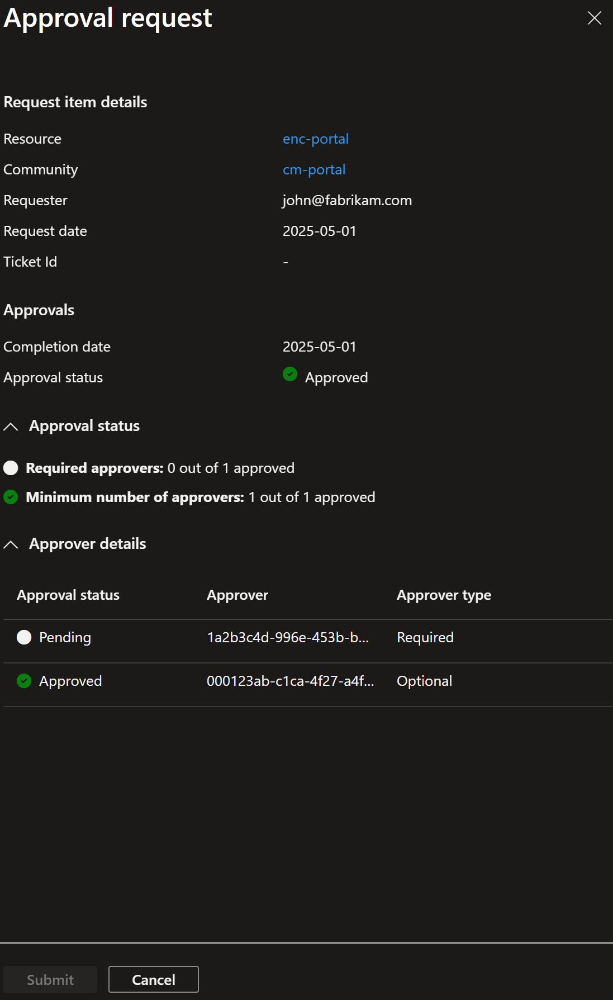

# Understand Approvals in Azure Enclave

Approvals add oversight to critical Azure Enclave actions. With approvals enabled, Azure Enclave queues requests to create new resources or change existing resources until a user with the **Enclave Approver Role** approves or denies the request.

## Introduction to approvals

Approvals in Azure Enclave provide a governance layer for resource creation and modification. They help organizations reduce the risk of unauthorized changes, prevent accidental misconfigurations, and keep an audit trail for sensitive operations. Approval workflows use Azure role-based access control (RBAC) so that only designated approvers can approve or deny requests.

## Which resource actions can require approval

You decide whether these resource actions require approval for your community:

- [Enclave](./what-enclave.md) creation
- [Enclave endpoint](./what-enclave-endpoint.md) modification
- [Community endpoint](./what-community-endpoint.md) modification
- [Enclave connection](./what-enclave-connection.md) creation and update
- Turning on [maintenance mode](./maintenance-mode.md) for an enclave

## How to set approval settings on resources

Approval settings can be set for eligible resources at the community level. The Community Owner can set which resources require approval when creating the community and can update those settings later as governance requirements evolve.

## Who can approve requests in Azure Enclave

Approval workflows in Azure Enclave use Azure RBAC so that only authorized individuals or groups can approve requests. Approvers are explicitly assigned based on their responsibilities and your organization's approval requirements.

Typical approvers include administrators, tenant owners, designated security or cyber personnel, business unit stakeholders, custom approver groups, or authorizing officials.

You have the flexibility to define approvers based on your requirements. You can ensure only those with the right authority and context can validate requests, maintaining strict controls over deployments and configurations in Azure Enclave. 

### How to designate someone as an approver

1. Go to the resource where you want to grant the approver role and select `Access Control (IAM)` in the left pane.
1. Select `Add`, and then select `Add role assignment`.
1. Search for and select `Enclave Approver Role`, and then select `Next`.
1. Select `Select Members`, search for and select the users or groups you want to make approvers, and then select `Next`.
1. On the final screen, select `Review + Assign`. The selected members get the approver role.

## Approvals FAQs

These are some of the frequently asked questions (FAQs) about Approvals.

### 1. How can I view approval requests?

The approvals view is available under **Monitoring** from three places:

- Azure Enclave home page

- Communities page

- Enclaves page

When you select `Approvals` from any of these places, you can see the scoped approval requests as long as you have the [approver role](#how-to-designate-someone-as-an-approver). You can also see approval request details, such as approval status, deployment status, and requester. Use the filters at the top of the page to adjust the request list.

### 2. How do I review approval requests?

Navigate to the approvals page and review any pending requests for approval and previous requests.
Keep in mind that only one request can be reviewed at a time.
The requests are visible to everyone but can only be approved or denied by users with the approver role.

To review a request:

1. Select an approval request.
1. Select `Review` in the header to open the approval details pane.
1. In the details pane, review the resource that the approval request is for. To see the underlying changes, select the resource name and review the specific changes.
1. Return to the previous screen, select either `Approved` or `Denied`, and then select `Submit`.
1. The deployment starts based on the approval action you selected.

### 3. Can I approve my own requests?

No. Approval of your own requests isn't allowed. Even if you're an approver, you need approval from someone else. Self-approval isn't allowed so that each change gets review from more than one person.

### 4. Can I delete accidentally raised requests?

You can only delete requests that are in the pending state. Requests that are already approved or denied can't be deleted.
The metadata for deleted requests remains in logs for auditing purposes.

### 5. How can I attach a ticket ID to an approval request?

1. Navigate to your approval request and select `Review`.
1. View the field called `Ticket ID`.
1. Select `Add Ticket ID`.
1. Enter the ticket ID in the field and select `Save`.
1. To update the ticket ID, select `Edit`.

> [!IMPORTANT]
>
> Don't enter personal data or personal details in the Ticket ID field.

### 6. Do approvals work with templates and other infrastructure as code (IaC)?

Yes. Approvals can be enabled for enclave creation, maintenance mode changes, enclave connection creation and updates, enclave endpoint updates, and community endpoint updates. Child resources that depend on a resource that's pending approval (for example, an enclave endpoint) might fail to deploy because configuration information for the pending resource is unavailable. In this situation, orchestrate resource deployments so the approver can review and complete the deployment of the pending resource before you deploy the child resources. This approach might require breaking a deployment into multiple steps or scripts that start after a required approval is complete.

### 7. If I change my approvals settings, what happens to existing, pending approval requests?

Approval settings are applied to the approval request when the request is created. Changes to approval settings apply only to future approval requests. You can cancel or deny any existing pending approval requests that you want to use the new approval settings.

For example, consider a community with approval settings that require one approver for new enclaves. If you create an approval request by creating a new enclave, the approval settings are applied and that request requires one approver. If the community or enclave approval settings are changed to add a second required approver, the existing enclave approval request doesn't require that new approver. It still requires the original one approver.

## References

- [What is Azure Enclave?](./what-azure-enclave.md)
- [Concepts and best practices](./best-practices.md)
- [What is an enclave?](./what-enclave.md)
