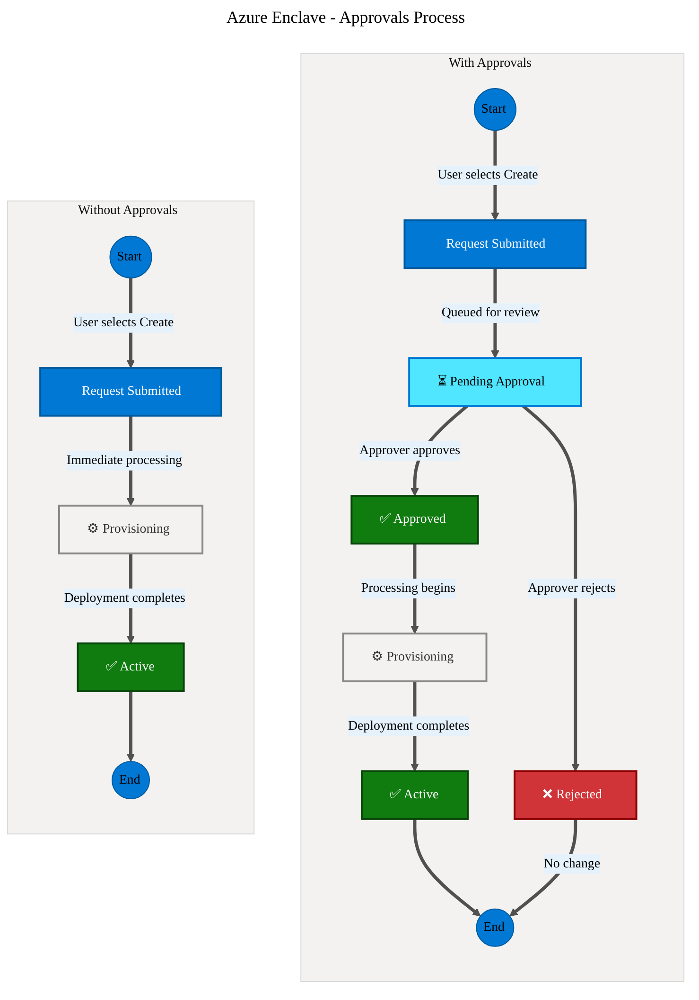

# What are Approvals in Azure Enclave?

Approvals in Azure Enclave provide another layer of governance and oversight for critical infrastructure operations. This feature enables administrators to queue requests to create new resources or modify existing resources, while requiring explicit approval before changes are implemented.

Consider these Approvals scenarios:

- You're the community cyber expert and want the administrator team to create new enclaves, but you need to approve enclave creation. Add yourself as a required approver for new enclaves.
- The community cyber team must review new enclave connections to help maintain community security and isolation. Add a security group for the community cyber team as a required approver for enclave connection creation and updates.
- You're an enclave owner who hosts a shared web app. You created an enclave endpoint for other enclaves to connect to your web app. You trust three people to review changes to that endpoint for availability and security. Add a security group as a required approver for connections to the enclave endpoint.

> [!IMPORTANT]
> 
> The Approvals feature is currently in **Preview**. This feature is encouraged for testing but shouldn't be used for production workloads while in preview.

## Enclave creation flow comparison

The following diagram illustrates how enclave creation differs when approvals are disabled versus enabled:

<!--
This is the mermaid definition for the above diagram. Use this to edit and regenerate the image.

-->

| Flow | Description |
|------|-------------|
| **Without Approvals** | Enclave creation proceeds immediately upon request submission. A user with creation permissions creates an enclave without more oversight. |
| **With Approvals** | Enclave creation enters a pending state, requiring explicit approval before provisioning begins. Rejected requests are recorded without resource creation. |

> [!NOTE]
>
> This example assumes the user has permissions to create the resource since that check is part of the typical flow in Azure. The approvals feature adds another layer of governance when a user already has permissions to create a resource.

## Why use Approvals?

Approvals help organizations maintain strict governance and security standards for sensitive environments by:

- **Enforcing separation of duties**: Ensuring that the person requesting a change isn't the same person approving it
- **Preventing unauthorized changes**: Requiring explicit approval before critical infrastructure modifications take effect
- **Enhancing audit trails**: Creating a comprehensive record of who requested changes, who approved them, and when
- **Reducing risk**: Catching potential misconfigurations or unauthorized changes before they're deployed
- **Supporting compliance requirements**: Meeting regulatory requirements for change management and oversight
- **Enabling controlled deployments**: Allowing teams to prepare changes while requiring management oversight before execution

## How Approvals work

The Approvals workflow in Azure Enclave follows these key steps:

1. **Request submission**: A user with appropriate permissions initiates an action that requires approval, such as creating an enclave connection or modifying an endpoint
1. **Pending state**: The requested change enters a pending state and is queued for review
1. **Approval review**: Users with the **Enclave Approver Role** can review pending approval requests
1. **Decision**: An approver either approves or rejects the request with optional comments
1. **Implementation**: If approved, the change is automatically implemented; if rejected, the request is discarded

## Resources that require approval

When the Approvals feature is enabled for a resource action, that action requires approval:

- **Enclave creation**: Creating a new enclave
- **Maintenance mode**: Modifying maintenance mode on an enclave, including turning maintenance mode on or off
- **Enclave connections**: Creating new connections between enclaves or to external resources or modifying existing connections
- **Enclave endpoints**: Modifying endpoint configurations that control network access
- **Community endpoints**: Changes to community-level networking rules

The specific operations requiring approval can be configured in the community configuration based on your organization's governance requirements.

## Roles and permissions

The Approvals feature integrates with the Azure Enclave role-based access control (RBAC):

### Enclave Approver Role

The **Enclave Approver Role** is designed for managing approval requests:

- **Read-only access** to all Azure Enclave resource types
- **Explicit permissions** to approve or reject pending approval requests
- **Cannot initiate changes**: This role is strictly for oversight and approval
- **Audit visibility**: Can view the full history of approval requests and decisions

### Other relevant roles

- **Enclave Owner/Contributor**: Can submit requests that require approval but can't self-approve
- **Community Owner/Contributor**: Can submit community-level requests requiring approval
- **Enclave Reader**: Can view pending approvals but can't approve or reject them

[Learn more about Azure Enclave RBAC roles](./built-in-rbac-roles.md)

## Integration with Azure Privileged Identity Management

Approvals can be combined with Azure Privileged Identity Management (PIM) for enhanced security:

- **Just-in-time approver access**: Approver permissions can be granted on a time-limited basis
- **Multi-factor authentication**: Require MFA for approval actions
- **Approval for approvers**: Require a secondary approval before granting approver permissions
- **Comprehensive audit logs**: Track all approval activities across both Azure Enclave and PIM

[Learn more about Just-in-Time Access](./just-in-time-access.md)

## Best practices

When implementing Approvals in your Azure Enclave environment:

1. **Assign dedicated approvers**: Designate specific individuals or teams as approvers to maintain separation of duties
1. **Define approval policies**: Clearly document which changes require approval and the approval criteria
1. **Set SLAs for approvals**: Establish timeframes for approval decisions to prevent deployment delays
1. **Use descriptive justifications**: Require requesters to provide detailed justifications for their change requests
1. **Regular audit reviews**: Periodically review approval logs to identify patterns and improve processes
1. **Combine with PIM**: Use time-bound approver access for sensitive environments
1. **Document rejection reasons**: When rejecting requests, provide clear feedback to help requesters understand why

## Monitoring and auditing

All approval activities are logged and auditable:

- **Azure Activity Logs**: All approval and rejection actions are logged in Azure Activity Logs
- **Log Analytics**: Query and analyze approval patterns and trends
- **Microsoft Sentinel**: Integrate approval logs with your security monitoring

## Approval states

Resources subject to approval can exist in the following states:

| State | Description |
|-------|-------------|
| **Pending** | The request is submitted and is awaiting approval |
| **Approved** | The request is approved and the change is being implemented |
| **Rejected** | The request is rejected and the requested resources aren't created or changed |
| **Connected/Active** | The approved change is successfully implemented |
| **Disconnected/Inactive** | The resource is in a disconnected state (for connections) |

## Next steps

- [Configure Approvals in Azure Enclave](./configure-approvals.md)
- [Manage approval requests](./manage-approvals.md)
- [Learn about Just-in-Time Access](./just-in-time-access.md)
- [Understand Azure Enclave RBAC](./built-in-rbac-roles.md)
- [Create an enclave connection with approvals](./create-enclave-connection-portal.md)
