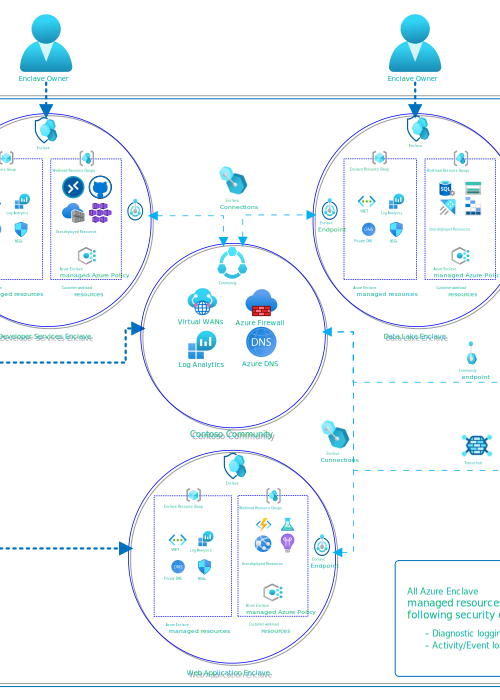
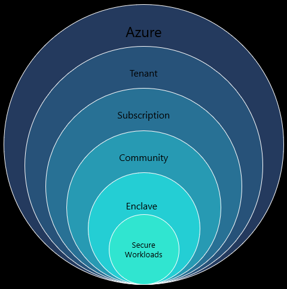

# What is Azure Enclave?

Azure Enclave accelerates and streamlines the deployment and management of secure, isolated, and compliant cloud environments for the most sensitive workloads. Azure Enclave is designed for commercial and air-gapped environments.

> [!IMPORTANT]
> 
> Azure Enclave is currently in preview and is provided without a service-level agreement. At this time, **Azure Enclave shouldn't be used for production workloads**. Certain features might not be supported, might have constrained capabilities, or might not be available in all Azure locations. See the full [Azure Enclave Terms](./preview-terms.md) for legal terms that apply to Azure features that are in beta, preview, or otherwise not yet released into general availability.

Azure Enclave takes a multi-layered and hierarchical approach to virtual boundary protection. A **community** serves as a central hub for networking, governance, and monitoring for a collection of isolated networks known as **enclaves**. Azure Enclave manages hub and firewall routing, along with virtual network flow logging, for configured enclave networking paths. Enclaves are isolated, zero-trust software-defined networks (Azure Virtual Network) that host your Azure service workloads. Enclaves and your workloads are governed through policy configuration management (Azure Policy).

## Accelerated deployment and management

Azure Enclave dramatically reduces the time and complexity required to create and manage secure, compliant cloud environments. Traditional secure environment deployment can take weeks or months of planning, configuration, and testing and still might be missing important isolation and policy controls. Azure Enclave reduces the deployment time to hours or days through platform-managed infrastructure and built-in security controls so you can focus on your customers or users.

## Isolated virtual networking and workloads
With Azure Enclave, you can easily create new isolated, zero-trust software-defined networks and deploy workloads in those networks to satisfy your business requirements on Azure.

- [**Communities**](./what-community.md) - Isolated, zero-trust, platform-managed virtual WAN boundary protected through a combination of Azure Firewall, policy guardrails, and Role Based Access Control (RBAC) Deny Assignments that serve as a hub for one or more enclaves.  Connections outside of the Community are managed through community endpoints and transit hub resources to allow connectivity to trusted destinations. Logging and diagnostics are enabled for all enclaves and workloads within the community by default. Each Enclave can send logging data to the community or keep it isolated to the enclave, or send logs to both.

- [**Enclaves**](./what-enclave.md) - Isolated, zero-trust, platform-managed virtual networks connected to the community hub protected through a combination of Network Security Groups (NSG), policy guardrails, and RBAC Deny Assignments that serve as the Virtual Network for one or more workloads. Enclave virtual networks and NSGs can't be directly modified and must be managed through enclave endpoints and enclave resources to establish network connectivity.

- [**Workloads**](./what-workload.md) - Logical groups that link your [workload resource groups](./what-workload.md#workload-resource-group) to an enclave. Workload resource groups are where you deploy customer-managed Azure resources. Those resources inherit the enclave's security posture, policies, and permissions.

## What gets deployed
When you deploy Azure Enclave resources, these resources are deployed for you:

- [**Communities**](./what-community.md) - The community managed resource group contains these resources depending on your selections during community creation.
  - Azure Virtual WAN
  - Azure Firewall
  - Firewall Policy
  - Managed identity for policy enforcement
  - Log Analytics workspace
  - (Optional) Data collection rule (for enclave Virtual Network flow log analytics if you configure any enclave logging to be sent to the community)
  - (Optional) Data collection endpoint (for enclave Virtual Network flow log analytics if you configure any enclave logging to be sent to the community)

  > [!NOTE]
  > 
  > Virtual WAN regional hub - A secured hub (Virtual WAN hub plus Azure Firewall) is created during enclave creation for each new region an enclave is deployed in.
  > Virtual WAN hub for transit - When you create a transit hub one of the following resources is also created depending on your choice:
    - VPN Gateway
    - ExpressRoute Gateway
    - Virtual Network Connection

- [**Enclaves**](./what-enclave.md)
  - Virtual Network
  - Network security group for each subnet (1 required, 1 for each customer subnet)
  - Managed identity, one for policy enforcement and one for Virtual Network flow logs
  - Storage account for network flow logs
  - Key Vault for network flow logs encryption on the storage account
  - (Optional) Log Analytics if you selected logging to the enclave
  - (Optional) Data collection rule (for enclave Virtual Network flow log analytics if you configure enclave logging to be sent to the enclave)
  - (Optional) Data collection endpoint (for enclave Virtual Network flow log analytics if you configure enclave logging to be sent to the enclave)
  - (Optional) Azure Bastion
  - (Optional) Azure Bastion subnet
  - (Optional) Public IP address for Azure Bastion

- [**Workloads**](./what-workload.md)
  - Workload Resource Groups - You create each [workload resource group](./what-workload.md#workload-resource-group) you need to organize your resources.

## Virtual connection management
With Azure Enclave, you can easily connect your communities, enclaves, and workloads to other networks and resources, both on Azure and on-premises.

- [**Enclave Endpoints**](./what-enclave-endpoint.md) are collections of networking rules that enable simplified and standardized connectivity to an enclave or an individual workload.
- [**Community Endpoints**](./what-community-endpoint.md) are collections of networking rules that enable external connectivity to trusted destinations including public websites, well-known services, and external private networks.
- [**Transit hubs**](./what-transit-hub.md) can be associated with community endpoint rules to allow secure site-to-site connectivity to external private networks via VPN Gateway or ExpressRoute.
- [**Enclave connections**](./what-enclave-connection.md) are associated with a community or enclave endpoint and allow network traffic based on the rules defined within the Endpoint.

## Multi-layered governance, security, and monitoring

Azure Enclave provides the following security layers built directly into the service:

- **Azure Policy guardrails** - Help control which resource types and configurations are allowed in communities, enclaves, and workloads.
- **Managed networking boundary** - Routes authorized traffic through managed endpoints, connections, network security groups, and Azure Firewall.
- **Logging and monitoring** - Sends activity and diagnostics to a community Log Analytics workspace, an enclave workspace, or both, depending on your configuration.
- **Access controls** - Uses Azure roles and deny assignments to help prevent unauthorized changes to platform-managed resources.
- **Connection management** - Uses enclave endpoints, community endpoints, transit hubs, and enclave connections to allow only explicitly defined traffic.
- **Service catalog** - Provides validated deployment templates for repeatable workload resource deployment.

For more governance guidance, see [best practices](./best-practices.md) and [access controls in enclaves](./access-controls-enclaves.md).

## Defense-in-depth 
Azure Enclave simplifies integration with existing Azure security and monitoring services including:

**Microsoft Sentinel**: Combine the power of Microsoft Sentinel's Security Information and Event Management (SIEM) and Security Orchestration, Automation, and Response (SOAR) capabilities with Azure Enclave to enhance threat detection, investigation, and response across your cloud environment.

**Azure Monitor**: Get end-to-end visibility and in-depth monitoring of your Azure Enclave operations, benefiting from Azure Monitor's advanced analytics.

**Microsoft Defender for Cloud**: Fortify your Azure Enclave by using the comprehensive threat protection features and security baseline insights of Microsoft Defender for Cloud.

**Azure Virtual Desktop**: Integrate your enclaves with Azure Virtual Desktop to provide users with a secure, remote desktop experience from anywhere.

Learn more about how Azure Enclave incorporates [defense-in-depth](./defense-in-depth.md).

## Next steps 
Here are some other articles to learn about the new Azure Enclave resources:

- [Why use Azure Enclave?](./why-azure-enclave.md)
- [Get started with Azure Enclave](./onboard.md)
- [What is a community?](./what-community.md)
- [What is an enclave?](./what-enclave.md)
- [What is a workload?](./what-workload.md)
- [Azure Enclave tutorials](./1-1-create-community.md)
