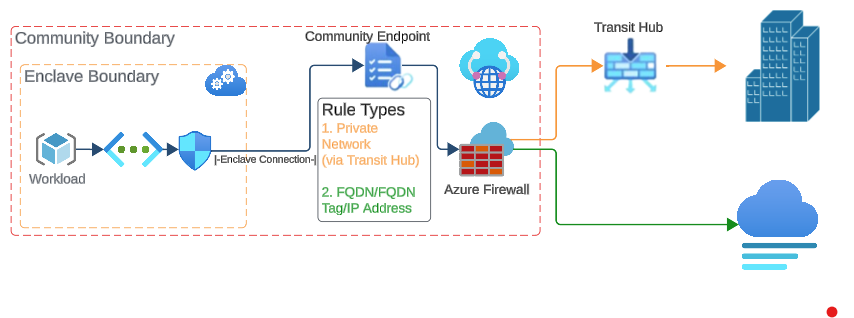

# What is a community endpoint?

A **community endpoint** is a collection of trusted destinations or transit hub connections to private networks outside of the community boundary.

Enclave connections associated with a community endpoint allow the **source enclave** to connect to destinations defined within the community endpoint. These endpoints provide a controlled mechanism for enclaves to communicate with external services while maintaining the network isolation boundaries of Azure Enclave.

Community endpoints are enforced through **Azure Firewall network rules**, ensuring outbound connectivity from enclaves is explicitly defined and governed.

## Architecture of a community endpoint

In this architecture:

1. An **enclave** initiates outbound connectivity.
1. Traffic is routed through the **community endpoint**.
1. The request is evaluated against **Azure Firewall network rules**.
1. If a rule matches, the connection to the destination is allowed.

This model ensures that all outbound traffic from enclaves is evaluated through centralized policy enforcement.

## Community endpoint rule types

Community endpoints support several rule types that define how enclaves can connect to external resources.

- **IP Address**  
  Enable traffic from an enclave to a specific IP address outside of the community Virtual WAN.

- **Fully Qualified Domain Name (FQDN)**  
  Enable traffic from an enclave to a trusted domain name (for example `portal.azure.com`).  
  FQDN rules support **TCP and UDP protocols**, allowing connectivity to services that expose endpoints through DNS rather than static IP addresses.

- **FQDN Tag**  
  Enable traffic from enclaves to known Microsoft Azure services via **FQDN tags** (for example `AzurePortal`).

- **Service Tag**  
  Enable traffic from enclaves to Azure services using **Azure Service Tags**. Service Tags represent groups of IP address prefixes for specific Azure services, simplifying the creation of security rules. When you use a Service Tag, Azure automatically maintains the underlying IP address ranges as they change, eliminating the need to manually update rules when service IP addresses are modified.

  Common Service Tags include:
  - `AzureCloud` - All Azure datacenter IP addresses
  - `AzureStorage` - Azure Storage service IP addresses
  - `AzureKeyVault` - Azure Key Vault service IP addresses
  - `AzureActiveDirectory` - Microsoft Entra ID service IP addresses
  - `AzureMonitor` - Azure Monitor service IP addresses
  - `Sql` - Azure SQL Database service IP addresses

  For a complete list of available Service Tags, see [Virtual Network service tags](/azure/virtual-network/service-tags-overview).

- **Private Network**  
  Enable traffic from enclaves to an external private network through an existing **transit hub** connection. The transit hub must exist before a private network rule can be created.

## Community endpoints for common services

Azure Enclave provides **pre-configured community endpoints for common services** that many organizations require. These built-in endpoints simplify the process of enabling connectivity to frequently used Azure and Microsoft services without requiring manual rule configuration.

Common service endpoints include connectivity to:

- **Azure management services** - Portal, Resource Manager, and management APIs
- **Microsoft Update services** - Windows Update and Microsoft Update endpoints
- **Azure monitoring services** - Azure Monitor, Log Analytics, and Application Insights
- **Identity services** - Microsoft Entra ID authentication and authorization endpoints
- **Certificate services** - Certificate revocation list (CRL) and Online Certificate Status Protocol (OCSP) endpoints

Using pre-configured common service endpoints provides several benefits:

- **Simplified configuration** - No need to manually identify and configure individual IP addresses or FQDNs
- **Automatic updates** - Endpoints are maintained by Azure and updated as service addresses change
- **Best practices alignment** - Pre-configured endpoints follow Microsoft recommended connectivity patterns
- **Reduced administrative overhead** - Minimizes the ongoing maintenance required for outbound connectivity rules

To enable common service endpoints for your community, see [Create a community endpoint](./create-community-endpoint-portal.md).

## FQDN network rules

Community endpoints support **FQDN-based Azure Firewall network rules** for **TCP and UDP protocols**. This capability enables enclaves to connect to domain-based destinations without requiring administrators to maintain static IP address lists.

When a community endpoint rule specifies an **FQDN destination**, Azure Firewall resolves the domain name to its associated IP addresses during rule evaluation. Traffic is then permitted or denied based on the configured rule parameters such as protocol and destination port.

Using FQDN-based rules provides several advantages:

- Simplifies firewall rule management by using domain names instead of IP addresses
- Supports services with **dynamic or frequently changing IP ranges**
- Enables easier connectivity to **SaaS platforms and Azure platform services**
- Improves scalability for large Azure Enclave deployments

Because rule evaluation relies on Azure Firewall behavior, community endpoint connectivity follows standard Azure Firewall rule processing and filtering logic.

For more information, see the following Azure Firewall documentation:

- [Azure Firewall rule processing logic](/azure/firewall/rule-processing)
- [Azure Firewall network rule filtering](/azure/firewall/firewall-faq#how-do-network-rules-work)
- [Azure Firewall FQDN filtering in network rules](/azure/firewall/domain-filtering-overview)

## Related documentation

- [Create a community endpoint](./create-community-endpoint-portal.md)
- [What is a community?](./what-community.md)
- [Best practices](./best-practices.md)