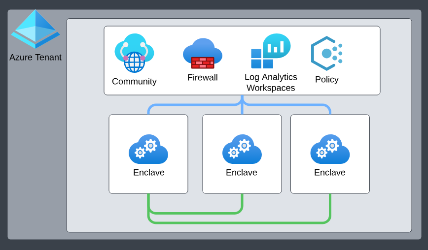

# What is a community?

Communities are isolated hub networks that can securely and logically group several [enclaves](./what-enclave.md) together for governance, management, and security purposes. A community owner can enable other communities or on-premises networks to connect through [transit hubs](./what-transit-hub.md) or [community endpoints](./what-community-endpoint.md).

## Architecture of a community

Communities come with the following primary platform-managed and platform-deployed resources:
- Isolated [Azure Virtual WAN](/azure/virtual-wan/virtual-wan-about) hub networks. By default, these communities aren't connected to the rest of the internet outside of [certain authorized Microsoft services](/azure/azure-portal/azure-portal-safelist-urls?tabs=public-cloud).
- [Azure Firewall](/azure/firewall/overview). By default, all communities are deployed with a secure-by-default Azure Firewall through which all community network traffic routes.
- [Log Analytics Workspace](/azure/azure-monitor/logs/log-analytics-overview). By default, all community resources are integrated into Azure Log Analytics, ensuring all activities within a community are effectively monitored, logged, and audited. More specifically, all resources deployed in a community send their [diagnostic platform logs](/azure/azure-monitor/essentials/diagnostic-settings) to this Log Analytics Workspace.

### Community address space

Community managers can add one or more address spaces (prefixes between /8 and /16) to an existing community. This action doesn't require the community to be in maintenance mode, but it does update Azure Firewall rules so connectivity is preserved across all ranges. You can't fully remove address spaces if they're already in use. However, you can replace an existing range by adding a broader address space that fully contains it, preserving allocation continuity and avoiding breaking changes.

When you create new enclaves, Azure Enclave uses an IP address management strategy that always allocates the smallest available community address space that can accommodate the requested enclave size. This approach minimizes fragmentation and preserves larger address ranges for future needs, such as large enclave deployments. For example, allocating a smaller enclave into a smaller fitting address space avoids blocking future allocations that would require a larger contiguous range.

> [!NOTE]
> 
> The platform reserves `192.168.0.0/16` to manage enclaves deployed within a community. Don't create communities with any of these address spaces as that action creates overlapping conflicts with the platform-managed enclave management IP ranges.

## Community managed resource group
When you create a community, the Azure Enclave resource provider also creates and manages a separate resource group called the community managed resource group. For more details regarding the community managed resource group, learn more about [Best practices for Azure Enclave](./best-practices.md). 

## Template

Azure Enclave provides resource module templates to streamline community deployment and configuration. See [template documentation](./azure-enclave-templates.md#resource-modules) for available modules and usage examples.

## Managed Resources
- [Azure Virtual WAN](/azure/virtual-wan/virtual-wan-about)
- [Azure Firewall](/azure/firewall/overview)
- [Azure Firewall policy](/azure/firewall-manager/policy-overview)
- [Log Analytics Workspace](/azure/azure-monitor/logs/log-analytics-overview)
- [Managed Identity](/entra/identity/managed-identities-azure-resources/overview)

## Related resources
- [What is Azure Enclave?](./what-azure-enclave.md)
- [What is an enclave?](./what-enclave.md)
- [Best practices for Azure Enclave](./best-practices.md)
- [Tutorial: Create a community](./1-1-create-community.md)
