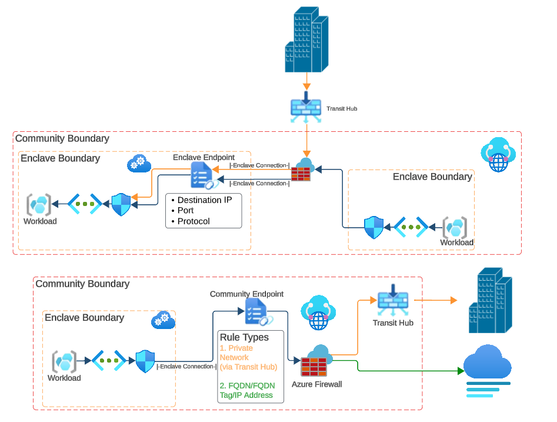

# What is an enclave connection?

Enclave connections enable network traffic to flow between an enclave and a trusted destination defined within the community boundary. The destination of every enclave connection is either an enclave endpoint or community endpoint. Enclave connections allow resources within your enclave to access services and data running within another enclave (via an enclave endpoint), or to trusted private and/or public destinations defined at the community level (via a community endpoint).

Enclave connections can also enable secured public access to resources within an enclave through a transit hub connection. In these cases, the transit hub would be the source of the connection and an enclave endpoint would be the destination.

## Architecture of an enclave connection

## Enclave connection types

Enclave connections support multiple source and destination configurations:

### Enclave-to-enclave connections

Connect resources in one enclave to resources in another enclave within the same community. Enclave to enclave connections enable secure communication between isolated workloads while maintaining network boundaries.

### Enclave-to-community endpoint connections

Connect resources in an enclave to external destinations defined in a community endpoint. Community endpoints enable controlled outbound access to:
- Public internet destinations (via IP, FQDN, FQDN Tag, or Service Tag rules)
- External private networks (via transit hub connections)

### Transit hub-to-enclave connections

Enable inbound connectivity from external networks to resources within an enclave. The transit hub serves as the connection source, allowing traffic from on-premises networks or other Azure virtual networks to reach enclave workloads.

### Transit hub-to-transit hub connections

Connect transit hubs within the same community to enable network traffic flow between different external network connections. This capability allows organizations to:

- **Route traffic between on-premises locations** - Connect multiple VPN or ExpressRoute connections through the community Virtual WAN
- **Enable spoke-to-spoke communication** - Allow traffic between virtual networks peered to different transit hubs
- **Create network transit architectures** - Build hub-and-spoke topologies where the community Virtual WAN serves as the central routing point

Transit hub interconnection supports scenarios where:
- Multiple regional offices need to communicate through a centralized Azure environment
- Different Azure subscriptions with separate virtual networks require connectivity
- Hybrid connectivity patterns require traffic to flow between ExpressRoute and VPN connections

To create a transit hub-to-transit hub connection, both transit hubs must exist within the same community. The connection enables bidirectional traffic flow based on the configured routing and firewall rules.

## Connection security

All enclave connections are governed by:

- **Azure Firewall rules** - Traffic is evaluated against community-level firewall policies
- **Network security groups** - Enclave-level network security groups (NSGs) provide extra traffic filtering
- **Private endpoints** - Resources communicate over private IP addresses within the Azure backbone

## Template

See [template documentation](./azure-enclave-templates.md#resource-modules)

## Next steps

- [Create an enclave connection](./create-enclave-connection-portal.md)
- [What is a community endpoint?](./what-community-endpoint.md)
- [What is a transit hub?](./what-transit-hub.md)