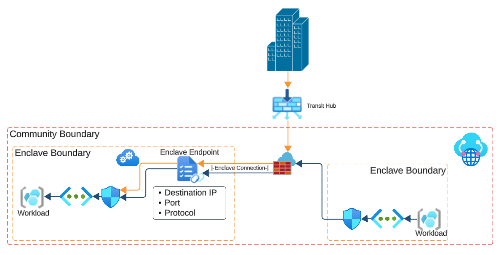

# What is an enclave endpoint?

Enclave endpoints define how workloads can be accessed from outside of an enclave boundary. When an enclave is created from Enclave-A to an Endpoint in Enclave-B, the Endpoint determines the destination, ports, and protocols for the connection. The enclave resource determines authorized source IP coming from Enclave-A that is authorized to connect to Enclave-B.

## Architecture of an enclave endpoint

## Enclave endpoint Rules
Enclave endpoint rules have the following three components:
- Destination IP Address: IP/CIDR range of an IP space within the enclave boundary
- Ports: Ports though which network traffic is allowed to flow to the destination IP
- Protocols: Protocols through which network traffic is allowed to flow to the destination IP

## Connection Types

Enclave endpoints support two types of connections:
- Inbound from another Enclave in the community
- Inbound from a transit hub

## Template
See [template documentation](./azure-enclave-templates.md#resource-modules)
