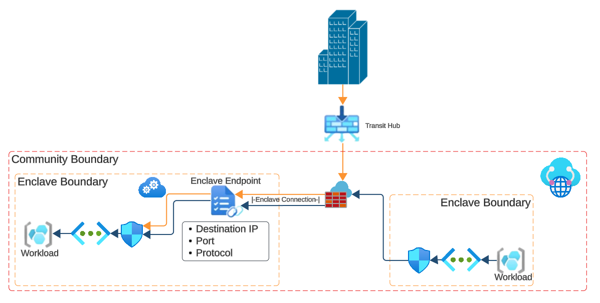

# What is an enclave endpoint?

Enclave endpoints define how workloads can be accessed from outside of an enclave boundary. When you create an enclave from Enclave-A to an endpoint in Enclave-B, the endpoint determines the destination, ports, and protocols for the connection. The enclave connection resource determines the authorized source CIDR/IP range from Enclave-A that is authorized to connect to Enclave-B.

## Architecture of an enclave endpoint

## Enclave endpoint rules

Enclave endpoint rules have the following three components:
- `IP Address`: IP/CIDR range of an IP space within the enclave boundary
- `Ports`: Ports through which network traffic is allowed to flow to the destination IP
- `Protocols`: Protocols through which network traffic is allowed to flow to the destination IP

## Connection Types

Enclave endpoints support two types of inbound connections:
- From another enclave in the community
- From a transit hub

## Template
See [template documentation](./azure-enclave-templates.md#resource-modules).
