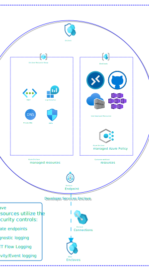

# What is an enclave?

An enclave is an isolated Azure Virtual Network that belongs to a [community](./what-community.md). It hosts one or more [workloads](./what-workload.md) that require network isolation, monitoring, and security boundaries. You can connect enclaves together using [enclave endpoints](./what-enclave-endpoint.md) to enable secure [enclave-to-enclave communication](./what-enclave-connection.md).

## Why create an enclave?

Enclaves give you boundaries for security, governance, and resource isolation. Each enclave provides:
- **Network isolation**: Enclaves are isolated from anything outside of the enclave default. Traffic is restricted to authorized Microsoft services and connections you explicitly enable using [enclave endpoints](./what-enclave-endpoint.md). 
- **Built-in monitoring and audit logs**: All activity in your enclave is automatically sent to a Log Analytics Workspace, giving you visibility into what's happening in your environment.
- **Shared security policies**: Resources within an enclave inherit the enclave's security posture, making it easier to apply consistent policies across workloads.

## Architecture of an enclave

Enclaves come with the following platform-managed resources:

**Networking**
- **Azure Virtual Network with Subnets**: An isolated [virtual network](/azure/virtual-network/virtual-networks-overview) that you define and manage, restricted to [authorized Microsoft services](/azure/azure-portal/azure-portal-safelist-urls) and controlled through [Network Security Groups](/azure/virtual-network/network-security-groups-overview).
- **Private Link integration**: [Private Endpoints](/azure/private-link/private-endpoint-overview) and [Private DNS Zones](/azure/dns/private-dns-privatednszone) ensure all platform resources communicate privately within your network boundary.

**Monitoring and Access**
- **Log Analytics Workspace**: Provides [diagnostic logging](/azure/azure-monitor/essentials/diagnostic-settings) and monitoring for enclave resources. Azure Enclave and user-deployed resources can send logs here, with routing configurable via diagnostic settings.
- **Azure Bastion**: Provides secure RDP/SSH admin access to resources within the enclave.

## Enclave managed resource group 

When you create an enclave, the Azure Enclave resource provider creates a managed resource group to hold all platform-managed resources. A [deny assignment](/azure/role-based-access-control/deny-assignments) prevents unauthorized modifications to this resource group, protecting enclave isolation and security boundaries from accidental or malicious changes. This mechanism ensures platform-managed resources remain in a secure, consistent state.

### Maintenance mode

Maintenance mode allows enclave owners to temporarily bypass the deny assignment restrictions for privileged maintenance tasks. Bypassing the deny assignment is useful when you need to make controlled changes to managed resources without losing isolation protection. Typical use cases include:
- Applying network configuration updates
- Updating enclave security policies
- Modifying monitoring or logging settings

[Learn more about maintenance mode](./maintenance-mode.md).

## Template
See [template documentation](./azure-enclave-templates.md#resource-modules)

## Managed Resources
The following resources types are deployed into the enclave managed resource group:
- [Azure Virtual Network](/azure/virtual-network/virtual-networks-overview)
- [Subnets](/azure/virtual-network/concepts-and-best-practices#virtual-network-concepts)
- [Network Security Groups](/azure/virtual-network/network-security-groups-overview)
- [Log Analytics Workspace](/azure/azure-monitor/logs/log-analytics-overview)
- [Azure Bastion](/azure/bastion/bastion-overview)
- [Private Endpoints](/azure/private-link/private-endpoint-overview)
- [Private DNS Zones](/azure/dns/private-dns-privatednszone)

## Next Steps
- [What is a workload?](./what-workload.md)
- [What is the service catalog?](./what-service-catalog.md)
- [What is a community?](./what-community.md)
- [Best practices](./best-practices.md)
- [Maintenance mode](./maintenance-mode.md)
- [Tutorial: Create an enclave](./1-2-create-enclaves-inside-community.md)
