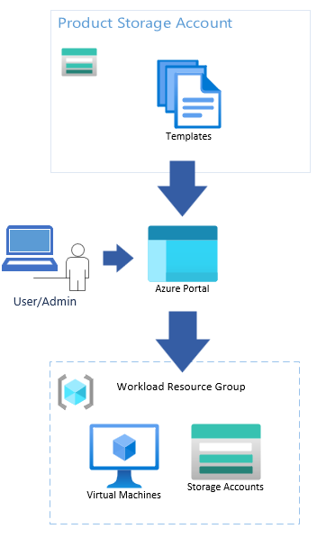

# What is the service catalog?

The service catalog enables you to quickly deploy tailored Azure Resource Manager (ARM) templates of Azure services into Azure Enclave while being compliant with Policy Guardrails and enclave isolation requirements. The service catalog helps you accelerate the creation of your workloads within the secure boundary of Azure Enclave without getting blocked by the security you want.



Diagram Description: The user/admin accesses the service catalog through the portal. Once the user selects the service catalog template they want to deploy, they can customize the resource creation, and then create those resources.

## What is in the service catalog?

Browse the [Service Catalog List](./list-service-catalog-templates.md) to view the available templates in the service catalog. Review the documentation for each service catalog template you wish to deploy to determine if there are any prerequisite steps.

> [!NOTE]
> You can edit the service catalog template itself but edits might change the parameter inputs view.

## Service Catalog Setup
Since Azure Enclave deploys with connections denied by default, you need to create a community endpoint to allow access to the storage account that contains service catalog templates.

```bicep
{
    endpointRuleName: 'service-catalog'
    destinationType: 'FQDN'
    #disable-next-line no-hardcoded-env-urls
    destination: 'veservicecatalogprod.z22.web.core.windows.net'
    protocols: ['HTTPS']
    ports: '443'
  }
```

You can update the destination for other Clouds using the values in [this article](./deploy-template-service-catalog-azure-cli.md).

## Ready? Deploy from the service catalog!

- [Service Catalog List: How-To Guides and tips for each template](./list-service-catalog-templates.md)
- [Service Catalog Storage Account deployment Quickstart](./deploy-storage-account-service-catalog.md)
- [What is Azure Enclave?](./what-azure-enclave.md)
- [Tutorial: Create resources from the service catalog](./1-4-use-service-catalog-create-azure-resources-workloads.md)
