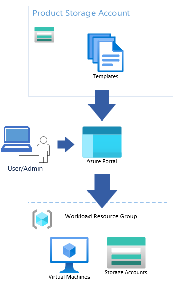

# What is the service catalog?

The service catalog enables you to quickly deploy tailored Azure Resource Manager (ARM) templates of Azure services into Azure Enclave while staying compliant with policy guardrails and enclave isolation requirements. The service catalog helps you accelerate the creation of your workloads within the secure boundary of Azure Enclave without being impeded by the security controls that protect your environment.



## What is in the service catalog?

Browse the [Service Catalog List](./list-service-catalog-templates.md) to view the available templates in the service catalog. Review the documentation for each service catalog template you wish to deploy to determine if there are any prerequisite steps.

> [!NOTE]
> You can edit the service catalog template itself but edits might change the parameter inputs view.

## Service catalog setup

Since Azure Enclave deploys with connections denied by default, you need to create a community endpoint to allow access to the storage account that contains service catalog templates.

```bicep
{
    endpointRuleName: 'service-catalog'
    destinationType: 'FQDN'
    #disable-next-line no-hardcoded-env-urls
    destination: 'veservicecatalogprod.z22.web.core.windows.net'
    protocols: ['HTTPS']
    ports: '443'
  }
```

To update the destination for other clouds, use the values in [Deploy service catalog templates using Azure CLI](./deploy-template-service-catalog-azure-cli.md).

## Next steps

- [Service catalog list: how-to guides and tips for each template](./list-service-catalog-templates.md)
- [Service catalog storage account deployment quickstart](./deploy-storage-account-service-catalog.md)
- [What is Azure Enclave?](./what-azure-enclave.md)
- [Tutorial: Create resources from the service catalog](./1-4-use-service-catalog-create-azure-resources-workloads.md)
