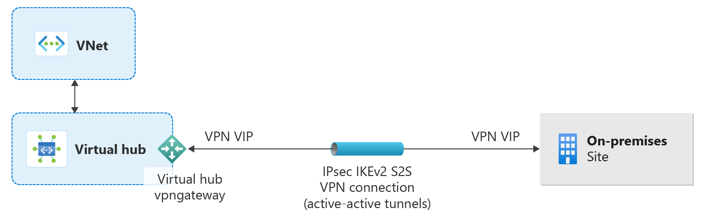

# What is a Transit hub?

A Transit hub establishes a virtual hub within a community Virtual WAN that serves as a secure tunnel between the community and an external private network. A transit hub can be associated with a Private Network rule within a community endpoint to enable enclaves to connect to trusted private networks outside of the community boundary.

## Architecture of a transit hub

## Transit hub types

Transit hubs support the following types of secure connectivity:

- **VPN Gateway** - Site-to-site VPN connections for secure connectivity over the public internet
- **ExpressRoute** - Private, dedicated connections through Microsoft's global network
- **vNet Peering** - Direct virtual network peering for Azure-to-Azure connectivity

## Simplified S2S connections for Azure Local and on-premises

Transit hubs now provide **simplified site-to-site (S2S) VPN connectivity** for Azure Local and on-premises environments. This streamlined approach reduces the complexity of establishing hybrid connectivity between your community and external networks.

### Benefits of simplified S2S connections

- **Reduced configuration steps** - Simplified wizard-based setup for common connectivity scenarios
- **Pre-configured security settings** - Default security policies aligned with Azure best practices
- **Automated routing** - Automatic route propagation between the community Virtual WAN and connected networks
- **Azure Local integration** - Native support for Azure Local deployments with optimized connectivity patterns

### Supported scenarios

Simplified S2S connections support the following deployment scenarios:

| Scenario | Description |
|----------|-------------|
| **Azure Local to community** | Connect Azure Local clusters to your community for hybrid workload deployment |
| **On-premises datacenter** | Establish secure connectivity from traditional on-premises infrastructure |
| **Branch office** | Connect remote branch locations through VPN tunnels |
| **Multi-site mesh** | Create interconnected network topologies across multiple locations |

### Configuration requirements

To use simplified S2S connections:

1. Ensure your on-premises or Azure Local VPN device supports IKEv2 and BGP
1. Gather your on-premises network address ranges (CIDR blocks)
1. Identify the public IP address of your on-premises VPN gateway
1. Configure the transit hub with your connection parameters

For detailed configuration steps, see [Create a transit hub](./create-transit-hub-portal.md).

## Transit hub interconnection

Transit hubs within the same community can be connected to enable traffic flow between different external network connections. This **transit hub-to-transit hub connectivity** enables several advanced networking scenarios:

### Use cases for transit hub interconnection

- **Cross-region connectivity** - Route traffic between on-premises locations in different geographic regions through the Azure backbone
- **Network segmentation** - Maintain separate transit hubs for different business units while allowing controlled communication
- **Redundant connectivity** - Establish backup paths using multiple transit hubs with different connection types (for example VPN and ExpressRoute)
- **Multi-cloud connectivity** - Connect different cloud environments through separate transit hubs

### How transit hub interconnection works

When two transit hubs are interconnected:

1. Traffic from one external network can route through its transit hub to the community Virtual WAN
1. The Virtual WAN routes traffic to the destination transit hub
1. Traffic exits through the second transit hub to the target external network

This architecture leverages Azure Virtual WAN's native routing capabilities to provide:

- **Optimized paths** - Traffic follows the most efficient route through the Azure backbone
- **Centralized policy** - All traffic is subject to community-level Azure Firewall rules
- **Simplified management** - No need to configure complex routing tables at each location

### Creating transit hub connections

To connect transit hubs within the same community:

1. Create both transit hubs within the community
1. Create an enclave connection with one transit hub as the source and the other as the destination
1. Configure the appropriate firewall rules to allow the desired traffic

For step-by-step instructions, see [Create an enclave connection](./create-enclave-connection-portal.md).

## Security and compliance

All traffic through transit hubs is governed by:

- **Azure Firewall** - Community-level firewall policies filter all traffic entering and leaving the community
- **Encryption** - VPN connections use IPsec encryption; ExpressRoute can use MACsec at the edge
- **Logging** - All connection activity is logged for audit and compliance purposes

## Next Steps

- [Create a transit hub in the Azure portal](./create-transit-hub-portal.md)
- [Create a community endpoint in the Azure portal](./create-community-endpoint-portal.md)
- [What is an enclave connection?](./what-enclave-connection.md)