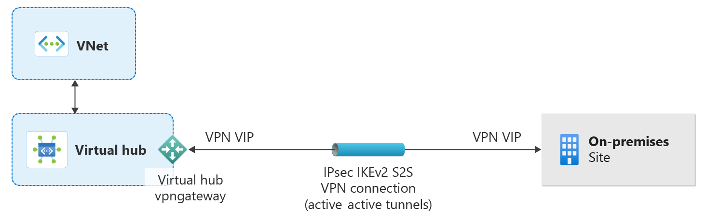

# What is a transit hub?

A transit hub creates a virtual hub within a community Virtual WAN that provides a secure connectivity path between the community and an external private network. You can associate a transit hub with a `PrivateNetwork` rule within a community endpoint to enable enclaves to connect to trusted private networks outside the community boundary.

## Architecture of a transit hub

## Supported connection types

Transit hubs support the following connection types:

- **Gateway** - Site-to-site VPN connections for secure connectivity over the public internet
- **ExpressRoute** - Private, dedicated connections through Microsoft's global network
- **Peering** - Direct virtual network peering for Azure-to-Azure connectivity

## Site-to-site VPN connections

Transit hubs provide site-to-site (S2S) VPN connectivity for on-premises environments. This approach reduces the complexity of establishing hybrid connectivity between your community and external networks.

### Benefits of S2S connections

- **Reduced configuration steps** - Simplified setup for common connectivity scenarios
- **Pre-configured security settings** - Default security policies aligned with Azure best practices
- **Automated routing** - Automatic route propagation between the community Virtual WAN and connected networks

### Supported scenarios

S2S connections support the following deployment scenarios:

| Scenario | Description |
|----------|-------------|
| **On-premises datacenter** | Establish secure connectivity from traditional on-premises infrastructure |
| **Branch office** | Connect remote branch locations through VPN tunnels |

### Configuration requirements

To use S2S connections:

1. Ensure your on-premises VPN device supports IKEv2 and BGP.
1. Gather your on-premises network address ranges (CIDR blocks)
1. Identify the public IP address of your on-premises VPN gateway
1. Configure the transit hub with your connection parameters

For detailed configuration steps, see [Create a transit hub](./create-transit-hub-portal.md).

## Transit hub configuration

You configure a transit hub by using one of the supported connection types. The connection type determines whether the hub uses a VPN gateway, ExpressRoute, or virtual network peering for connectivity.

For step-by-step instructions, see [Create a transit hub](./create-transit-hub-portal.md).

## Security and compliance

Transit hubs use the following features to govern traffic:

- **Azure Firewall** - Community-level firewall policies filter all traffic entering and leaving the community
- **Encryption** - VPN connections use IPsec encryption.
- **Logging** - You can log connection activity for audit and compliance purposes.

## Next Steps

- [Create a transit hub in the Azure portal](./create-transit-hub-portal.md)
- [Create a community endpoint in the Azure portal](./create-community-endpoint-portal.md)
- [What is an enclave connection?](./what-enclave-connection.md)
