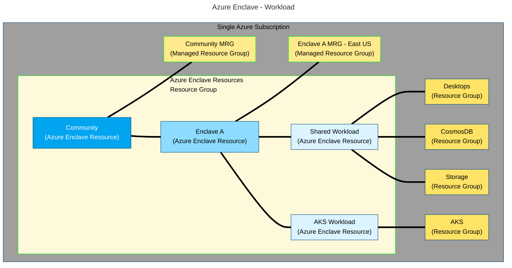

# What is a workload?

Workloads are logical groups of Azure resources that you define inside an Azure Enclave. You can link an Azure resource group to a workload resource to bring that resource group into the security and control boundary of the enclave (see the [diagram](#architecture-of-a-workload)). Community and enclave owners can create isolated [mission-critical](/azure/well-architected/mission-critical/mission-critical-overview) workloads then allow specific access as needed. When enclave owners deploy Azure resources and services into workloads, each workload automatically inherits the enclave's security posture and policies. You create your own Azure services in your workload resource groups and maintain those resources under the [shared responsibility model](/azure/security/fundamentals/shared-responsibility) in the cloud. By default, workloads can also use community services that are reachable from their enclave.

## Why use a workload?
Workloads are a logical way to organize your Azure resource groups and create a link to your Azure Enclave environment. With workloads, you can separate groups of policies and exceptions scoped and applied to a workload and the resources in the linked workload resource groups. Workload resource groups have some restrictions, which are described in the [Best Practices](./best-practices.md#workload-resource-group).

The alternative is to deploy an Azure resource group through the portal that isn't linked to a workload. Workload resource groups are equivalent to normal Azure resource groups with the added benefit of keeping the resources secured within the enclave boundary. Deploying a normal Azure resource group through the portal is still an option, but a normal Azure resource group wouldn't be secured within the enclave boundary.

> [!VIDEO https://learn-video.azurefd.net/vod/player?id=58cd99f7-02bf-4ddb-bbf4-04028745bc7b]

## Architecture of a workload
Workloads are linked as a child resource to [enclaves](./what-enclave.md) and are linked as the parent resource to [workload resource groups](#workload-resource-group).

- [Azure Enclave governance](./what-azure-enclave.md#multi-layered-governance-security-and-monitoring)
- [Enclave services and properties](./what-enclave.md)
- [Well-Architected Framework workload guidance](/azure/well-architected/workloads)
- [Well-Architected Framework Service Guides](/azure/well-architected/service-guides/?product=popular)

This diagram shows two example workloads. The `Shared Workload` is linked to three workload resource groups and the `AKS Workload` is linked to one workload resource group. Resource groups are highlighted in green and Azure resources are highlighted in dark blue.

<!--
This is the mermaid definition for the above diagram. Use this to edit and regenerate the image.

-->

## Workload resource group
When you create an Azure Enclave workload, you create linked workload resource groups where you can organize your Azure resources. 

For more details regarding workload resource group best practices and guidelines, learn more about [Best practices of workload resource groups](./best-practices.md#workload-resource-group).

## What can I add to my workload?
The workload resource groups function like an Azure resource group and you can deploy Azure resources that are compliant with the workload policies. You can create new resources using the methods you're familiar with for your Azure resources. Additionally, you can create resources from the Portal through the service catalog: [What is the service catalog](./what-service-catalog.md)

## Next Steps
- [Tutorial: Workloads in Azure Enclave](./2-1-plan-architecture-workloads.md)
- [What is the service catalog?](./what-service-catalog.md)
- [What is Azure Enclave?](./what-azure-enclave.md)
- [What is a community?](./what-community.md)
- [What is an enclave?](./what-enclave.md)
- [Shared responsibility model in the cloud](/azure/security/fundamentals/shared-responsibility)
- [Best practices](./best-practices.md)
- [Tutorial: Create a workload](./1-3-create-workloads-inside-enclave.md)
