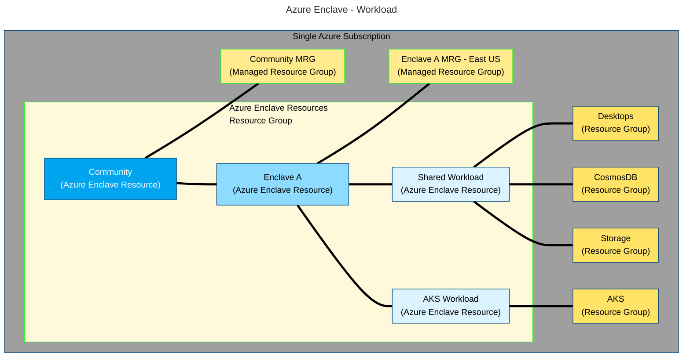

# What is a workload?

Workloads are logical groups of Azure resources that you define inside an Azure Enclave. You link Azure resource groups to a workload resource to bring those resource groups into the security and control boundary of the enclave. For an illustration, see the [architecture diagram](#architecture-of-a-workload).

Community and enclave owners can create isolated [mission-critical](/azure/well-architected/mission-critical/mission-critical-overview) workloads, and then allow specific access as needed. When you deploy Azure resources and services into workloads, each workload automatically inherits the enclave's security posture and policies.

You create your own Azure services in your workload resource groups and maintain those resources under the [shared responsibility model](/azure/security/fundamentals/shared-responsibility) in the cloud. Workloads can also reach community services through the enclave connections that are configured for their enclave.

## Why use a workload?

Workloads are a logical way to organize your Azure resource groups and create a link to your Azure Enclave environment. Policy assignments are applied at the scope of each linked workload resource group, so the resources you deploy there must comply. The policy set itself comes from the enclave's governed service list, or from the community's list when the enclave doesn't define one, and every workload in the enclave inherits it. Workload resource groups have some restrictions, which are described in [Best practices for Azure Enclave](./best-practices.md#workload-resource-group).

The alternative is to deploy an Azure resource group through the portal that isn't linked to a workload. Workload resource groups are equivalent to normal Azure resource groups with the added benefit of keeping the resources secured within the enclave boundary. Deploying a normal Azure resource group through the portal is still an option, but a normal Azure resource group wouldn't be secured within the enclave boundary.

## Architecture of a workload

Workloads are child resources of [enclaves](./what-enclave.md). Each workload references its [workload resource groups](#workload-resource-group) by resource ID in the workload's `resourceGroupCollection` property. Those resource groups remain standard Azure resource groups, so they aren't Azure Resource Manager child resources of the workload.

This diagram shows two example workloads. The `Shared Workload` is linked to three workload resource groups and the `AKS Workload` is linked to one workload resource group. Resource groups are highlighted in green and Azure resources are highlighted in dark blue.

<!--
This is the mermaid definition for the above diagram. Use this to edit and regenerate the image.

```mermaid
---
title: Azure Enclave - Workload
config:
  theme: base
---
flowchart TB
  subgraph Subscription ["Single Azure Subscription"]
    subgraph ave-resource-groups [Azure Enclave Resources
                                  Resource Group]
      Community["Community
                (Azure Enclave Resource)"]
      Enclave2["Enclave A
               (Azure Enclave Resource)"]
      subgraph Workload1 ["Shared Workload
                          (Azure Enclave Resource)"]
      end
      subgraph Workload2 ["AKS Workload
                          (Azure Enclave Resource)"]
      end
    end

    subgraph WL1-RG-Desktops ["Desktops
                              (Resource Group)"]
    end
    subgraph WL1-RG-Storage ["Storage 
                             (Resource Group)"]
    end
    subgraph WL2-RG-AKS ["AKS
                         (Resource Group)"]
    end
    subgraph WL1-RG-CosmosDB ["CosmosDB
                              (Resource Group)"]
    end

    subgraph Community-MRG ["Community MRG
                            (Managed Resource Group)"]
    end
    subgraph Enclave2-MRG ["Enclave A MRG - East US
                           (Managed Resource Group)"]
    end
  end

  Community --- Community-MRG
  Community --- Enclave2
  Enclave2 --- Enclave2-MRG
  Enclave2 --- Workload1
  Enclave2 --- Workload2
  Workload1 --- WL1-RG-Desktops
  Workload2 --- WL2-RG-AKS
  Workload1 --- WL1-RG-CosmosDB
  Workload1 --- WL1-RG-Storage
  
%% Styling
  linkStyle default stroke-width:4px,stroke:Black;

  classDef subscription fill:#9F9F9F,stroke:#004578,color:#000;
  classDef resourceGroup fill:#fff9db,stroke:#00FF00,color:#000;
  classDef managedResourceGroup fill:#ffea8d,stroke:#00FF00,color:#000;
  classDef workloadResourceGroup fill:#ffe366,stroke:#004578,color:#000;
  classDef community fill:#00A4EF,stroke:#004578,color:#fff;
  classDef enclave fill:#8ddbff,stroke:#004578,color:#000;
  classDef workload fill:#dbf4ff,stroke:#004578,color:#000;

  class Subscription subscription;
  class WL1-RG-Desktops,WL2-RG-AKS,WL1-RG-CosmosDB,WL1-RG-Storage workloadResourceGroup;
  class Community-MRG,Enclave2-MRG managedResourceGroup;
  class ave-resource-groups resourceGroup;
  class Community community;
  class Enclave2 enclave;
  class Workload1,Workload2 workload;
```
-->

## Workload resource group

When you create a workload in your enclave, specify the workload resource groups to link to it. Azure Enclave creates the resource groups that don't exist yet and links the existing resource groups. An existing resource group must be empty, must be in the same subscription as the workload, and can't already be linked to another workload.

For more details regarding workload resource group best practices and guidelines, learn more about [Best practices of workload resource groups](./best-practices.md#workload-resource-group).

## What can I add to my workload?

The workload resource groups function like an Azure resource group. You can deploy Azure resources that comply with the policies assigned to the workload resource groups. Create new resources by using the methods you're familiar with for your Azure resources. You can also create resources from the Azure portal through the service catalog. For more information, see [What is the service catalog?](./what-service-catalog.md)

## Next steps

- [Tutorial: Create a workload](./1-3-create-workloads-inside-enclave.md)
- [Tutorial: Workloads in Azure Enclave](./2-1-plan-architecture-workloads.md)
- [What is the service catalog?](./what-service-catalog.md)
- [What is an enclave?](./what-enclave.md)
- [What is a community?](./what-community.md)
- [What is Azure Enclave?](./what-azure-enclave.md)
- [Azure Enclave governance](./what-azure-enclave.md#multi-layered-governance-security-and-monitoring)
- [Best practices](./best-practices.md)
- [Shared responsibility model in the cloud](/azure/security/fundamentals/shared-responsibility)
- [Well-Architected Framework workload guidance](/azure/well-architected/workloads)
- [Well-Architected Framework service guides](/azure/well-architected/service-guides/?product=popular)
