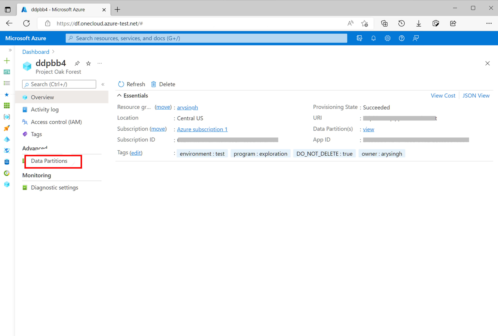
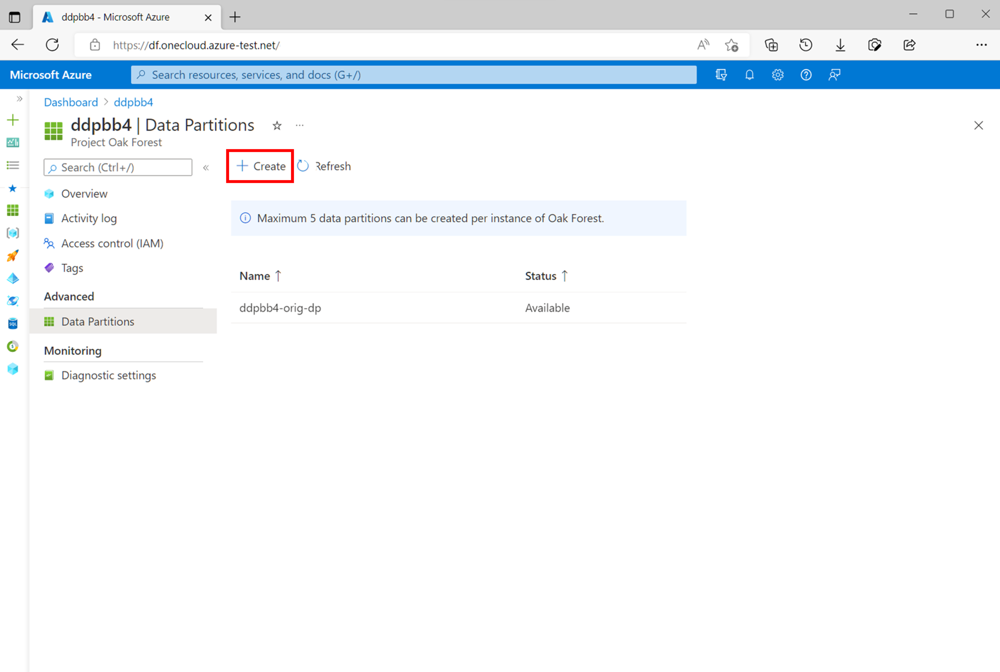
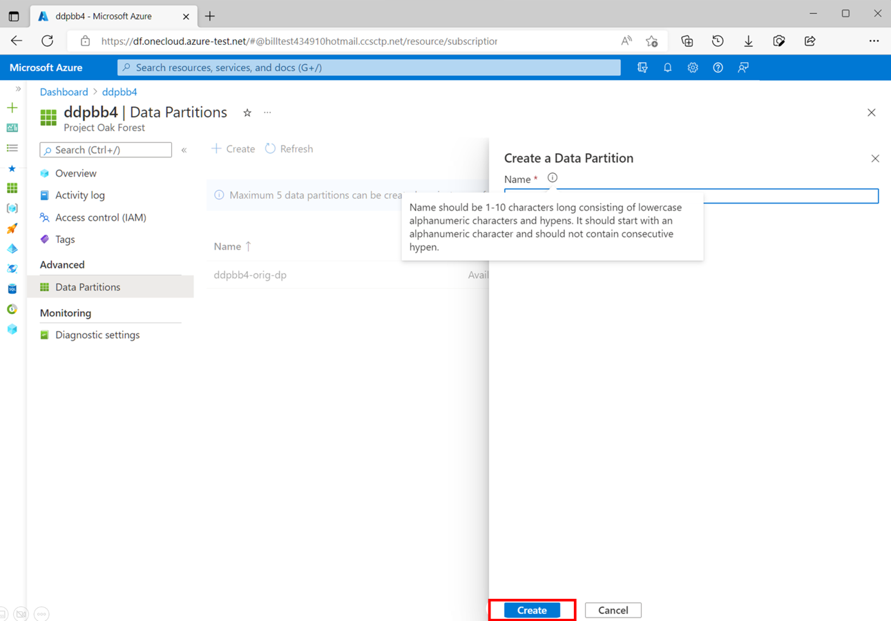
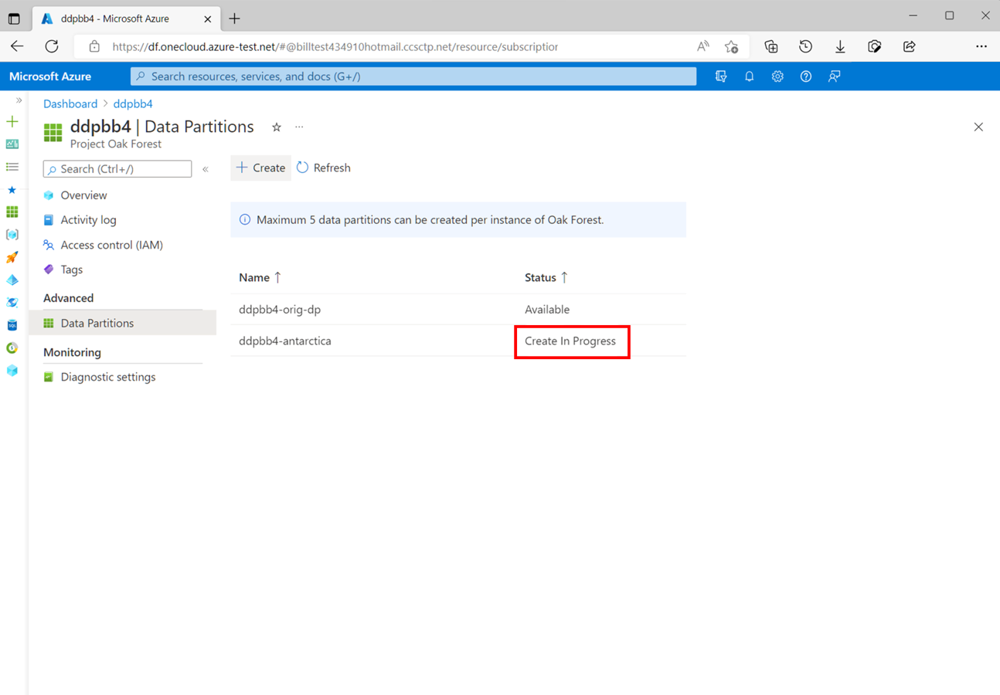
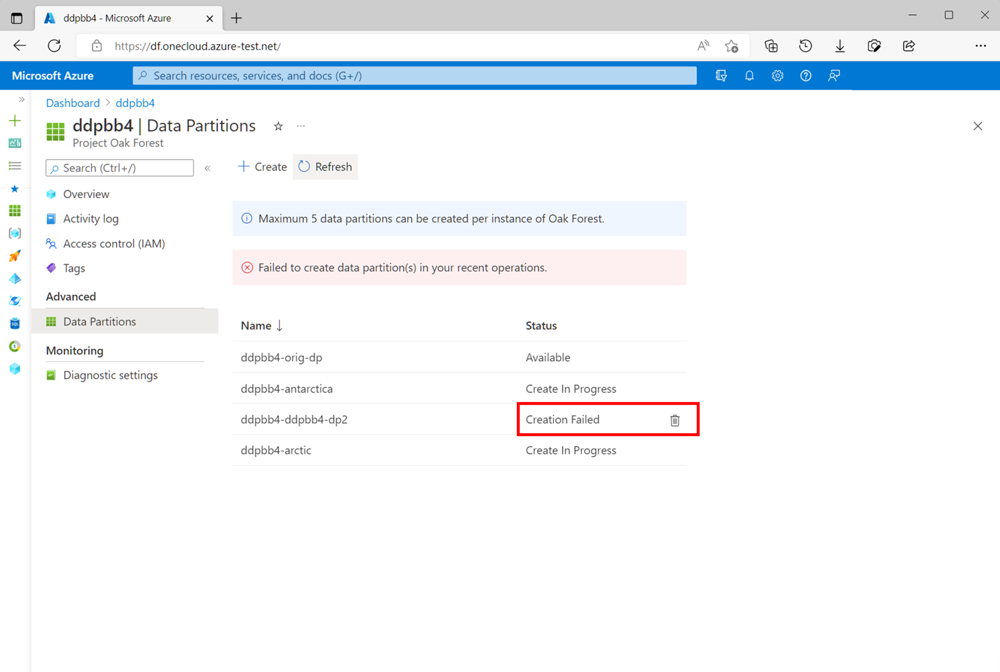

# How to manage data partitions?

The concept of "data partitions" is picked from [OSDU&trade;](https://osduforum.org/) where single deployment can contain multiple partitions. In the following how-to article, you learn about how to add new data partitions to an existing Azure Data Manager for Energy instance. 

Each partition provides the highest level of data isolation within a single deployment. All access rights are governed at a partition level. Data is separated in a way that allows for the partition's life cycle and deployment to be handled independently. (See [Partition Service](https://community.opengroup.org/osdu/platform/home/-/issues/31) in OSDU&trade;)

You can create up to 10 data partitions in one Azure Data Manager for Energy instance. Once a data partition is created successfully, it can't be renamed or deleted.

## Create a data partition

1. Open the "Data Partitions" menu-item from left-panel of Azure Data Manager for Energy overview page.

    

2. This page shows a table of all data partitions in your Azure Data Manager for Energy instance with the status of the data partition next to it. Select *Create*. A new pane opens to the right of the screen.

    

3. Choose a name for your data partition.

    Each data partition name needs to be 1-10 characters long and is a combination of lowercase letters, numbers and hyphens only. Selecting *Create* starts the deployment of the underlying cloud resources for the new data partition. 

    >[!NOTE]
    >The deployment of a new data partition completes in 15-20 minutes. 

    

    You notice that the name of the new partition appears in the list of partition. While the deployment is in progress, its status shows as "Creating."

    

    When the partition is successfully created, the status against the name of the new partition changes to "Available." 

    
 

## Deleting failed data partitions

The data-partition deployment triggered in the previous process might fail in some cases due to various issues. These issues include quota limits reached, ARM template deployment transient issues, data seeding failures, and failure in connecting to underlying AKS clusters. 

The status of such data partitions shows as "Creation Failed." You can delete these deployments using the "delete" button that shows next to all failed data partition deployments. This deletion cleans up any records created in the backend. Once the failed partition gets deleted, you can retry creating a new partition. 

OSDU&trade; is a trademark of The Open Group.

## Next steps

You can start loading data in your new data partitions.

> [!div class="nextstepaction"]
> [Load data using manifest ingestion](tutorial-manifest-ingestion.md)
