# How to convert a SEG-Y file to ZGY

In this article, you learn how to convert SEG-Y formatted data to the ZGY format. Seismic data stored in industry standard SEG-Y format can be converted to ZGY for use in applications such as Petrel via the Seismic DMS. See here for [ZGY Conversion FAQ's](https://community.opengroup.org/osdu/platform/data-flow/ingestion/segy-to-zgy-conversion#faq) and more background can be found in the OSDU&trade; community here: [SEG-Y to ZGY conversation](https://community.opengroup.org/osdu/platform/data-flow/ingestion/segy-to-zgy-conversion). This tutorial is a step by step guideline how to perform the conversion. Note the actual production workflow may differ and use as a guide for the required set of steps to achieve the conversion. 

## Prerequisites
- An Azure subscription
- An instance of [Azure Data Manager for Energy](quickstart-create-microsoft-energy-data-services-instance.md) created in your Azure subscription.
- A SEG-Y File
  - You may use any of the following files from the Volve dataset as a test. The Volve data set itself is available from [Equinor](https://www.equinor.com/energy/volve-data-sharing).
    - [Small < 100 MB](https://community.opengroup.org/osdu/platform/deployment-and-operations/infra-azure-provisioning/-/blob/azure/m16-master/source/ddms-smoke-tests/ST0202R08_PSDM_DELTA_FIELD_DEPTH.MIG_FIN.POST_STACK.3D.JS-017534.segy)
    - [Medium < 250 MB](https://community.opengroup.org/osdu/platform/deployment-and-operations/infra-azure-provisioning/-/blob/azure/m16-master/source/ddms-smoke-tests/ST0202R08_PS_PSDM_RAW_DEPTH.MIG_RAW.POST_STACK.3D.JS-017534.segy)
    - [Large ~ 1 GB](https://community.opengroup.org/osdu/platform/deployment-and-operations/infra-azure-provisioning/-/blob/283ba58aff7c40e62c2ac649e48a33643571f449/source/ddms-smoke-tests/sample-ST10010ZC11_PZ_PSDM_KIRCH_FULL_T.MIG_FIN.POST_STACK.3D.JS-017536.segy)

## Get your Azure Data Manager for Energy instance details

The first step is to get the following information from your [Azure Data Manager for Energy instance](quickstart-create-microsoft-energy-data-services-instance.md) in the [Azure portal](https://portal.azure.com/?microsoft_azure_marketplace_ItemHideKey=Microsoft_Azure_OpenEnergyPlatformHidden):

| Parameter          | Value             | Example                               |
| ------------------ | ------------------------ |-------------------------------------- |
| client_id          | Application (client) ID  | 3dbbbcc2-f28f-44b6-a5ab-xxxxxxxxxxxx  |
| client_secret      | Client secrets           |  _fl******************                |
| tenant_id          | Directory (tenant) ID    | 72f988bf-86f1-41af-91ab-xxxxxxxxxxxx  |
| base_url           | URL                      | `https://<instance>.energy.azure.com` |
| data-partition-id  | Data Partition(s)        | `<data-partition-name>`               |

You use this information later in the tutorial.

## Set up Postman

Next, set up Postman:

1. Download and install the [Postman](https://www.postman.com/downloads/) desktop app.

2. Import the following files in Postman:

   - [Converter Postman collection](https://github.com/microsoft/adme-samples/blob/main/postman/SEGYtoZGY.postman_collection.json)
   - [Converter Postman environment](https://github.com/microsoft/adme-samples/blob/main/postman/SEGYtoZGY.postman_environment.json)

   To import the files:

   1. Select **Import** in Postman.

    [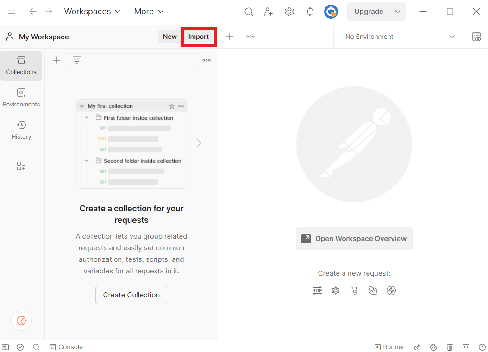](media/tutorial-ddms/postman-import-button.png#lightbox)

   2. Paste the URL of each file into the search box.

    [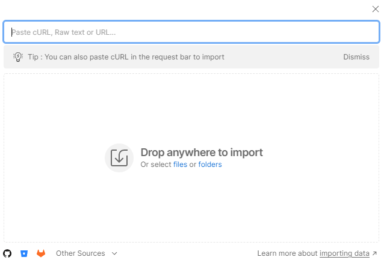](media/tutorial-ddms/postman-import-search.png#lightbox)
  
3. In the Postman environment, update **CURRENT VALUE** with the information from your Azure Data Manager for Energy instance details

   1. In Postman, in the left menu, select **Environments**, and then select **SEGYtoZGY Environment**.

   2. In the **CURRENT VALUE** column, enter the information that's described in the table in 'Get your Azure Data Manager for Energy instance details'.

    [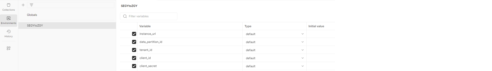](media/how-to-convert-segy-to-zgy/postman-environment-current-values.png#lightbox)

## Step by Step Process to convert SEG-Y file to ZGY file
The Postman collection provided has all of the sample calls to serve as a guide. You can also retrieve the equivalent cURL command for a Postman call by clicking the **Code** button.

[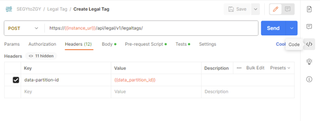](media/how-to-convert-segy-to-zgy/postman-code-button.png#lightbox)

### Create a Legal Tag

[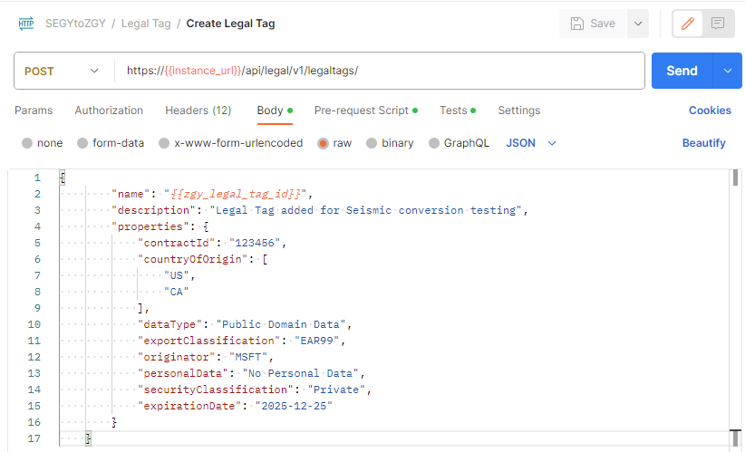](media/how-to-convert-segy-to-zgy/postman-api-create-legal-tag.png#lightbox)

### Prepare dataset files
Prepare the metadata / manifest file / records file for the dataset. The manifest file includes:  
  - WorkProduct
  - SeismicBinGrid
  - FileCollection
  - SeismicTraceData

Conversion uses a manifest file that you upload to your storage account later in order to run the conversion. This manifest file is created by using multiple JSON files and running a script. The JSON files for this process are stored [here](https://community.opengroup.org/osdu/platform/data-flow/ingestion/segy-to-zgy-conversion/-/tree/master/doc/sample-records/volve) for the Volve Dataset. For more information on Volve, such as where the dataset definitions come from, visit [their website](https://www.equinor.com/energy/volve-data-sharing). Complete the following steps in order to create the manifest file:

1. Clone the [repo](https://community.opengroup.org/osdu/platform/data-flow/ingestion/segy-to-zgy-conversion/-/tree/master/) and navigate to the folder `doc/sample-records/volve`
2. Edit the values in the `prepare-records.sh` bash script. Recall that the format of the legal tag is prefixed with the Azure Data Manager for Energy instance name and data partition name, so it looks like `<instancename>-<datapartitionname>-<legaltagname>`.
```bash
DATA_PARTITION_ID=<your-partition-id>
ACL_OWNER=data.default.owners@<your-partition-id>.<your-tenant>.com
ACL_VIEWER=data.default.viewers@<your-partition-id>.<your-tenant>.com
LEGAL_TAG=<legal-tag-created>
```
3. Run the `prepare-records.sh` script.
4. The output is a JSON array with all objects and is saved in the `all_records.json` file.
5. Save the `filecollection_segy_id` and the `work_product_id` values in that JSON file to use in the conversion step. That way the converter knows where to look for this contents of your `all_records.json`.

> [!NOTE]
> The `all_records.json` file must also contain appropriate data for each element.
>
> **Example**: The following parameters are used when calculating the ZGY coordinates for `SeismicBinGrid`:
> - `P6BinGridOriginEasting`
> - `P6BinGridOriginI`
> - `P6BinGridOriginJ`
> - `P6BinGridOriginNorthing`
> - `P6ScaleFactorOfBinGrid`
> - `P6BinNodeIncrementOnIaxis`
> - `P6BinNodeIncrementOnJaxis`
> - `P6BinWidthOnIaxis`
> - `P6BinWidthOnJaxis`
> - `P6MapGridBearingOfBinGridJaxis`
> - `P6TransformationMethod`
> - `persistableReferenceCrs` from the `asIngestedCoordinates` block
> If the `SeismicBinGrid` has the P6 parameters and the CRS specified under `AsIngestedCoordinates`, the conversion itself should be able to complete successfully, but Petrel will not understand the survey geometry of the file unless it also gets the 5 corner points under `SpatialArea`,`AsIngestedCoordinates`, `SpatialArea`, and `Wgs84Coordinates`.

### User Access

The user needs to be part of the `users.datalake.admins` group. Validate the current entitlements for the user using the following call:

[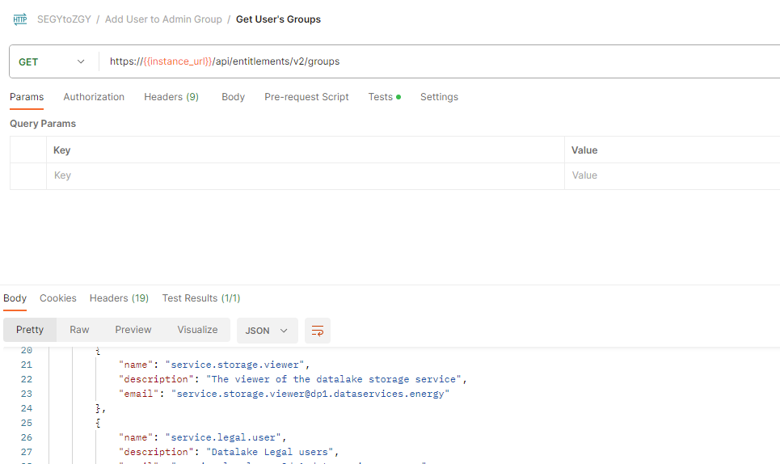](media/how-to-convert-segy-to-zgy/postman-api-get-user-groups.png#lightbox)

Later in this tutorial, you need at least one `owner` and at least one `viewer`. These user groups look like `data.default.owners` and `data.default.viewers`. Make sure to note one of each in your list.

If the user isn't part of the required group, you can add the required entitlement using the following sample call:
    email-id: Is the value "Id" returned from the call above.

[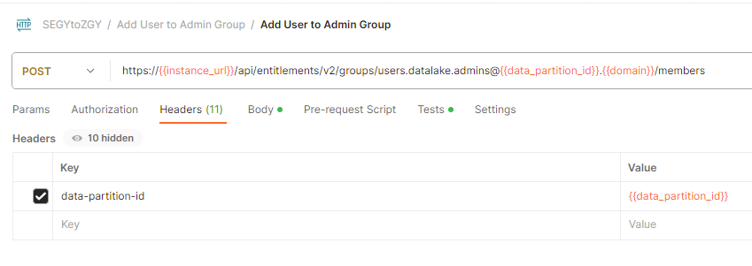](media/how-to-convert-segy-to-zgy/postman-api-add-user-to-admins.png#lightbox)

If you haven't yet created entitlements groups, follow the directions as outlined in [How to manage users](how-to-manage-users.md). If you would like to see what groups you have, use [Get entitlements groups for a given user](how-to-manage-users.md#get-entitlements-groups-for-a-given-user-in-a-data-partition). Data access isolation is achieved with this dedicated ACL (access control list) per object within a given data partition. 

### Prepare Subproject

#### 1. Register Data Partition to Seismic

[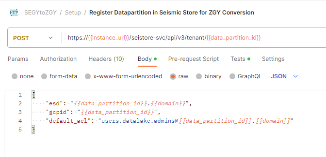](media/how-to-convert-segy-to-zgy/postman-api-register-tenant.png#lightbox)

#### 2. Create Subproject

Use your previously created entitlement groups that you would like to add as ACL (Access Control List) admins and viewers. Data partition entitlements don't necessarily translate to the subprojects within it, so it is important to be explicit about the ACLs for each subproject, regardless of what data partition it is in.

[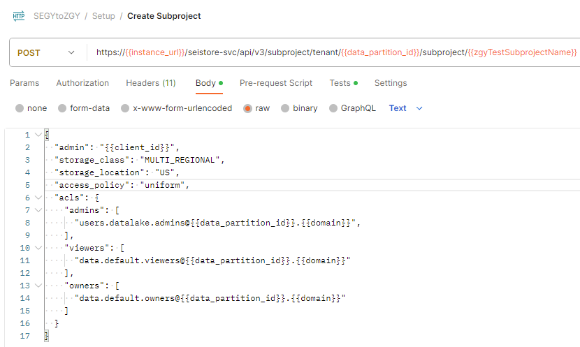](media/how-to-convert-segy-to-zgy/postman-api-create-subproject.png#lightbox)

#### 3. Create dataset

> [!NOTE]
> This step is only required if you are not using `sdutil` for uploading the seismic files.

[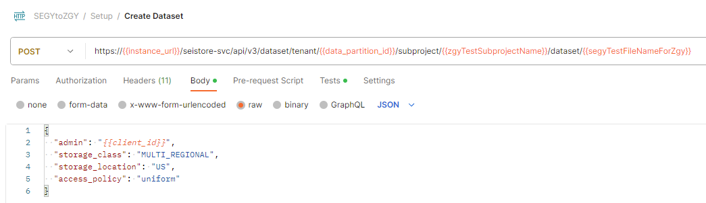](media/how-to-convert-segy-to-zgy/postman-api-create-dataset.png#lightbox)

### Upload the File

There are two ways to upload a SEGY file. One option is used the sasurl through Postman / curl call. You need to download Postman or setup Curl on your OS. 
The second method is to use [SDUTIL](https://community.opengroup.org/osdu/platform/domain-data-mgmt-services/seismic/seismic-dms-suite/seismic-store-sdutil/-/tags/azure-stable). To login to your instance for ADME via the tool, you need to generate a refresh token for the instance. See [How to generate a refresh token](how-to-generate-refresh-token.md). Alternatively, you can modify the code of SDUTIL to use client credentials instead to log in. If you have not already, you need to setup SDUTIL. Download the codebase and edit the `config.yaml` at the root. Replace the contents of this config file with the following yaml. 

```yaml
seistore:
    service: '{"azure": {"azureEnv":{"url": "<instance url>/seistore-svc/api/v3", "appkey": ""}}}'
    url: '<instance url>/seistore-svc/api/v3'
    cloud_provider: azure
    env: glab
    auth-mode: JWT Token
    ssl_verify: false
auth_provider:
    azure: '{ 
        "provider": "azure", 
        "authorize_url": "https://login.microsoftonline.com/", "oauth_token_host_end": "/oauth2/v2.0/token", 
        "scope_end":"/.default openid profile offline_access",
        "redirect_uri":"http://localhost:8080",
        "login_grant_type": "refresh_token",
        "refresh_token": "<RefreshToken acquired earlier>" 
        }'
azure:
    empty: none
```

#### Method 1: Postman

##### Get the sasurl:

[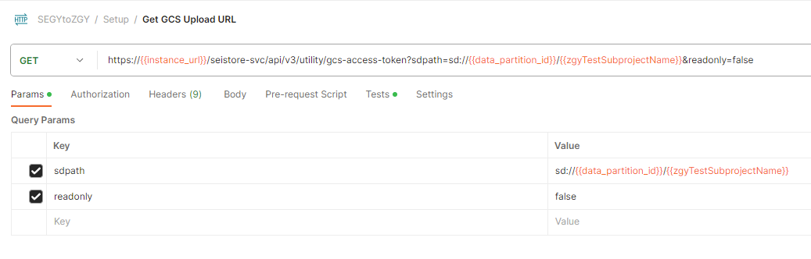](media/how-to-convert-segy-to-zgy/postman-api-get-gcs-upload-url.png#lightbox)

##### Upload the file:

You need to select the file to upload in the Body section of the API call.

[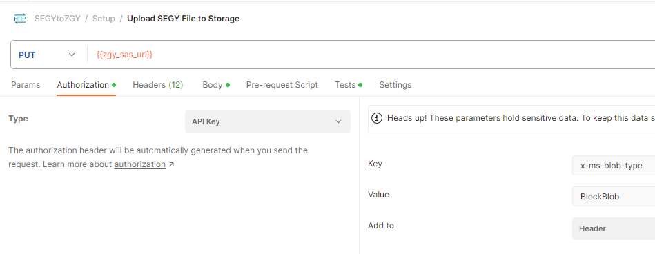](media/how-to-convert-segy-to-zgy/postman-api-upload-file.png#lightbox)


[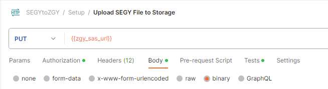](media/how-to-convert-segy-to-zgy/postman-api-upload-file-binary.png#lightbox)

##### Verify upload

[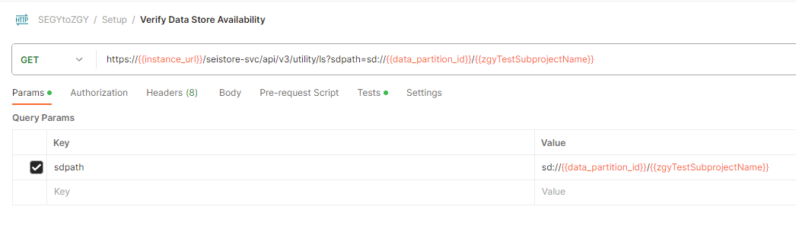](media/how-to-convert-segy-to-zgy/postman-api-verify-file-upload.png#lightbox)

#### Method 2: SDUTIL

**sdutil** is an OSDU desktop utility to access seismic service. We use it to upload/download files. Use the azure-stable tag from [SDUTIL](https://community.opengroup.org/osdu/platform/domain-data-mgmt-services/seismic/seismic-dms-suite/seismic-store-sdutil/-/tags/azure-stable).

> [!NOTE]
> When running `python sdutil config init`, you don't need to enter anything when prompted with `Insert the azure (azureGlabEnv) application key:`.

```bash
python sdutil config init
python sdutil auth login
python sdutil ls sd://<data-partition-id>/<subproject>/
```

Upload your seismic file to your Seismic Store. Here's an example with a SEGY-format file called `source.segy`:

```bash
python sdutil cp <local folder>/source.segy sd://<data-partition-id>/<subproject>/destination.segy
```
For example:

```bash
python sdutil cp ST10010ZC11_PZ_PSDM_KIRCH_FULL_T.MIG_FIN.POST_STACK.3D.JS-017536.segy sd://<data-partition-id>/<subproject>/destination.segy
```

### Create Storage Records

Insert the contents of your `all_records.json` file in storage for work-product, seismic trace data, seismic grid, and file collection. Copy and paste the contents of that file to the request body of the API call.

[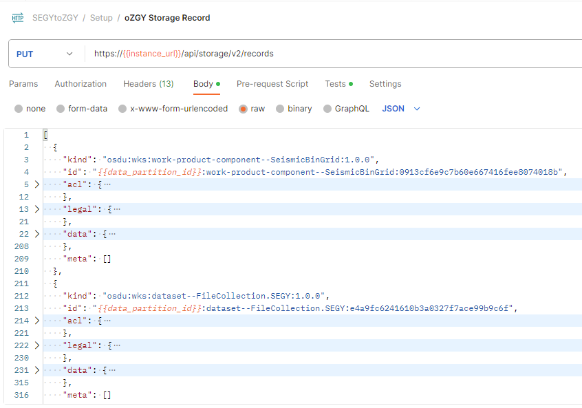](media/how-to-convert-segy-to-zgy/postman-api-create-records.png#lightbox)

### Run Converter

1. Trigger the ZGY Conversion DAG to convert your data using the execution context values you had saved above.

    Fetch the id token from sdutil for the uploaded file or use an access/bearer token from Postman.

```markdown
python sdutil auth idtoken
```

[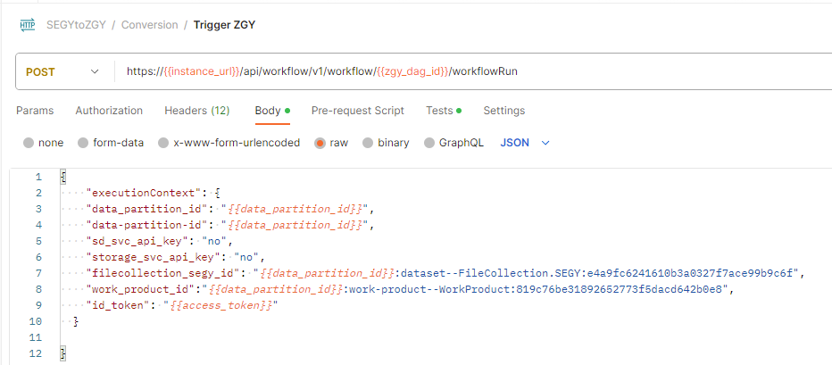](media/how-to-convert-segy-to-zgy/postman-api-start-workflow.png#lightbox)

2. Let the DAG run to the `succeeded` state. You can check the status using the workflow status call. The run ID is in the response of the above call

[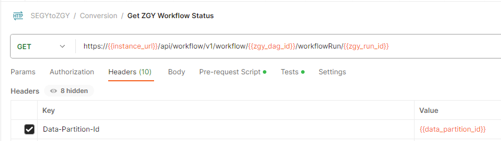](media/how-to-convert-segy-to-zgy/postman-api-check-workflow-status.png#lightbox)

3. You can see if the converted file is present using the following command in sdutil or in the Postman API call:

    ```bash
    python sdutil ls sd://<data-partition-id>/<subproject>
    ```

[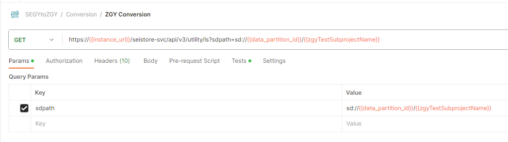](media/how-to-convert-segy-to-zgy/postman-api-verify-file-converted.png#lightbox)

4. You can download and inspect the file using the [sdutil](https://community.opengroup.org/osdu/platform/domain-data-mgmt-services/seismic/seismic-dms-suite/seismic-store-sdutil/-/tags/azure-stable) `cp` command:

    ```bash
    python sdutil cp sd://<data-partition-id>/<subproject>/<filename.zgy> <local/destination/path>
    ```
OSDU&trade; is a trademark of The Open Group.

## Next steps
<!-- Add a context sentence for the following links -->
> [!div class="nextstepaction"]
> [How to convert SEGY to OVDS](./how-to-convert-segy-to-ovds.md)
