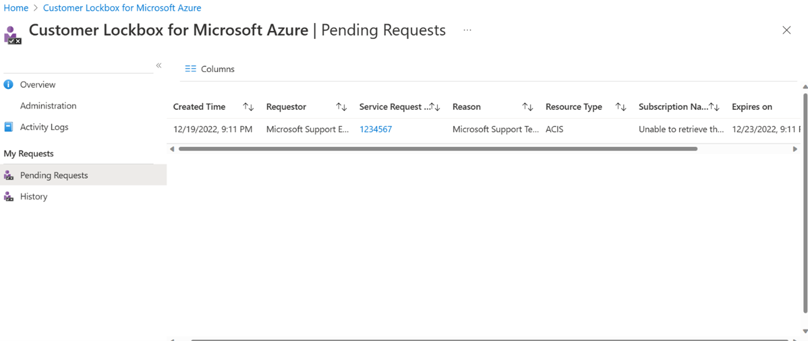

# Use Customer Lockbox for Azure Data Manager for Energy

Azure Data Manager for Energy is the managed service offering for OSDU&trade;. There are instances where Microsoft Support may need to access your data or compute layer during a support request. You can use Customer Lockbox as an interface to review and approve or reject these access requests.

This article covers how Customer Lockbox requests are initiated and tracked for Azure Data Manager for Energy. 

## Lockbox workflow for Azure Data Manager for Energy access

The Azure Data Manager for Energy team at Microsoft typically does not access customer data. The team tries to resolve issues by using standard tools and telemetry.

If the issues cannot be resolved and require Microsoft Support to investigate, the team needs to request elevated access to the limited resources via Just in Time (JIT) portal (internal to Microsoft). The JIT portal validates permission level, provides multi-factor authentication, and includes approval from the Internal Microsoft Approvers. 

After the request for elevated access is approved via the JIT (just-in-time systems) portal, if you have enabled Lockbox, Microsoft will also require your explicit consent to access the data. The access is requested and tracked via the Customer Lockbox blade within the Azure portal.

## Prerequisites for access request

Before you begin, make sure:
1.	You have created a [Azure Data Manager for Energy instance](quickstart-create-microsoft-energy-data-services-instance.md).
2.	You have enabled [Lockbox within the Azure portal](../security/fundamentals/customer-lockbox-overview.md). 

## Track, approve request via Lockbox
To track and approve a request to access customer data, follow these steps:
1.	You raise an issue for Azure Data Manager for Energy using the Azure portal. The support engineer connects to Azure Data Manager for Energy via Support session and tries to troubleshoot the issue by using standard tools and telemetry. Let us say to mitigate the issue, the recommendation is to restart an AKS (Azure Kubernetes Service) cluster. 
2.	In this case, the support engineer creates a Lockbox request to access the AKS cluster for the given subscription.
3.	When the request is created, usually the notification goes to the subscription owner, but you can also configure a group for notifications.
4.	You can see the lockbox request in the Azure portal for your approval.

 
  

5.	To approve the lockbox request from portal, you can select Approve.
6.	Once the request is approved, the AKS clusters are accessible in the support session.
7.	The support engineer restarts the AKS cluster to resolve the issue and then disables the support session or the session will expire in 4 to 8 hours.

If you have not enabled Lockbox, then your consent is not needed to access the compute or data layer of Azure Data Manager for Energy.

## Next steps
<!-- Add a context sentence for the following links -->
To learn more about data security and encryption
> [!div class="nextstepaction"]
> [Data security and encryption in Azure Data Manager for Energy](how-to-manage-data-security-and-encryption.md)
