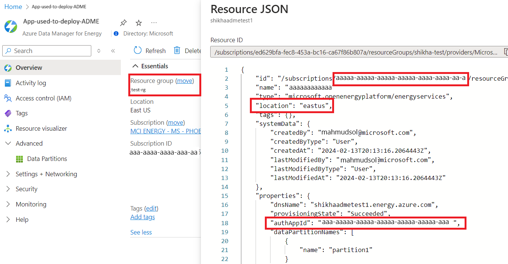

# Deploy OSDU Admin UI on top of Azure Data Manager for Energy

This guide shows you how to deploy the OSDU Admin UI on top of your Azure Data Manager for Energy instance.

The OSDU Admin UI enables platform administrators to manage the Azure Data Manager for Energy data partition you connect it to. The management tasks include entitlements (user and group management), legal tags, schemas, reference data, and view objects and visualize those on a map.

## Prerequisites
- Install [Visual Studio Code with Dev Containers](https://code.visualstudio.com/docs/devcontainers/tutorial). It's possible to deploy the OSDU Admin UI from your local computer using either Linux or Windows WSL, we recommend using a Dev Container to eliminate potential conflicts of tooling versions, environments etc. 
- Provision an [Azure Data Manager for Energy instance](quickstart-create-microsoft-energy-data-services-instance.md).
- Add the App Registration permissions to enable Admin UI to function properly:
  - [Application.Read.All](/graph/permissions-reference#applicationreadall)
  - [User.Read](/graph/permissions-reference#applicationreadall)
  - [User.Read.All](/graph/permissions-reference#userreadall)
    
    :::image type="content" source="media/how-to-deploy-osdu-admin-ui/app-permission-1.png" alt-text="Screenshot that shows applications read all permission.":::

    :::image type="content" source="media/how-to-deploy-osdu-admin-ui/app-permission-2.png" alt-text="Screenshot that shows user read all permission.":::

## Environment setup
1. Use the Dev Container in Visual Studio Code to deploy the OSDU Admin UI to eliminate conflicts from your local machine.
2. Click on Open to clone the repository.

   [](https://vscode.dev/redirect?url=vscode://ms-vscode-remote.remote-containers/cloneInVolume?url=https://community.opengroup.org/osdu/ui/admin-ui-group/admin-ui-totalenergies/admin-ui-totalenergies)

3. Accept the cloning prompt.

   :::image type="content" source="media/how-to-deploy-osdu-admin-ui/clone-the-repository.png" alt-text="Screenshot that shows cloning the repository.":::

4. When prompted for a container configuration template,
  1. Select [Ubuntu](https://github.com/devcontainers/templates/tree/main/src/ubuntu).
  2. Accept the default version.
  3. Add the [Azure CLI](https://github.com/devcontainers/features/tree/main/src/azure-cli) feature.

    :::image type="content" source="media/how-to-deploy-osdu-admin-ui/option-selection.png" alt-text="Screenshot that shows option selection.":::

5. After a few minutes, the devcontainer is running.
   
   :::image type="content" source="media/how-to-deploy-osdu-admin-ui/running-devcontainer.png" alt-text="Screenshot that shows running devcontainer.":::
   
6. Open the terminal

   :::image type="content" source="media/how-to-deploy-osdu-admin-ui/open-terminal.png" alt-text="Screenshot that shows opening terminal.":::

7. Install NVM, Node.js, NPM, and Angular CLI by executing the command in the bash terminal.
    
    ```bash
    curl -o- https://raw.githubusercontent.com/nvm-sh/nvm/v0.39.7/install.sh | bash && \
    export NVM_DIR="$([ -z "${XDG_CONFIG_HOME-}" ] && printf %s "${HOME}/.nvm" || printf %s "${XDG_CONFIG_HOME}/nvm")"
    [ -s "$NVM_DIR/nvm.sh" ] && \. "$NVM_DIR/nvm.sh" && \
    nvm install 14.17.3 && \
    export NG_CLI_ANALYTICS=false && \ 
    npm install -g @angular/cli@13.3.9 && \
    curl -sL https://aka.ms/InstallAzureCLIDeb | sudo bash
    ```

   :::image type="content" source="media/how-to-deploy-osdu-admin-ui/install-screen.png" alt-text="Screenshot that shows installation.":::

8. Log into Azure CLI by executing the command on the terminal. It takes you to the login screen.
    ```azurecli-interactive
    az login
    ```

9. It takes you to the login screen. Enter your credentials and upon success, you see a success message.

   :::image type="content" source="media/how-to-deploy-osdu-admin-ui/login.png" alt-text="Screenshot that shows successful login.":::

    
## Configure environment variables
1. Fetch `client-id` as authAppId, `resource-group`, `subscription-id` and `location`.

   

2. Make sure the correct subscription is selected by running the following command:
    ```azurecli-interactive
    az account show
    ```

    :::image type="content" source="media/how-to-deploy-osdu-admin-ui/subs-id-terminal.png" alt-text="Screenshot that shows subscription ID on terminal.":::   


3. If you need to change subscription:
    ```azurecli-interactive
    az account set --subscription <subscription-id>
    ```

4. Enter the required environment variables on the terminal.
   ```bash
export CLIENT_ID="<client-id>" ## App Registration to be used by OSDU Admin UI, usually the client ID used to provision ADME
export TENANT_ID="<tenant-id>" ## Tenant ID
export ADME_URL="<adme-url>"  ## Remove www or https from the text
export DATA_PARTITION="<partition>"
export WEBSITE_NAME="<storage-name>" ## Unique name of the storage account or  static web app that will be generated
export RESOURCE_GROUP="<resource-group>" ## Name of resource group
export LOCATION="<location>" ## Azure region to deploy to, i.e. "westeurope"
   ```

## Deploy storage account
1. Create resource group. Skip this step if the resource group exists already.
    ```azurecli-interactive
    az group create \
        --name $RESOURCE_GROUP \
        --location $LOCATION
    ```
    
1. Create storage account.
    ```azurecli-interactive
    az storage account create \
        --resource-group $RESOURCE_GROUP \
        --location $LOCATION \
        --name $WEBSITE_NAME \
        --sku Standard_LRS \
        --public-network-access Enabled \
        --allow-blob-public-access true
    ```

1. Configure the static website.
    ```azurecli-interactive
    az storage blob service-properties update \
        --account-name $WEBSITE_NAME \
        --static-website \
        --404-document index.html \
        --index-document index.html
    ```

1. Fetch the redirect URI.
    ```azurecli-interactive
    export REDIRECT_URI=$(az storage account show --resource-group $RESOURCE_GROUP --name $WEBSITE_NAME --query "primaryEndpoints.web") && \
    echo "Redirect URL: $REDIRECT_URI"
    ```

1. Get the App Registration's Single-page Application (SPA) section.
   ```azurecli-interactive
    echo "https://ms.portal.azure.com/#view/Microsoft_AAD_RegisteredApps/ApplicationMenuBlade/~/Authentication/appId/$CLIENT_ID/isMSAApp~/false" 
    ```

1. Open the link you got from the above result in the browser and add the `REDIRECT_URI`.
   
   

## Build and deploy the web app

1. Navigate to the `OSDUApp` folder.
    ```bash
    cd OSDUApp/
    ```
2. Install the dependencies.
    ```nodejs    
    npm install
    ```
3. Modify the parameters in the config file located at `/src/config/config.json`.
    ```json
    {
        "mapboxKey": "key", // This is optional for the access token from Mapbox.com and used to visualize data on the map feature.
        ...
        "data_partition": "<adme_data_partition>", // ADME Data Partition ID (i.e. opendes)
      "idp": {
         ...
         "tenant_id": "<tenant_id>", // Entra ID tenant ID
         "client_id": "<client_id>", // App Registration ID to use for the admin UI, usually the same as the ADME App Registration ID, i.e. "6ee7e0d6-0641-4b29-a283-541c5d00655a"
         "redirect_uri": "<https://storageaccount.zXX.web.core.windows.net/>", // This is the website URL ($REDIRECT_URI)
         "scope": "<client_id>/.default" // Scope of the ADME instance, i.e. "6ee7e0d6-0641-4b29-a283-541c5d00655a/.default"
      },
      "api_endpoints": { // Just replace contoso.energy.azure.com with your ADME_URL after removing https or wwww in all the API endpoints below.
         "entitlement_endpoint": "https://contoso.energy.azure.com/api/", 
         "storage_endpoint": "https://contoso.energy.azure.com/api/",
         "search_endpoint": "https://contoso.energy.azure.com/api/",
         "legal_endpoint": "https://contoso.energy.azure.com/api/",
         "schema_endpoint": "https://contoso.energy.azure.com/api/",
         "osdu_connector_api_endpoint":"osdu_connector", // Optional. API endpoint of the OSDU Connector API*
         "file_endpoint": "https://contoso.energy.azure.com/api/",
         "graphAPI_endpoint": "https://graph.microsoft.com/v1.0/",
         "workflow_endpoint": "https://contoso.energy.azure.com/api/"
      }
      ...
    }
    ```


    \* [OSDU Connector API](https://community.opengroup.org/osdu/ui/admin-ui-group/admin-ui-totalenergies/connector-api-totalenergies) is built as an interface between consumers and OSDU APIs wrapping some API chain calls and objects. Currently, it manages all operations and actions on project and scenario objects.

4. If you aren't able to give app permissions in the Prerequisite step because of the subscription constraints, remove `User.ReadBasic.All` and `Application.Read.All` from the `src/config/environments/environment.ts`. Removing these permissions would disable the Admin UI from converting the OIDs of users and applications into the user names and application names respectively. 

   :::image type="content" source="media/how-to-deploy-osdu-admin-ui/graph-permission.png" alt-text="Screenshot that shows graph permissions.":::   
   
5. Build the web UI.
    ```bash
    ng build
    ```

6. Upload the build to Storage Account.
    ```azurecli-interactive
    az storage blob upload-batch \
        --account-name $WEBSITE_NAME \
        --source ./dist/OSDUApp \
        --destination '$web' \
        --overwrite
    ```
    
7. Fetch the website URL.
    ```bash
   echo $REDIRECT_URI
    ```

8. Open the Website URL in the browser and validate that it's working correctly and connected to the correct Azure Data Manager for Energy instance. 
    
## References

For information about OSDU Admin UI, see [OSDU GitLab](https://community.opengroup.org/osdu/ui/admin-ui-group/admin-ui-totalenergies/admin-ui-totalenergies).<br>
For other deployment methods (Terraform or Azure DevOps pipeline), see [OSDU Admin UI DevOps](https://community.opengroup.org/osdu/ui/admin-ui-group/admin-ui-totalenergies/admin-ui-totalenergies/-/tree/main/OSDUApp/devops/azure).
