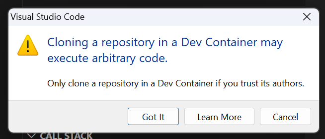
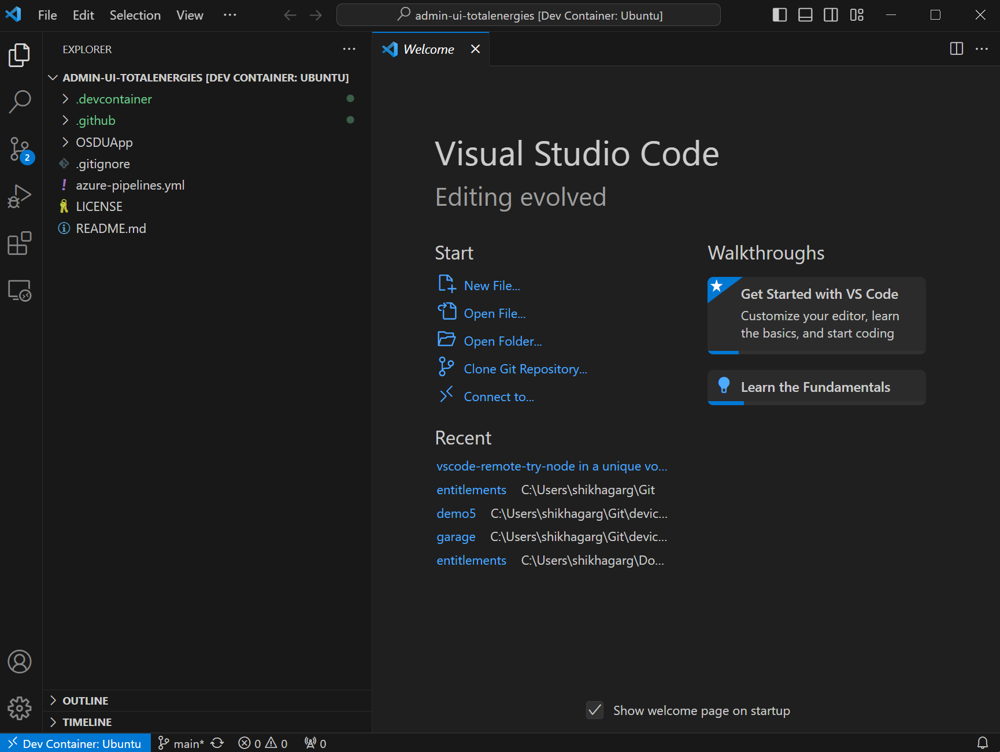
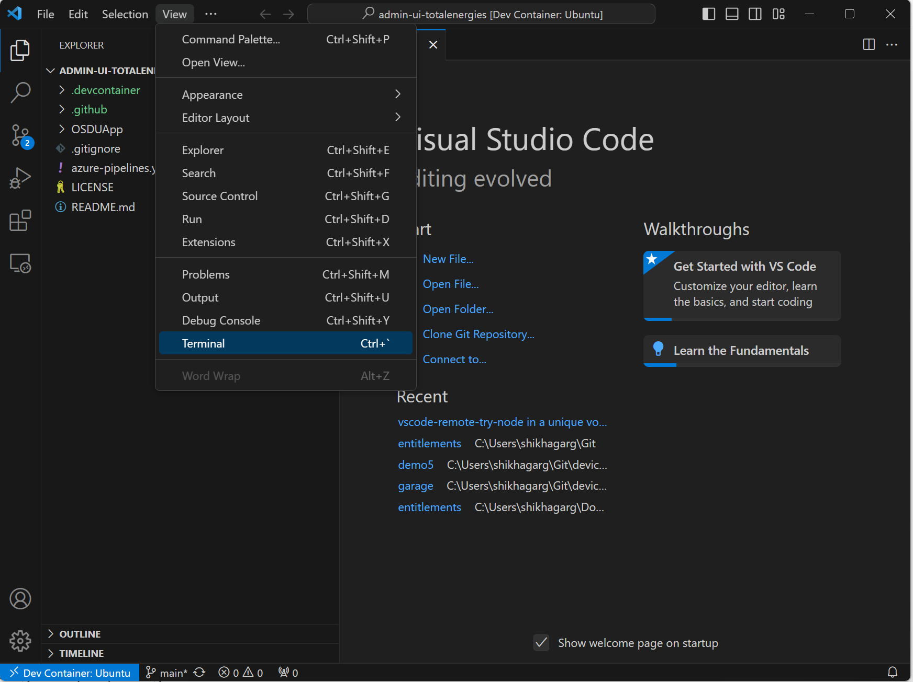
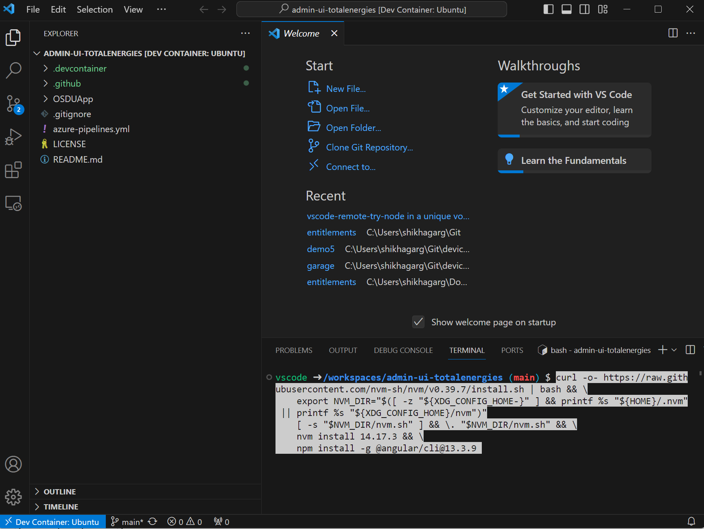
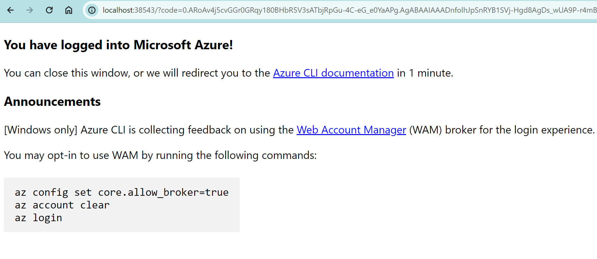
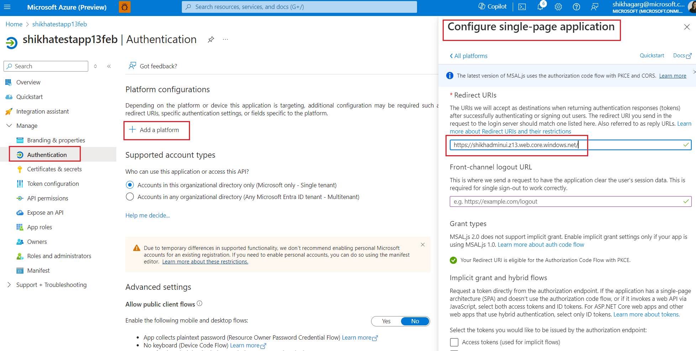

# Deploy OSDU Admin UI on top of Azure Data Manager for Energy

This guide shows you how to deploy the OSDU Admin UI on top of your Azure Data Manager for Energy (ADME) instance.

The OSDU Admin UI enables platform administrators to manage the Azure Data Manager for Energy data partition you connect it to. The management tasks include entitlements (user and group management), legal tags, schemas, reference data, view, and visualize objects on a map.

## Prerequisites
- Install [Visual Studio Code with Dev Containers](https://code.visualstudio.com/docs/devcontainers/tutorial). It's possible to deploy the OSDU Admin UI from your local computer using either Linux or Windows Subsystem for Linux (WSL), we recommend using a Dev Container to eliminate potential conflicts of tooling versions, environments etc. 
- An [Azure Data Manager for Energy instance](quickstart-create-microsoft-energy-data-services-instance.md).
- An [Microsoft Entra ID App Registration](/entra/identity-platform/quickstart-register-app). <br> This App Registration can be the same as the one used for the Azure Data Manager for Energy instance. The following API permissions are required on the App Registration for the Admin UI to function properly.
    - [Application.Read.All](/graph/permissions-reference#applicationreadall)
    - [User.Read](/graph/permissions-reference#applicationreadall)
    - [User.ReadBasic.All](/graph/permissions-reference#userreadbasicall)
   
  Upon first login to the Admin UI it will request the necessary permissions. You can also grant the required permissions in advance, see [App Registration API Permission documentation](/entra/identity-platform/quickstart-configure-app-access-web-apis#application-permission-to-microsoft-graph).

## Environment setup
1. Use the Dev Container in Visual Studio Code to deploy the OSDU Admin UI to eliminate conflicts from your local machine.
1. Select `Remote - Containers | Open` to open a Development Container and clone the OSDU Admin UI repository.

   [](https://vscode.dev/redirect?url=vscode://ms-vscode-remote.remote-containers/cloneInVolume?url=https://community.opengroup.org/osdu/ui/admin-ui-group/admin-ui-totalenergies/admin-ui-totalenergies)

1. Accept the cloning prompt.

   [](./media/how-to-deploy-osdu-admin-ui/clone-the-repository.png#lightbox)

1. When prompted for a container configuration template.
   1. Select [Ubuntu](https://github.com/devcontainers/templates/tree/main/src/ubuntu).
   2. Accept the default version.
   3. Don't add any extra features.

1. After a few minutes, the devcontainer is running.

   [](./media/how-to-deploy-osdu-admin-ui/running-devcontainer.png#lightbox)
   
1. Open the terminal.

   [](./media/how-to-deploy-osdu-admin-ui/open-terminal.png#lightbox)

1. Install [Angular CLI](https://angular.io/cli), [Azure CLI](/cli/azure/install-azure-cli), [npm](https://docs.npmjs.com/downloading-and-installing-node-js-and-npm), and [Node Version Manager (NVM)](https://github.com/nvm-sh/nvm).
    
    ```bash
    curl -o- https://raw.githubusercontent.com/nvm-sh/nvm/v0.39.7/install.sh | bash && \
    export NVM_DIR="$([ -z "${XDG_CONFIG_HOME-}" ] && printf %s "${HOME}/.nvm" || printf %s "${XDG_CONFIG_HOME}/nvm")"
    [ -s "$NVM_DIR/nvm.sh" ] && \. "$NVM_DIR/nvm.sh" && \
    nvm install 14.17.3 && \
    export NG_CLI_ANALYTICS=false && \ 
    npm install -g @angular/cli@13.3.9 && \
    curl -sL https://aka.ms/InstallAzureCLIDeb | sudo bash
    ```
    [](./media/how-to-deploy-osdu-admin-ui/install-screen.png#lightbox)

1. Log into Azure CLI by executing the command on the terminal. It takes you to the sign-in screen.
    ```azurecli
    az login
    ```

1. It takes you to the sign-in screen. Enter your credentials and upon success, you see a success message.

   [](./media/how-to-deploy-osdu-admin-ui/login.png#lightbox)

1. Validate that you're using the correct subscription.
    ```azurecli
    az account show
    ```

1. If needed, use this code to change subscription.
    ```azurecli
    az account set --subscription <subscription-id>
    ```
    
## Configure environment variables

1. Enter the required environment variables on the terminal.
   ```bash
    export ADMINUI_CLIENT_ID="" ## App Registration to be used by OSDU Admin UI, usually the client ID used to provision ADME
    export WEBSITE_NAME="" ## Unique name of the static web app or storage account that will be generated. Storage account name must be between 3 and 24 characters in length and use numbers and lower-case letters only.
    export RESOURCE_GROUP="" ## Name of resource group
    export LOCATION="" ## Azure region to deploy to, i.e. "westeurope"
   ```

## Deploy storage account
1. Create resource group. Skip this step if the resource group exists already.
    ```azurecli
    az group create \
        --name $RESOURCE_GROUP \
        --location $LOCATION
    ```
    
1. Create storage account.
    ```azurecli
    az storage account create \
        --resource-group $RESOURCE_GROUP \
        --location $LOCATION \
        --name $WEBSITE_NAME \
        --sku Standard_LRS \
        --public-network-access Enabled \
        --allow-blob-public-access true
    ```

1. Configure the static website.
    ```azurecli
    az storage blob service-properties update \
        --account-name $WEBSITE_NAME \
        --static-website \
        --404-document index.html \
        --index-document index.html
    ```

1. Set $web container permissions to allow anonymous access.
    ```azurecli
    az storage container set-permission \
        --name '$web' \
        --account-name $WEBSITE_NAME \
        --public-access blob
    ```

1. Add the redirect URI to the App Registration. 
    ```azurecli
    export REDIRECT_URI=$(az storage account show --resource-group $RESOURCE_GROUP --name $WEBSITE_NAME --query "primaryEndpoints.web") && \
    echo "Redirect URL: $REDIRECT_URI" && \
    echo "Add the redirect URI above to the following App Registration's Single-page Application (SPA) section: https://ms.portal.azure.com/#view/Microsoft_AAD_RegisteredApps/ApplicationMenuBlade/~/Authentication/appId/$ADMINUI_CLIENT_ID/isMSAApp~/false"
    ```
      
   [](./media/how-to-deploy-osdu-admin-ui/app-uri-config.png#lightbox)

## Build and deploy the web app

1. Navigate to the `OSDUApp` folder.
    ```bash
    cd OSDUApp/
    ```
1. Install the dependencies.
    ```nodejs    
    npm install
    ```
1. Modify the parameters in the config file located at `/src/config/config.json`.
    ```json
    {
        "mapboxKey": "key", // This is optional for the access token from Mapbox.com and used to visualize data on the map feature.
        ...
        "data_partition": "<adme_data_partition>", // ADME Data Partition ID (i.e. opendes)
      "idp": {
         ...
         "tenant_id": "<tenant_id>", // Entra ID tenant ID
         "client_id": "<client_id>", // App Registration ID to use for the admin UI, usually the same as the ADME App Registration ID, i.e. "6ee7e0d6-0641-4b29-a283-541c5d00655a"
         "redirect_uri": "<redirect_uri>", // This is the website URL ($REDIRECT_URI), i.e. "https://contoso.z1.web.core.windows.net"
         "scope": "<client_id>/.default" // Scope of the ADME instance, i.e. "6ee7e0d6-0641-4b29-a283-541c5d00655a/.default"
      },
      "api_endpoints": { // Just replace contoso.energy.azure.com with your ADME_URL after removing https or wwww in all the API endpoints below.
         "entitlement_endpoint": "https://contoso.energy.azure.com/api/", 
         "storage_endpoint": "https://contoso.energy.azure.com/api/",
         "search_endpoint": "https://contoso.energy.azure.com/api/",
         "legal_endpoint": "https://contoso.energy.azure.com/api/",
         "schema_endpoint": "https://contoso.energy.azure.com/api/",
         "osdu_connector_api_endpoint":"osdu_connector", // Optional. API endpoint of the OSDU Connector API*
         "file_endpoint": "https://contoso.energy.azure.com/api/",
         "graphAPI_endpoint": "https://graph.microsoft.com/v1.0/",
         "workflow_endpoint": "https://contoso.energy.azure.com/api/"
      }
      ...
    }
    ```

   > [!NOTE]
   > [OSDU Connector API](https://community.opengroup.org/osdu/ui/admin-ui-group/admin-ui-totalenergies/connector-api-totalenergies) is built as an interface between consumers and OSDU APIs wrapping some API chain calls and objects. Currently, it manages all operations and actions on project and scenario objects.
   
1. If you are not able to give access to the app as defined in the prerequisite step, remove `User.Read`, `User.ReadBasic.All` and `Application.Read.All` from the `src/config/environments/environment.ts`. Removing these permissions would disable the Admin UI from converting the OIDs of users and applications into the user names and application names respectively and hence would disable the autocomplete feature of resolving OIDs from names.
   
1. Build the web UI.
    ```bash
    ng build
    ```

1. Upload the build to Storage Account.
    ```azurecli
    az storage blob upload-batch \
        --account-name $WEBSITE_NAME \
        --source ./dist/OSDUApp \
        --destination '$web' \
        --overwrite
    ```
    
1. Fetch the website URL.
    ```bash
   echo $REDIRECT_URI
    ```

1. Open the Website URL in the browser and validate that it's working correctly and connected to the correct Azure Data Manager for Energy instance.

## Next steps
After you have a successful Admin UI working, you can:

- [Add first set of users](how-to-manage-users.md#first-time-addition-of-users-in-a-new-data-partition).
- [Manage legal tags](how-to-manage-legal-tags.md).
- [Manage ACLs](how-to-manage-acls.md).

You can also ingest data into your Azure Data Manager for Energy instance:

- [Tutorial on CSV parser ingestion](tutorial-csv-ingestion.md).
- [Tutorial on manifest ingestion](tutorial-manifest-ingestion.md).
    
## References

For information about OSDU Admin UI, see [OSDU GitLab](https://community.opengroup.org/osdu/ui/admin-ui-group/admin-ui-totalenergies/admin-ui-totalenergies).<br>
For other deployment methods (Terraform or Azure DevOps CI/CD pipeline), see [OSDU Admin UI DevOps](https://community.opengroup.org/osdu/ui/admin-ui-group/admin-ui-totalenergies/admin-ui-totalenergies/-/tree/main/OSDUApp/devops/azure).
