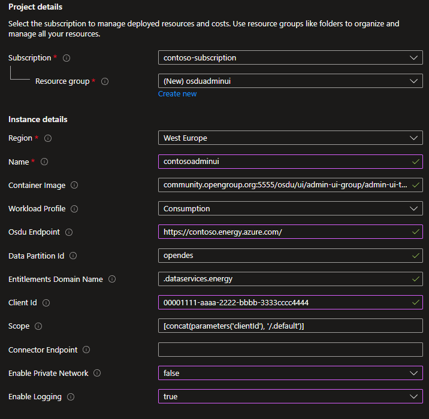

# Deploy OSDU Admin UI on top of Azure Data Manager for Energy

This guide shows you how to deploy the OSDU Admin UI on top of your Azure Data Manager for Energy (ADME) instance.

The OSDU Admin UI enables platform administrators to manage the Azure Data Manager for Energy data partition you connect it to. The management tasks include entitlements (user and group management), legal tags, schemas, reference data, view, and visualize objects on a map.

## Prerequisites

- An [Azure Data Manager for Energy instance](quickstart-create-microsoft-energy-data-services-instance.md).
- An [Microsoft Entra ID App Registration](/entra/identity-platform/quickstart-register-app). <br> This App Registration can be the same as the one used for the Azure Data Manager for Energy instance. The following API permissions are required on the App Registration for the Admin UI to function properly.
    - [Application.Read.All](/graph/permissions-reference#applicationreadall)
    - [User.Read](/graph/permissions-reference#applicationreadall)
    - [User.ReadBasic.All](/graph/permissions-reference#userreadbasicall)
   
  Upon first sign-in to the Admin UI, it requests the necessary permissions. You can also grant the required permissions in advance. See [App Registration API Permission documentation](/entra/identity-platform/quickstart-configure-app-access-web-apis#application-permission-to-microsoft-graph).

## Deployment options

There are two deployment options for the OSDU Admin UI:

1. **[Quick-deploy using Azure Container Apps](#quick-deploy-with-azure-container-apps)**: One-click deploy using Azure Container Apps. This deployment is the easiest and quickest way to deploy the OSDU Admin UI. It supports both public and private deployments.

1. **[Custom deployment using Azure Storage Account Static Website](#custom-deployment-using-azure-storage-account-static-website)**: Build and deploy the OSDU Admin UI using Azure Storage Account. This deployment option is more customizable and allows you to configure the deployment to your needs.

## Quick-deploy with Azure Container Apps

1. Select the `Deploy to Azure` button to deploy the OSDU Admin UI using Azure Container Apps.

   [](https://portal.azure.com/#create/Microsoft.Template/uri/https%3A%2F%2Fraw.githubusercontent.com%2FAzure%2FADME-Solution-Accelerators%2Frefs%2Fheads%2Fmain%2Fartifacts%2Fadminui%2Fazuredeploy.json)

1. Fill in the required parameters in the Azure portal. For more information about the parameters, see the [parameters section](#parameters) for more information.

   [](./media/how-to-deploy-osdu-admin-ui/quick-deploy.png#lightbox)

1. Select **Review + create** and then **Create** to deploy the OSDU Admin UI.

1. Check the `Outputs` section for the URL of the deployed OSDU Admin UI.

1. Configure the [ADME CORS policy](#add-cors-policy) and [App Registration SPA redirect URI](#add-redirect-uri-to-app-registration) with the website URL.

1. Open the URL in a browser and validate that it's working correctly and connected to the correct Azure Data Manager for Energy instance.
 
### Parameters

| Parameter | Description | Required |
| --- | --- | ---: |
| Subscription | The Azure subscription to deploy the OSDU Admin UI to. | Yes |
| Resource group | The resource group to deploy the OSDU Admin UI to. | Yes |
| Region | The Azure region to deploy the OSDU Admin UI to. | Yes |
| Name | The name of the OSDU Admin UI instance. Other resources use this name as the base-name and append a service abbreviation | Yes |
| Container Image | The container image to use for the OSDU Admin UI. See [OSDU Forum Admin UI Container Registry](https://community.opengroup.org/osdu/ui/admin-ui-group/admin-ui-totalenergies/admin-ui-totalenergies/container_registry) for available images. | Yes |
| Osdu Endpoint | The endpoint of the Azure Data Manager for Energy or OSDU instance to connect to. | Yes |
| Data Partition IDs | Comma-separated list of data partition ID of the Azure Data Manager for Energy or OSDU instance to connect to. | Yes |
| Entitlements Domain Name | The domain name to use for the entitlements service. Keep `.dataservices.energy` for any ADME deployment, only update if you're using another OSDU implementation. | Yes |
| Client ID | The client ID of the App Registration to use for the OSDU Admin UI. | Yes |
| Scope | The scope of the App Registration used by Azure Data Manager for Energy or OSDU. If the Client ID is the ADME App Registration, you can leave this default. | Yes |
| Connector Endpoint | *Optional:* The OSDU Admin UI [Connector API](https://community.opengroup.org/osdu/ui/admin-ui-group/admin-ui-totalenergies/connector-api-totalenergies) endpoint to use for the Admin UI. | No |
| Enable Private Network | *Optional:* Enable private network access to the OSDU Admin UI. | No |
| Enable Logging | *Optional:* Enable logging for the OSDU Admin UI. | No |

## Custom deployment using Azure Storage Account Static Website

### Prepare your computer

- Install [Visual Studio Code with Dev Containers](https://code.visualstudio.com/docs/devcontainers/tutorial). It's possible to deploy the OSDU Admin UI from your local computer using either Linux or Windows Subsystem for Linux (WSL), we recommend using a Dev Container to eliminate potential conflicts of tooling versions, environments etc. 

### Environment setup

1. Use the Dev Container in Visual Studio Code to deploy the OSDU Admin UI to eliminate conflicts from your local machine.

1. Select `Remote - Containers | Open` to open a Development Container and clone the OSDU Admin UI repository.

   [](https://vscode.dev/redirect?url=vscode://ms-vscode-remote.remote-containers/cloneInVolume?url=https://community.opengroup.org/osdu/ui/admin-ui-group/admin-ui-totalenergies/admin-ui-totalenergies)

1. Accept the cloning prompt.

   [](./media/how-to-deploy-osdu-admin-ui/clone-the-repository.png#lightbox)

1. When prompted for a container configuration template.
   1. Select [Ubuntu](https://github.com/devcontainers/templates/tree/main/src/ubuntu).
   2. Accept the default version.
   3. Don't add any extra features.

1. After a few minutes, the devcontainer is running.

   [](./media/how-to-deploy-osdu-admin-ui/running-devcontainer.png#lightbox)
   
1. Open the terminal.

   [](./media/how-to-deploy-osdu-admin-ui/open-terminal.png#lightbox)

1. Install [Angular CLI](https://angular.io/cli), [Azure CLI](/cli/azure/install-azure-cli), [npm](https://docs.npmjs.com/downloading-and-installing-node-js-and-npm), and [Node Version Manager (NVM)](https://github.com/nvm-sh/nvm).
    
    ```bash
    curl -o- https://raw.githubusercontent.com/nvm-sh/nvm/v0.39.7/install.sh | bash && \
    export NVM_DIR="$([ -z "${XDG_CONFIG_HOME-}" ] && printf %s "${HOME}/.nvm" || printf %s "${XDG_CONFIG_HOME}/nvm")"
    [ -s "$NVM_DIR/nvm.sh" ] && \. "$NVM_DIR/nvm.sh" && \
    nvm install 14.17.3 && \
    export NG_CLI_ANALYTICS=false && \ 
    npm install -g @angular/cli@13.3.9 && \
    apt-get install jq -y && \
    curl -sL https://aka.ms/InstallAzureCLIDeb | sudo bash
    ```
    [](./media/how-to-deploy-osdu-admin-ui/install-screen.png#lightbox)

1. Log into Azure CLI by executing the command on the terminal. It takes you to the sign-in screen.
    ```azurecli
    az login
    ```

1. It takes you to the sign-in screen. Enter your credentials and upon success, you see a success message.

   [](./media/how-to-deploy-osdu-admin-ui/login.png#lightbox)

1. Validate that you're using the correct subscription.
    ```azurecli
    az account show
    ```

1. If needed, use this code to change subscription.
    ```azurecli
    az account set --subscription <subscription-id>
    ```
    
### Configure environment variables

1. Enter the required environment variables on the terminal.

    ```bash
    export WEBSITE_NAME="" ## Unique name of the static web app or storage account that will be generated. Storage account name must be between 3 and 24 characters in length and use numbers and lower-case letters only.
    export RESOURCE_GROUP="" ## Name of resource group
    export LOCATION="" ## Azure region to deploy to, i.e. "westeurope"
    ```

## Deploy storage account

1. Create resource group. Skip this step if the resource group exists already.
    
    ```azurecli
    az group create \
        --name $RESOURCE_GROUP \
        --location $LOCATION
    ```
    
1. Create storage account.
    
    ```azurecli
    az storage account create \
        --resource-group $RESOURCE_GROUP \
        --location $LOCATION \
        --name $WEBSITE_NAME \
        --sku Standard_LRS \
        --public-network-access Enabled \
        --allow-blob-public-access true
    ```

1. Configure the static website.
    
    ```azurecli
    az storage blob service-properties update \
        --account-name $WEBSITE_NAME \
        --static-website \
        --404-document index.html \
        --index-document index.html
    ```

1. Set $web container permissions to allow anonymous access.
    
    ```azurecli
    az storage container set-permission \
        --name '$web' \
        --account-name $WEBSITE_NAME \
        --public-access blob
    ```

### Configure the website

1. Navigate to the `OSDUApp` folder.
    
    ```bash
    cd OSDUApp/
    ```

1. Copy Azure routing.ts file.
    
    ```bash
    cp providers/azure/routing.ts src/app/routing.ts
    ```

1. Install the dependencies.
    
    ```nodejs    
    npm install
    ```

1. Modify the parameters in the config file located at `/src/config/config.json`.
    
#### [Code snippet](#tab/code)

Replace the values of the environment variables with your values.

```bash
export OSDU_ENDPOINT="" # Endpoint of the Azure Data Manager for Energy or OSDU instance to connect to
export DATA_PARTITION_ID="" # ADME Data Partition ID (i.e. opendes)
export DOMAIN_NAME=".dataservices.energy" # Domain name to use for the entitlements service. Use .dataservices.energy for any ADME deployment.
export TENANT_ID="" # Entra ID tenant ID
export CLIENT_ID="" # App Registration ID to use for the admin UI, usually the same as the ADME App Registration ID
export SCOPE="" # Scope of the ADME instance, i.e. "6ee7e0d6-0641-4b29-a283-541c5d00655a/.default"
export GRAPH_ENDPOINT="https://graph.microsoft.com/v1.0/" # Microsoft Graph API endpoint
export APPINSIGHTS_INSTRUMENTATIONKEY="" # Optional. Application Insights instrumentation key
export OSDU_CONNECTOR_API_ENDPOINT="" # Optional. API endpoint of the OSDU Connector API


jq --arg data "$DATA_PARTITION_ID" \
--arg domain "$DOMAIN_NAME" \
--arg tenant "$TENANT_ID" \
--arg client "$CLIENT_ID" \
--arg redirect "$REDIRECT_URI" \
--arg scope "$SCOPE" \
--arg endpoint "$OSDU_ENDPOINT" \
--arg graph "$GRAPH_ENDPOINT" \
--arg appinnsights "$APPINSIGHTS_INSTRUMENTATIONKEY" \
--arg connectorapi "$OSDU_CONNECTOR_API_ENDPOINT" \
'.settings.appInsights.instrumentationKey = $appinnsights |
    .settings.data_partition = $data | 
    .settings.domain_name = $domain | 
    .settings.idp.tenant_id = $tenant | 
    .settings.idp.client_id = $client | 
    .settings.idp.redirect_uri = $redirect | 
    .settings.idp.scope = $scope | 
    .settings.api_endpoints.entitlement_endpoint = $endpoint | 
    .settings.api_endpoints.storage_endpoint = $endpoint | 
    .settings.api_endpoints.search_endpoint = $endpoint | 
    .settings.api_endpoints.legal_endpoint = $endpoint | 
    .settings.api_endpoints.schema_endpoint = $endpoint | 
    .settings.api_endpoints.file_endpoint = $endpoint | 
    .settings.api_endpoints.secrets_endpoint = $connectorapi | 
    .settings.api_endpoints.graphAPI_endpoint = $graph | 
    .settings.api_endpoints.workflow_endpoint = $endpoint | 
    .settings.api_endpoints.secrets_endpoint = $endpoint | 
    .settings.api_endpoints.wddms_endpoint = $endpoint' \
src/config/config.json > src/config/temp.json
mv src/config/temp.json src/config/config.json
```

#### [Manual](#tab/manual)
    
Replace the values according to the explanation.

```json
{
    ...
    "domain_name": ".dataservices.energy", // Domain name to use for the entitlements service. Use .dataservices.energy for any ADME deployment.
    "data_partition": "<adme_data_partition>", // ADME Data Partition ID (i.e. opendes)
    "idp": {
        ...
        "tenant_id": "<tenant_id>", // Entra ID tenant ID
        "client_id": "<client_id>", // App Registration ID to use for the admin UI, usually the same as the ADME App Registration ID, i.e. "6ee7e0d6-0641-4b29-a283-541c5d00655a"
        "redirect_uri": "<redirect_uri>", // This is the website URL ($REDIRECT_URI), i.e. "https://contoso.z1.web.core.windows.net"
        "scope": "<client_id>/.default" // Scope of the ADME instance, i.e. "00001111-aaaa-2222-bbbb-3333cccc4444/.default"
    },
    "api_endpoints": { // Just replace contoso.energy.azure.com with your ADME_URL after removing https or wwww in all the API endpoints below.
        "entitlement_endpoint": "https://contoso.energy.azure.com/api/", 
        "storage_endpoint": "https://contoso.energy.azure.com/api/",
        "search_endpoint": "https://contoso.energy.azure.com/api/",
        "legal_endpoint": "https://contoso.energy.azure.com/api/",
        "schema_endpoint": "https://contoso.energy.azure.com/api/",
        "osdu_connector_api_endpoint":"osdu_connector", // Optional. API endpoint of the OSDU Connector API*
        "file_endpoint": "https://contoso.energy.azure.com/api/",
        "graphAPI_endpoint": "https://graph.microsoft.com/v1.0/",
        "workflow_endpoint": "https://contoso.energy.azure.com/api/"
    }
    ...
}

```

---

> [!NOTE]
> [OSDU Connector API](https://community.opengroup.org/osdu/ui/admin-ui-group/admin-ui-totalenergies/connector-api-totalenergies) is built as an interface between consumers and OSDU APIs wrapping some API chain calls and objects. Currently, it manages all operations and actions on project and scenario objects.

1. Build the web UI.
    ```bash
    ng build
    ```

1. Upload the build to Storage Account.
    ```azurecli
    az storage blob upload-batch \
        --account-name $WEBSITE_NAME \
        --source ./dist/OSDUApp \
        --destination '$web' \
        --overwrite
    ```

1. Fetch the website URL.
    ```bash
   echo $REDIRECT_URI
    ```

1. Configure the [ADME CORS policy](#add-cors-policy) and [App Registration SPA redirect URI](#add-redirect-uri-to-app-registration) with the website URL.

1. Open the Website URL in the browser and validate that it's working correctly and connected to the correct Azure Data Manager for Energy instance.

## Add CORS policy

For the Admin UI to work correctly, you need to add the redirect URI to the CORS policy on the Azure Data Manager for Energy instance.
Learn how to add a CORS policy to your Azure Data Manager for Energy instance, see the [CORS policy documentation](how-to-enable-cors.md).

## Add redirect URI to App Registration

You need to add the redirect URI as a Single-Page App to the App Registration used by the Admin UI.
To configure the redirect URI, follow the steps in the [Add redirect URI to App Registration](/entra/identity-platform/scenario-spa-app-registration) documentation.

## Next steps
After you have a successful Admin UI working, you can:

- [Add first set of users](how-to-manage-users.md#first-time-addition-of-users-in-a-new-data-partition).
- [Manage legal tags](how-to-manage-legal-tags.md).
- [Manage ACLs](how-to-manage-acls.md).

You can also ingest data into your Azure Data Manager for Energy instance:

- [Tutorial on CSV parser ingestion](tutorial-csv-ingestion.md).
- [Tutorial on manifest ingestion](tutorial-manifest-ingestion.md).
    
## References

For information about OSDU Admin UI, see [OSDU GitLab](https://community.opengroup.org/osdu/ui/admin-ui-group/admin-ui-totalenergies/admin-ui-totalenergies).<br>
For other deployment methods (Terraform or Azure DevOps CI/CD pipeline), see [OSDU Admin UI DevOps](https://community.opengroup.org/osdu/ui/admin-ui-group/admin-ui-totalenergies/admin-ui-totalenergies/-/tree/main/OSDUApp/devops/azure).
