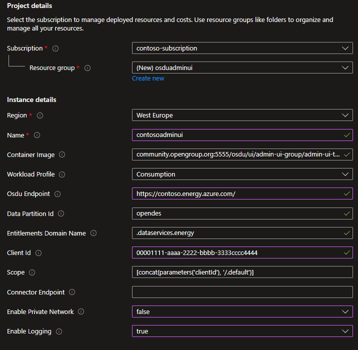
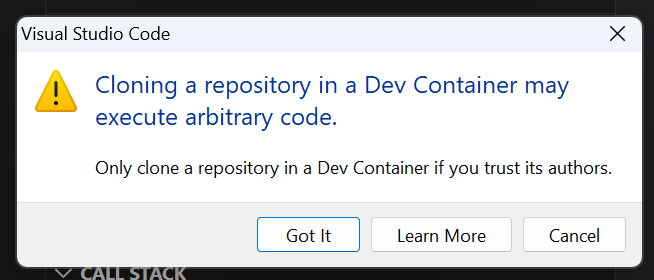
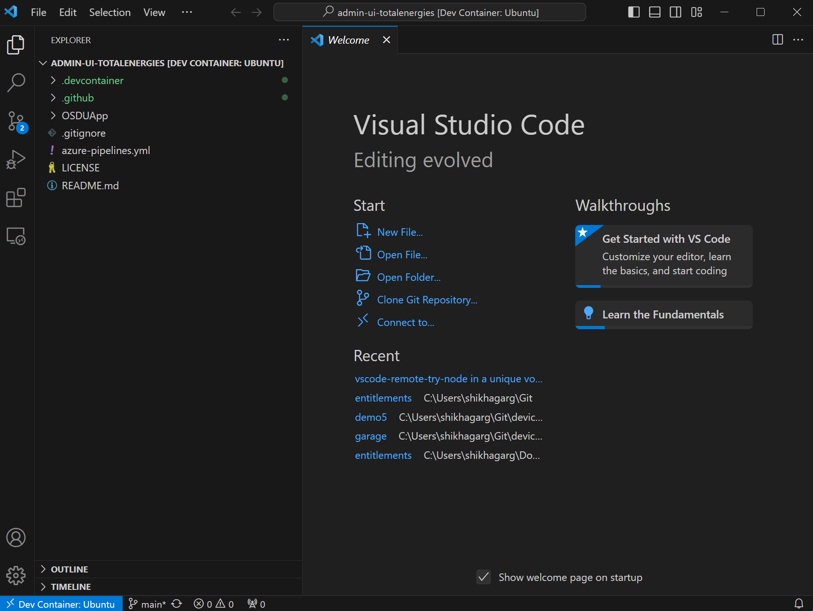
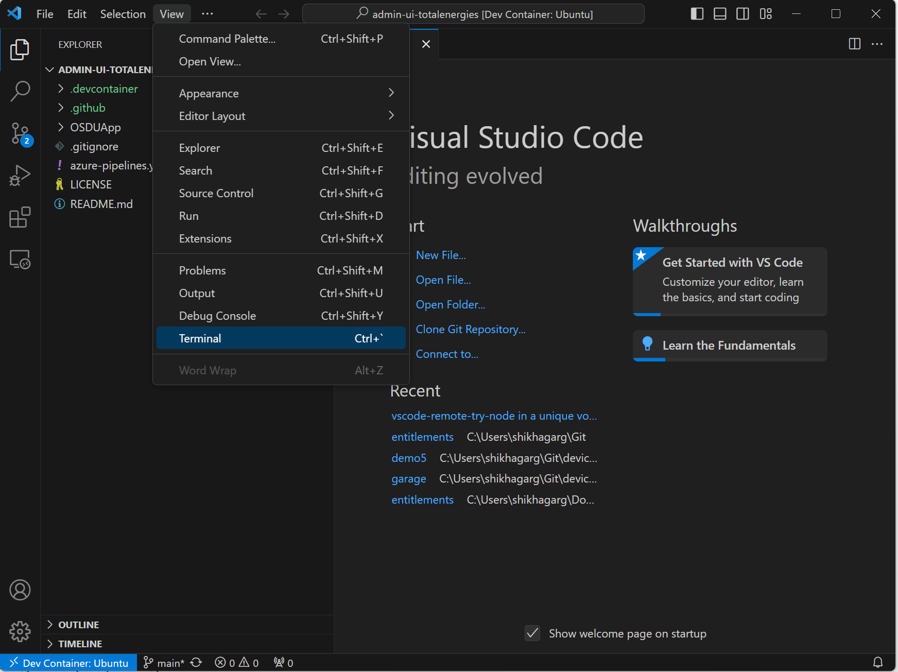
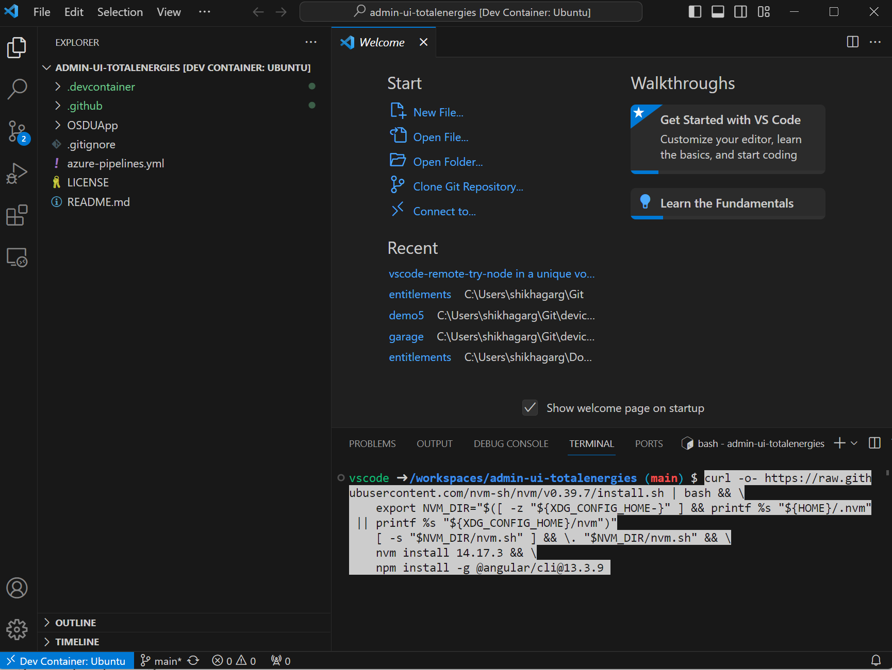

# Deploy OSDU Admin UI on top of Azure Data Manager for Energy

This guide shows you how to deploy the OSDU Admin UI on top of your Azure Data Manager for Energy (ADME) instance.

The OSDU Admin UI enables platform administrators to manage the Azure Data Manager for Energy data partition that it connects to. Management tasks include entitlements (user and group management), legal tags, schemas, reference data, and viewing and visualizing objects on a map.

## Prerequisites

- An [Azure Data Manager for Energy instance](quickstart-create-microsoft-energy-data-services-instance.md).
- A [Microsoft Entra ID App Registration](/entra/identity-platform/quickstart-register-app). <br> This app registration can be the same as the one used for the Azure Data Manager for Energy instance. The following API permissions are required on the app registration for the Admin UI to function properly.
  - [Application.Read.All](/graph/permissions-reference#applicationreadall)
  - [User.Read](/graph/permissions-reference#applicationreadall)
  - [User.ReadBasic.All](/graph/permissions-reference#userreadbasicall)

   Upon first sign-in to the Admin UI, the application requests the necessary permissions. You can also grant the required permissions in advance. For more information, see [Configure app access to web APIs](/entra/identity-platform/quickstart-configure-app-access-web-apis#application-permission-to-microsoft-graph).

## Deployment options

There are two deployment options for the OSDU Admin UI:

1. **[Quick-deploy using Azure Container Apps](#quick-deploy-with-azure-container-apps)**: A one-click deployment using Azure Container Apps. This option is the fastest way to deploy the OSDU Admin UI and supports both public and private deployments.
1. **[Custom deployment using Azure Storage Account Static Website](#custom-deployment-using-azure-storage-account-static-website)**: Build and deploy the OSDU Admin UI by using Azure Storage Account Static Website. This option is more customizable and allows you to tailor the deployment to your requirements.

## Quick-deploy with Azure Container Apps

1. Select the `Deploy to Azure` button to deploy the OSDU Admin UI using Azure Container Apps.

   [](https://portal.azure.com/#create/Microsoft.Template/uri/https%3A%2F%2Fraw.githubusercontent.com%2FAzure%2FADME-Solution-Accelerators%2Frefs%2Fheads%2Fmain%2Fartifacts%2Fadminui%2Fazuredeploy.json)

1. Fill in the required parameters in the Azure portal. For more information about the parameters, see the [parameters section](#parameters).

   [](./media/how-to-deploy-osdu-admin-ui/quick-deploy.png#lightbox)

1. Select **Review + create** and then **Create** to deploy the OSDU Admin UI.

1. Check the `Outputs` section for the URL of the deployed OSDU Admin UI.

1. Configure the [ADME CORS policy](#add-cors-policy) and [App Registration SPA redirect URI](#add-redirect-uri-to-app-registration) with the website URL.

1. Open the URL in a browser and validate that it's working correctly and connected to the correct Azure Data Manager for Energy instance.

> [!NOTE]
> If you provide `gcz_endpoint`, the Azure Container Apps deployment injects it into the Admin UI container automatically. The Admin UI then generates runtime configuration with `settings.api_endpoints.gcz_endpoint`, so no manual post-deployment `config.json` update or portal environment variable edit is required. GCZ must already be deployed separately.

> [!IMPORTANT]
> The `Deploy to Azure` button currently points to the Microsoft-hosted `azuredeploy.json` template. If the template is re-hosted in a PG-controlled repository, update the button link to use the new raw template URL.

### Parameters

| Parameter | Description | Required |
| --- | --- | ---: |
| Subscription | The Azure subscription to deploy the OSDU Admin UI to. | Yes |
| Resource group | The resource group to deploy the OSDU Admin UI to. | Yes |
| Region | The Azure region to deploy the OSDU Admin UI to. | Yes |
| Name | The name of the OSDU Admin UI instance. Other resources use this name as the base-name and append a service abbreviation. | Yes |
| Container Image | The container image to use for the OSDU Admin UI. See [OSDU Forum Admin UI Container Registry](https://community.opengroup.org/osdu/ui/admin-ui-group/admin-ui-totalenergies/admin-ui-totalenergies/container_registry) for available images. | Yes |
| OSDU Endpoint | The endpoint of the Azure Data Manager for Energy or OSDU instance to connect to. Use the base ADME endpoint. The deployment normalizes it for the container runtime. | Yes |
| Data Partition IDs | Comma-separated list of data partition IDs of the Azure Data Manager for Energy or OSDU instance to connect to. | Yes |
| Entitlements Domain Name | The domain name to use for the entitlements service. Keep `.dataservices.energy` for any ADME deployment, only update if you're using another OSDU implementation. | Yes |
| Client ID | The client ID of the App Registration to use for the OSDU Admin UI. | Yes |
| Scope | The scope of the App Registration used by Azure Data Manager for Energy or OSDU. If the Client ID is the ADME App Registration, you can leave this default. | Yes |
| Connector Endpoint | *Optional:* The OSDU Admin UI [Connector API](https://community.opengroup.org/osdu/ui/admin-ui-group/admin-ui-totalenergies/connector-api-totalenergies) endpoint to use for the Admin UI. | No |
| GCZ Endpoint | *Optional:* Base GCZ endpoint ending with `/gcz/`. Example: `https://contoso.energy.azure.com/api/gcz/`. GCZ must already be deployed separately. | No |
| Enable Private Network | *Optional:* Enable private network access to the OSDU Admin UI. | No |
| Enable Logging | *Optional:* Enable logging for the OSDU Admin UI. | No |

## Custom deployment using Azure Storage Account Static Website

### Prepare your computer

- Install [Visual Studio Code with Dev Containers](https://code.visualstudio.com/docs/devcontainers/tutorial). You can deploy the OSDU Admin UI from your local computer by using either Linux or Windows Subsystem for Linux (WSL). We recommend using a Dev Container to reduce tooling and environment conflicts.

### Environment setup

1. Use a Dev Container in Visual Studio Code to reduce conflicts with locally installed tools.

1. Select `Remote - Containers | Open` to open a Development Container and clone the OSDU Admin UI repository.

   [](https://vscode.dev/redirect?url=vscode://ms-vscode-remote.remote-containers/cloneInVolume?url=https://community.opengroup.org/osdu/ui/admin-ui-group/admin-ui-totalenergies/admin-ui-totalenergies)

1. Accept the cloning prompt.

   [](./media/how-to-deploy-osdu-admin-ui/clone-the-repository.png#lightbox)

1. When prompted for a container configuration template:
   1. Select [Ubuntu](https://github.com/devcontainers/templates/tree/main/src/ubuntu).
   1. Accept the default version.
   1. Don't add any extra features.

1. After a few minutes, the devcontainer is running.

   [](./media/how-to-deploy-osdu-admin-ui/running-devcontainer.png#lightbox)

1. Open the terminal.

   [](./media/how-to-deploy-osdu-admin-ui/open-terminal.png#lightbox)

1. Install [Angular CLI](https://angular.io/cli), [Azure CLI](/cli/azure/install-azure-cli), [npm](https://docs.npmjs.com/downloading-and-installing-node-js-and-npm), and [Node Version Manager (NVM)](https://github.com/nvm-sh/nvm).

   ```bash
   curl -o- https://raw.githubusercontent.com/nvm-sh/nvm/v0.39.7/install.sh | bash && \
   export NVM_DIR="$([ -z "${XDG_CONFIG_HOME-}" ] && printf %s "${HOME}/.nvm" || printf %s "${XDG_CONFIG_HOME}/nvm")" && \
   [ -s "$NVM_DIR/nvm.sh" ] && . "$NVM_DIR/nvm.sh" && \
   nvm install 20.19.6 && \
   export NG_CLI_ANALYTICS=false && \
   npm install -g @angular/cli@13.3.9 && \
   sudo apt-get update && \
   sudo apt-get install -y jq && \
   curl -sL https://aka.ms/InstallAzureCLIDeb | sudo bash
   ```

   [](./media/how-to-deploy-osdu-admin-ui/install-screen.png#lightbox)

1. Log into Azure CLI by executing the command in the terminal.

   ```azurecli
   az login
   ```

1. Enter your credentials and verify that sign-in succeeds.

1. Validate that you're using the correct subscription.

   ```azurecli
   az account show
   ```

1. If needed, change the subscription.

   ```azurecli
   az account set --subscription <subscription-id>
   ```

### Configure environment variables

1. Enter the required environment variables in the terminal.

   ```bash
   export WEBSITE_NAME="" ## Unique name of the static website storage account. The storage account name must be between 3 and 24 characters in length and contain only numbers and lower-case letters.
   export RESOURCE_GROUP="" ## Name of the resource group
   export LOCATION="" ## Azure region to deploy to, for example "westeurope"
   ```

## Deploy storage account

1. Create the resource group. Skip this step if the resource group already exists.

   ```azurecli
   az group create \
       --name $RESOURCE_GROUP \
       --location $LOCATION
   ```

1. Create the storage account.

   ```azurecli
   az storage account create \
       --resource-group $RESOURCE_GROUP \
       --location $LOCATION \
       --name $WEBSITE_NAME \
       --sku Standard_LRS \
       --public-network-access Enabled \
       --allow-blob-public-access true
   ```

1. Configure the static website.

   ```azurecli
   az storage blob service-properties update \
       --account-name $WEBSITE_NAME \
       --static-website \
       --404-document index.html \
       --index-document index.html
   ```

1. Set `$web` container permissions to allow anonymous access.

   ```azurecli
   az storage container set-permission \
       --name '$web' \
       --account-name $WEBSITE_NAME \
       --public-access blob
   ```

### Configure the website

1. Navigate to the `OSDUApp` folder.

   ```bash
   cd OSDUApp/
   ```

1. Copy the Azure `routing.ts` file.

   ```bash
   cp providers/azure/routing.ts src/app/routing.ts
   ```

1. Install the dependencies.

   ```nodejs
   npm install
   ```

1. Modify the parameters in the config file located at `/src/config/config.json`.

#### [Code snippet](#tab/code)

Replace the environment variable values with values for your deployment.

```bash
export OSDU_ENDPOINT="" # Endpoint of the Azure Data Manager for Energy or OSDU instance to connect to, ending with /api/ . Example: https://contoso.energy.azure.com/api/
export DATA_PARTITION_ID="" # ADME Data Partition ID, or comma-separated list if using multiple partitions
export DOMAIN_NAME=".dataservices.energy" # Domain name to use for the entitlements service. Use .dataservices.energy for any ADME deployment.
export TENANT_ID="" # Entra ID tenant ID
export CLIENT_ID="" # App Registration ID to use for the Admin UI, usually the same as the ADME App Registration ID
export SCOPE="" # Scope of the ADME instance, for example "6ee7e0d6-0641-4b29-a283-541c5d00655a/.default"
export GRAPH_ENDPOINT="https://graph.microsoft.com/v1.0/" # Microsoft Graph API endpoint
export APPINSIGHTS_INSTRUMENTATIONKEY="" # Optional. Application Insights instrumentation key
export OSDU_CONNECTOR_API_ENDPOINT="" # Optional. API endpoint of the OSDU Connector API
export REDIRECT_URI="" # This is your static website URL, for example https://<storage-account-name>.z21.web.core.windows.net/
export GCZ_ENDPOINT="" # Optional. Base GCZ service endpoint ending with /gcz/ . Example: https://contoso.energy.azure.com/api/gcz/

jq \
  --arg data "$DATA_PARTITION_ID" \
  --arg domain "$DOMAIN_NAME" \
  --arg tenant "$TENANT_ID" \
  --arg client "$CLIENT_ID" \
  --arg redirect "$REDIRECT_URI" \
  --arg scope "$SCOPE" \
  --arg endpoint "$OSDU_ENDPOINT" \
  --arg graph "$GRAPH_ENDPOINT" \
  --arg appinsights "$APPINSIGHTS_INSTRUMENTATIONKEY" \
  --arg connectorapi "$OSDU_CONNECTOR_API_ENDPOINT" \
  --arg gcz "$GCZ_ENDPOINT" \
'
.settings.appInsights.instrumentationKey = $appinsights |
.settings.data_partition = ($data | split(",")) |
.settings.domain_name = $domain |
.settings.idp.tenant_id = $tenant |
.settings.idp.client_id = $client |
.settings.idp.redirect_uri = $redirect |
.settings.idp.scope = $scope |
.settings.api_endpoints.entitlement_endpoint = $endpoint |
.settings.api_endpoints.storage_endpoint = $endpoint |
.settings.api_endpoints.search_endpoint = $endpoint |
.settings.api_endpoints.legal_endpoint = $endpoint |
.settings.api_endpoints.schema_endpoint = $endpoint |
.settings.api_endpoints.file_endpoint = $endpoint |
.settings.api_endpoints.secrets_endpoint = $connectorapi |
.settings.api_endpoints.graphAPI_endpoint = $graph |
.settings.api_endpoints.workflow_endpoint = $endpoint |
.settings.api_endpoints.wddms_endpoint = $endpoint |
.settings.api_endpoints.gcz_endpoint = $gcz
' \
src/config/config.json > src/config/temp.json && \
mv src/config/temp.json src/config/config.json
```

#### [Manual](#tab/manual)

Replace the values according to the explanation.

```json
{
  ...
  "domain_name": ".dataservices.energy",
  "data_partition": ["<adme_data_partition>"],
  "idp": {
    ...
    "tenant_id": "<tenant_id>",
    "client_id": "<client_id>",
    "redirect_uri": "<redirect_uri>",
    "scope": "<client_id>/.default"
  },
  "api_endpoints": {
    "entitlement_endpoint": "https://contoso.energy.azure.com/api/",
    "storage_endpoint": "https://contoso.energy.azure.com/api/",
    "search_endpoint": "https://contoso.energy.azure.com/api/",
    "legal_endpoint": "https://contoso.energy.azure.com/api/",
    "schema_endpoint": "https://contoso.energy.azure.com/api/",
    "osdu_connector_api_endpoint": "osdu_connector",
    "file_endpoint": "https://contoso.energy.azure.com/api/",
    "graphAPI_endpoint": "https://graph.microsoft.com/v1.0/",
    "workflow_endpoint": "https://contoso.energy.azure.com/api/",
    "wddms_endpoint": "https://contoso.energy.azure.com/api/",
    "gcz_endpoint": "https://contoso.energy.azure.com/api/gcz/"
  }
  ...
}
```

> [!NOTE]
> [OSDU Connector API](https://community.opengroup.org/osdu/ui/admin-ui-group/admin-ui-totalenergies/connector-api-totalenergies) provides an interface between consumers and OSDU APIs by wrapping selected API chains and objects. It currently manages operations and actions on project and scenario objects.
>
> If you configure `gcz_endpoint`, use the base GCZ endpoint ending with `/gcz/`. GCZ must already be deployed separately.

1. Build the web UI.

   ```bash
   ng build --configuration=azure-prod
   ```

1. Upload the build to Storage Account.

   ```azurecli
   az storage blob upload-batch \
       --account-name $WEBSITE_NAME \
       --source ./dist/OSDUApp/ \
       --destination '$web' \
       --overwrite
   ```

1. Retrieve the website URL.

   ```bash
   echo $REDIRECT_URI
   ```

1. Configure the [ADME CORS policy](#add-cors-policy) and [App Registration SPA redirect URI](#add-redirect-uri-to-app-registration) with the website URL.

1. Open the website URL in a browser and verify that it is working correctly and connected to the correct Azure Data Manager for Energy instance.

## Add CORS policy

For the Admin UI to work correctly, add the redirect URI to the CORS policy on the Azure Data Manager for Energy instance. For more information, see [Enable CORS](how-to-enable-cors.md).

## Add redirect URI to App Registration

Add the redirect URI as a Single-Page Application to the app registration used by the Admin UI. To configure the redirect URI, follow the steps in [Scenario: Single-page application](/entra/identity-platform/scenario-spa-app-registration).

## Next steps

After you have a successful Admin UI working, you can:

- [Add first set of users](how-to-manage-users.md#first-time-addition-of-users-in-a-new-data-partition).
- [Manage legal tags](how-to-manage-legal-tags.md).
- [Manage ACLs](how-to-manage-acls.md).

You can also ingest data into your Azure Data Manager for Energy instance:

- [Tutorial on CSV parser ingestion](tutorial-csv-ingestion.md).
- [Tutorial on manifest ingestion](tutorial-manifest-ingestion.md).

## References

For information about OSDU Admin UI, see [OSDU GitLab](https://community.opengroup.org/osdu/ui/admin-ui-group/admin-ui-totalenergies/admin-ui-totalenergies).  
For other deployment methods (Terraform or Azure DevOps CI/CD pipeline), see [OSDU Admin UI DevOps](https://community.opengroup.org/osdu/ui/admin-ui-group/admin-ui-totalenergies/admin-ui-totalenergies/-/tree/main/OSDUApp/devops/azure).
