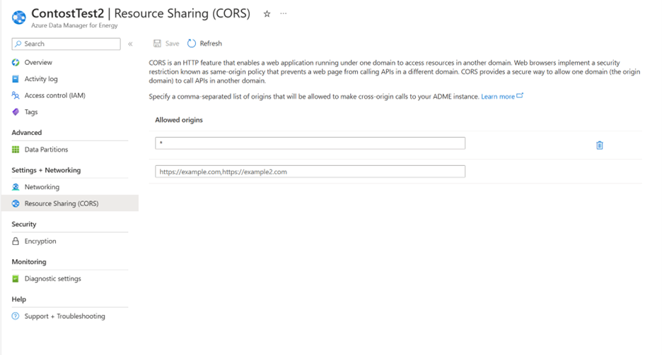
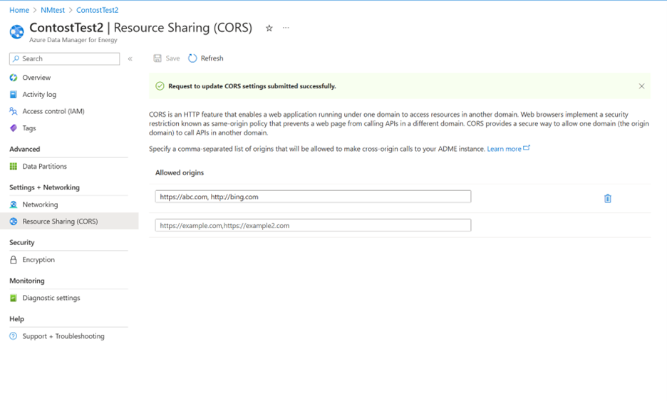
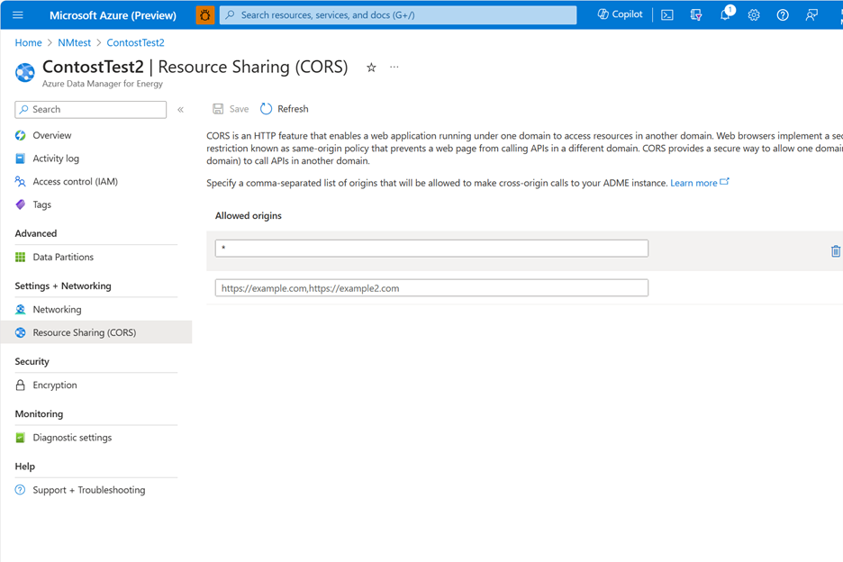
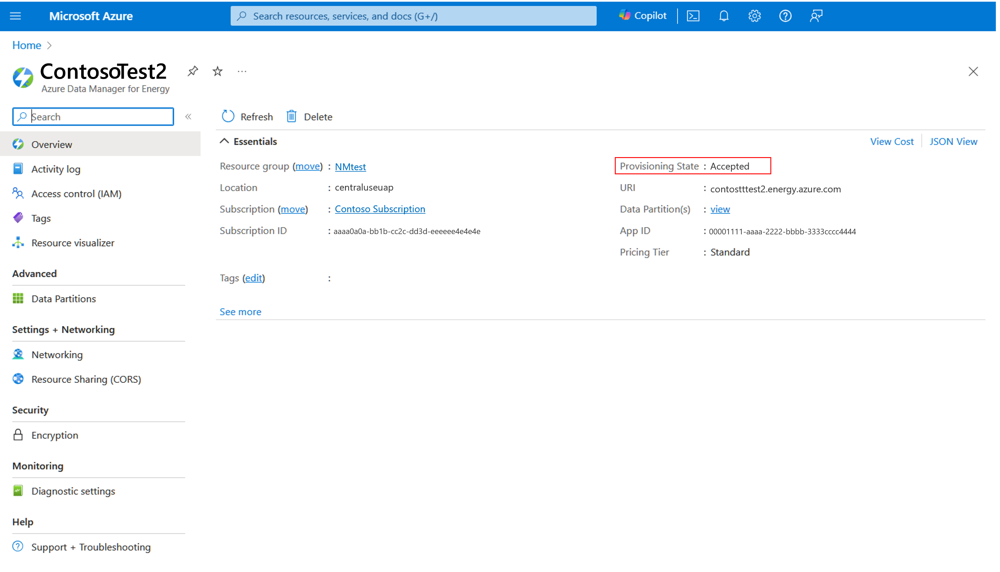

# Use CORS for resource sharing in Azure Data Manager for Energy
This document is to help you as user of Azure Data Manager for Energy to set up CORS policies.

## What is CORS?

CORS (Cross Origin Resource Sharing) is an HTTP feature that enables a web application running under one domain to access resources in another domain. In order to reduce the possibility of cross-site scripting attacks, all modern web browsers implement a security restriction known as same-origin policy, which prevents a web page from calling APIs in a different domain. CORS provides a secure way to allow one origin (the origin domain) to call APIs in another origin.
You can set CORS rules for each Azure Data Manager for Energy instance. When you set CORS rules for the instance, it gets applied automatically across all the services and storage accounts linked with your Azure Data Manager for Energy resource. Once you set the CORS rules, then a properly authorized request made against the service evaluates from a different domain to determine whether it's allowed according to the rules you've specified. 

## Enabling CORS on Azure Data Manager for Energy instance

1.	Create an **Azure Data Manager for Energy** instance.
1.	Select the **Resource Sharing(CORS)** tab.
   
 
1.	In the Resource Sharing(CORS) tab, select **Allowed Origins**. 
1.	There can be upto 5 **Allowed Origins** added for a given instance.
      
1. If you explicitly want to have ***(Wildcard)**, then in the allowed origin * can be added.
1.	If no setting is enabled on CORS page it's defaulted to Wildcard*, allow all. 
1. The other values of CORS policy like  **Allowed Methods**, **Allowed Headers**, **Exposed Headers**, **Max age in seconds** are set with default values displayed on the screen.
1.	Next, select “**Review+Create**” after completing other tabs. 
1.	Select the "**Create**" button. 
1.	An **Azure Data Manager for Energy** instance is created with CORS policy.
1.	Next, once the instance is created the CORS policy set can be viewed in instance **overview** page.
1. You can navigate to **Resource Sharing(CORS)** and see that CORS is enabled with required **Allowed Origins**.
       
1. You can modify the Allowed Origins in CORS page at any time after Azure data manager for Energy instance is provisioned.
   1. For adding a new origin type on the box below.
       
   1. For deleting an existing allowed origin use the icon.
      
   1. If * (wildcard all) is added in any of the allowed origins then please ensure to delete all the other individual allowed origins.
1. Once the Allowed origin is added, the state of resource provisioning is in “Accepted” and during this time further modifications of CORS policy will not be possible. It takes 15 mins for CORS policies to be updated before update CORS window is available again for modifications.
     

## How are CORS rules evaluated?
CORS rules are evaluated as follows:
1. First, the origin domain of the request is checked against the domains listed for the AllowedOrigins element. 
2. Rules evaluation proceeds if the origin domain is included in the list or all domains are allowed with the wildcard character (*). If the origin domain isn't included, the request fails.

## Limitations on CORS policy
The following limitations apply to CORS rules:
- The maximum size of all CORS rules settings on the request, excluding XML tags, shouldn't exceed 2 KiB.
- The length of allowed origin shouldn't exceed 256 characters.

## Next steps
- To learn more about CORS 
   > [!div class="nextstepaction"]
   > [CORS overview](/rest/api/storageservices/cross-origin-resource-sharing--cors--support-for-the-azure-storage-services)
