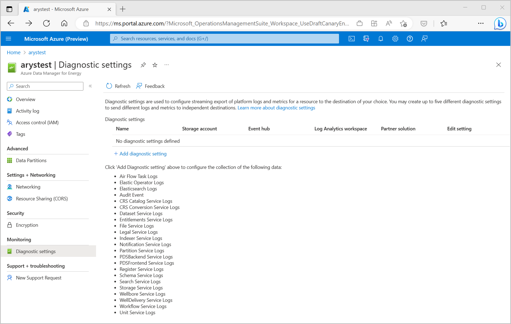
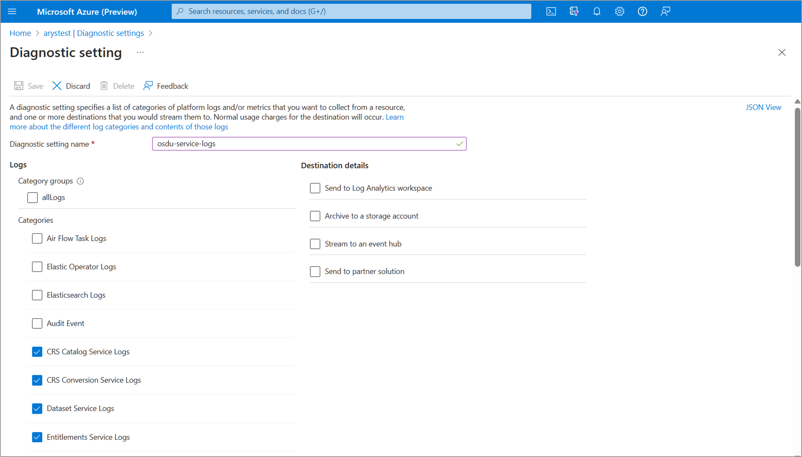
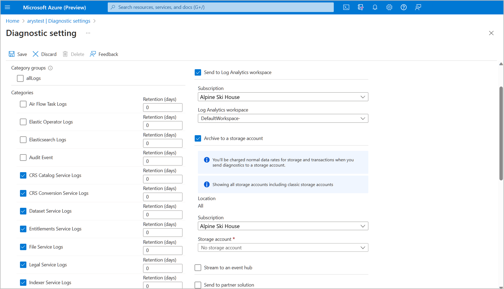
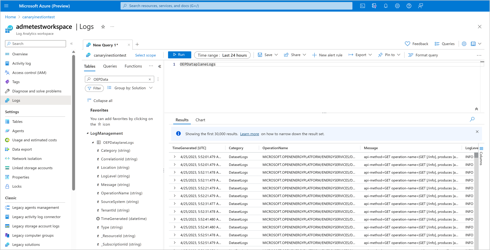

# Integrate OSDU Service Logs with Azure Monitor

Azure Data Manager for Energy supports exporting OSDU Service Logs to Azure Monitor using a diagnostic setting. This feature helps you better troubleshoot, debug, & monitor the OSDU services. The instructions here are similar to how you would integrate other logs, such as Airflow and Elastic, with Azure Monitor.

## Prerequisites

* An existing **Log Analytics Workspace**.
    This workspace is used to query OSDU service logs using the Kusto Query Language (KQL) query editor in the Log Analytics workspace. Useful Resource: [Create a log analytics workspace in Azure portal](../azure-monitor/logs/quick-create-workspace.md).

* An existing **storage account**:
    It's used to store JSON dumps of OSDU service logs. The storage account doesn’t have to be in the same subscription as your Log Analytics workspace.

## Enabling diagnostic settings for OSDU service logs integration

1. Open Microsoft Azure Data Manager for Energy *Overview* page.
1. Select *Diagnostic Settings* from the left panel.
    
    [](media/how-to-integrate-osdu-service-logs-with-azure-monitor/diagnostic-settings-overview-page.png#lightbox)
    
1. Select *Add diagnostic setting*. Choose a diagnostic setting name and select the services under *Categories* for which you want to send logs to your chosen destination.


    [](media/how-to-integrate-osdu-service-logs-with-azure-monitor/diagnostic-settings-creation-page.png#lightbox)
    

1. Under the Logs section, you can choose one or multiple OSDU services for which you want to create a diagnostic setting. Select *Archive to a storage account* and/or *Send to Log Analytics workspace* as desired.

     [](media/how-to-integrate-osdu-service-logs-with-azure-monitor/diagnostic-settings-configuration.png#lightbox)
 
1. Verify the subscription, storage account, and Log Analytics workspace to which you want to archive the logs or integrate with.

## Working with OSDU service logs in Log Analytics Workspace

1. Navigate to the *Logs* tab in the left panel. 
1. Expand the list of tables under Log Management category. The OSDU service logs exported using a diagnostic setting show up in the *OEPDataplaneLogs* table. 
1. Move to the editor pane. Here, you can write Kusto Query Language (KQL) queries to filter your OSDU service logs and display only the relevant ones.

     [](media/how-to-integrate-osdu-service-logs-with-azure-monitor/log-analytics-workspace.png#lightbox)

## Troubleshooting with OSDU service logs

Analyzing OSDU service logs in Azure Monitor can help you identify errors and issues related to specific services and APIs. Examine logs for services like the Workflow Service, Partition Service, or Entitlements Service to quickly identify and resolve any issues in the API calls or service functionality.

Log Analytics Workspace query editor supports KQL queries. Here are some sample queries that may be helpful:

* A query to filter OSDU service logs generated by a specific service in your Azure Data Manager for Energy in the last 6 hours. 

```sql
OEPDataplaneLogs
| where TimeGenerated >= ago(6h)
| where _ResourceID contains "name-of-your-adme-instance"
| where Category = "DatasetLogs"
```

* A query to filter logs for all OSDU service calls that resulted in errors today. 

```sql
OEPDataplaneLogs
| where _ResourceID contains "name-of-your-adme-instance"
| where TimeGenerated >= startofday(ago(0d))
| where TimeGenerated < startofday(ago(-1d))
| where LogLevel != "INFO"
```
    
## Archiving OSDU service logs to storage accounts

You can archive OSDU service logs to storage accounts and take advantage of Azure Monitor features for logs archival, retention policies, and more:

* Specify the storage account for archiving logs during the diagnostic setting creation process.
* Set retention policies for the archived logs.
* Access the logs in the storage account for other analysis or long-term storage.

## Next steps

Now that you're collecting OSDU service logs, create a log query alert to be proactively notified when interesting data is identified in your log data.

> [!div class="nextstepaction"]
> [Create a log query alert for an Azure resource](../azure-monitor/alerts/tutorial-log-alert.md)